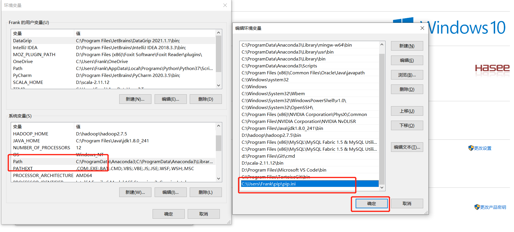
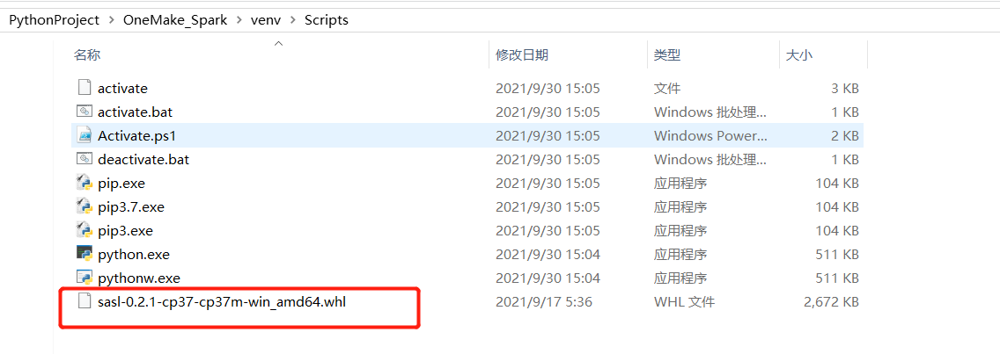
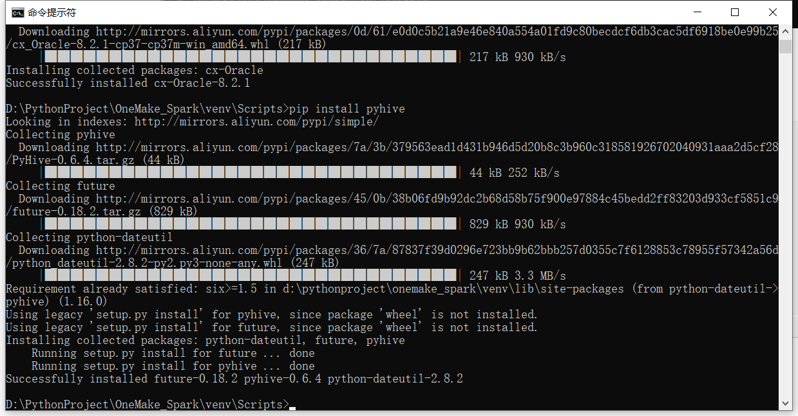
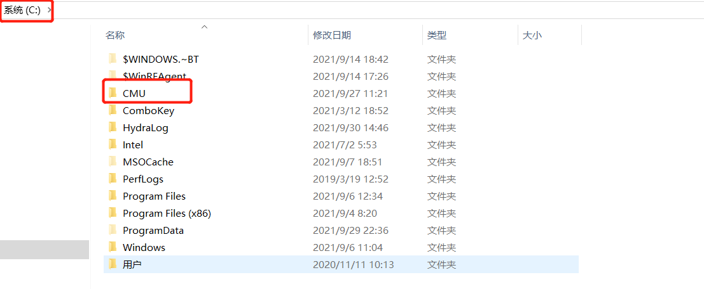

# ODS层自动化构建实现

## I. 数仓分层回顾

- **目标**：**回顾一站制造项目分层设计**

- **实施**

  

  - ODS层：原始数据层，所有从Oracle中同步过来的数据
  - 实现：101张表的数据和Schema信息已经存储在HDFS上
  - 目标
    - step1：建库建表
    - step2：申明分区

- **小结**

  - 回顾一站制造项目分层设计

## II. Hive建表语法

- **目标**：**掌握Hive建表语法**

- **实施**

  ```sql
  CREATE [TEMPORARY] [EXTERNAL] TABLE [IF NOT EXISTS] [db_name.]table_name
  (
      col1Name col1Type [COMMENT col_comment],
      co21Name col2Type [COMMENT col_comment],
      co31Name col3Type [COMMENT col_comment],
      co41Name col4Type [COMMENT col_comment],
      co51Name col5Type [COMMENT col_comment],
      ……
      coN1Name colNType [COMMENT col_comment]
  
  )
  [COMMENT table_comment]
  [PARTITIONED BY (col_name data_type ...)]
  [CLUSTERED BY (col_name...) [SORTED BY (col_name ...)] INTO N BUCKETS]
  [ROW FORMAT row_format]
  	row format delimited fields terminated by 
  	lines terminated by
  [STORED AS file_format]
  [LOCATION hdfs_path]
  TBLPROPERTIES
  ```

  - **语法**

  - **注意**：能在Hive中运行，通常都可以在SparkSQL中执行，但是Spark中语法有两个细节需要注意

    - Hive语法：支持数据类型比较少，建表语法严格要求顺序

      ```
      Spark：Integer
      Hive：int
      ```

    - SparkSQL语法：支持数据类型兼容Hive类型，顺序有些位置可以互换

    - 本次所有SQL：SparkSQL

- **小结**

  - 掌握Hive建表语法

## III. Avro建表语法

- **目标**：**掌握Hive中Avro建表方式及语法**

- **路径**

  - step1：指定文件类型
  - step2：指定Schema
  - step3：建表方式

- **实施**

  - Hive官网：https://cwiki.apache.org/confluence/display/Hive/LanguageManual+DDL#LanguageManualDDL-CreateTable

  - DataBrics官网：https://docs.databricks.com/spark/2.x/spark-sql/language-manual/create-table.html

  - Avro用法：https://cwiki.apache.org/confluence/display/Hive/AvroSerDe

  - **指定文件类型**

    - 方式一：指定类型

      ```sql
      stored as avro
      ```

    - 方式二：指定解析类

      ```sql
      --解析表的文件的时候，用哪个类来解析
      ROW FORMAT SERDE
        'org.apache.hadoop.hive.serde2.avro.AvroSerDe'
      --读取这张表的数据用哪个类来读取
      STORED AS INPUTFORMAT
        'org.apache.hadoop.hive.ql.io.avro.AvroContainerInputFormat'
      --写入这张表的数据用哪个类来写入
      OUTPUTFORMAT
        'org.apache.hadoop.hive.ql.io.avro.AvroContainerOutputFormat'
      ```

  - **指定Schema**

    - 方式一：手动定义Schema

      ```sql
        CREATE TABLE embedded
      COMMENT "这是表的注释"
        ROW FORMAT SERDE
          'org.apache.hadoop.hive.serde2.avro.AvroSerDe'
        STORED AS INPUTFORMAT
          'org.apache.hadoop.hive.ql.io.avro.AvroContainerInputFormat'
        OUTPUTFORMAT
          'org.apache.hadoop.hive.ql.io.avro.AvroContainerOutputFormat'
        TBLPROPERTIES (
          'avro.schema.literal'='{
            "namespace": "com.howdy",
            "name": "some_schema",
            "type": "record",
            "fields": [ { "name":"string1","type":"string"}]
          }'
        );
      ```

      - 方式二：加载Schema文件

      ```sql
      CREATE TABLE embedded
      COMMENT "这是表的注释"
        ROW FORMAT SERDE
        'org.apache.hadoop.hive.serde2.avro.AvroSerDe'
        STORED as INPUTFORMAT
          'org.apache.hadoop.hive.ql.io.avro.AvroContainerInputFormat'
        OUTPUTFORMAT
          'org.apache.hadoop.hive.ql.io.avro.AvroContainerOutputFormat'
        TBLPROPERTIES (
         'avro.schema.url'='file:///path/to/the/schema/embedded.avsc'
        );
      ```

  - **建表语法**

    - 方式一：指定类型和加载Schema文件

      ```sql
        create external table one_make_ods_test.ciss_base_areas
      comment '行政地理区域表'
        PARTITIONED BY (dt string)
      stored as avro
        location '/data/dw/ods/one_make/full_imp/ciss4.ciss_base_areas'
        TBLPROPERTIES ('avro.schema.url'='/data/dw/ods/one_make/avsc/CISS4_CISS_BASE_AREAS.avsc');
      ```

    - 方式二：**指定解析类和加载Schema文件**

      ```sql
        create external table one_make_ods_test.ciss_base_areas
      comment '行政地理区域表'
        PARTITIONED BY (dt string)
      ROW FORMAT SERDE
          'org.apache.hadoop.hive.serde2.avro.AvroSerDe'
        STORED AS INPUTFORMAT
          'org.apache.hadoop.hive.ql.io.avro.AvroContainerInputFormat'
        OUTPUTFORMAT
          'org.apache.hadoop.hive.ql.io.avro.AvroContainerOutputFormat'
        location '/data/dw/ods/one_make/full_imp/ciss4.ciss_base_areas'
        TBLPROPERTIES ('avro.schema.url'='/data/dw/ods/one_make/avsc/CISS4_CISS_BASE_AREAS.avsc');
      ```

- **小结**

  - 掌握Hive中Avro建表方式及语法

## IV. ODS层自动化构建

### 1. 需求分析

- **目标**：掌握ODS层的实现需求

- **路径**

  - step1：目标
  - step2：问题
  - step3：需求
  - step4：分析

- **实施**

  - **目标**：将已经采集同步成功的101张表的数据加载到Hive的ODS层数据表中

  - **问题**

    - 难点1：表太多，如何构建每张表？

    - 难点2：自动化建表时，哪些是动态变化的？

      ```sql
      create external table one_make_ods_test.ciss_base_areas
      comment '行政地理区域表'
      PARTITIONED BY (dt string)
      ROW FORMAT SERDE
      'org.apache.hadoop.hive.serde2.avro.AvroSerDe'
      STORED AS INPUTFORMAT
      'org.apache.hadoop.hive.ql.io.avro.AvroContainerInputFormat'
      OUTPUTFORMAT
      'org.apache.hadoop.hive.ql.io.avro.AvroContainerOutputFormat'
      location '/data/dw/ods/one_make/full_imp/ciss4.ciss_base_areas'
      TBLPROPERTIES ('avro.schema.url'='/data/dw/ods/one_make/avsc/CISS4_CISS_BASE_AREAS.avsc');
      ```

    - 难点3：如果使用自动建表，如何获取每张表的字段信息？

    - 难点4：表的注释怎么得到？

  - **需求**：加载Sqoop生成的Avro的Schema文件，实现自动化建表

  - **分析**

    - step0：本质上就是在执行SQL语句，代码中提交SQL流程

    - step1：代码中构建一个Hive/SparkSQL的连接

    - step2：创建ODS层数据库

      ```sql
      create database if not exists one_make_ods;
      ```

    - step3：创建ODS层全量表:44张表

      ```sql
      create external table one_make_ods_test.ciss_base_areas
      comment '行政地理区域表'
      PARTITIONED BY (dt string)
      ROW FORMAT SERDE 'org.apache.hadoop.hive.serde2.avro.AvroSerDe'
      STORED AS INPUTFORMAT 'org.apache.hadoop.hive.ql.io.avro.AvroContainerInputFormat'
      OUTPUTFORMAT 'org.apache.hadoop.hive.ql.io.avro.AvroContainerOutputFormat'
      location '/data/dw/ods/one_make/full_imp/ciss4.ciss_base_areas'
      TBLPROPERTIES ('avro.schema.url'='hdfs://bigdata.itcast.cn:9000/data/dw/ods/one_make/avsc/CISS4_CISS_BASE_AREAS.avsc');
      ```

      - 读取全量表表名

      - 获取表的注释

      - 获取表的目录：/data/dw/ods/one_make/full_imp/表名

      - 获取表的Schema：/data/dw/ods/one_make/avsc/表名.avsc

      - 拼接建表字符串

        - 简单拼接：str3 = str1+str2

          ```
          str1 = "I love"
          str2 = "China"
          str3 = str1 +" "+str2
          ```

        - 复杂拼接：将要拼接的所有元素放入一个列表，将列表转换为字符串

          ```
          str1 = "I love"
          str2 = "China"
          strlist = list()
          strlist.append(str1)
          strlist.append(str2)
          str=" ".join(strlist)
          ```

      - 执行建表SQL语句

    - step4：创建ODS层增量表:57张表

      - 读取增量表表名：**不同的列表中**
      - 获取表的目录：/data/dw/ods/one_make/**incr**_imp/表名

    - 要想实现上面这个功能，推断一些类和方法？

- **小结**

  - 掌握ODS层的实现需求 

### 2. 创建项目环境

- **目标**：**实现Pycharm中工程结构的构建**

- **实施**

  - **安装Python3.7环境**

    

    - 项目使用的Python3.7的环境代码，所以需要在Windows中安装Python3.7，与原先的Python高版本不冲突，正常安装即可

  - **创建Python工程**

    

  - **安装PyHive、cx_Oracle库**

    - step1：在Windows的用户家目录下创建pip.ini文件

      - 例如：**C:\Users\Frank\pip\pip.ini**

      - 内容：指定pip安装从阿里云下载

        ```properties
        [global]
        
        index-url=http://mirrors.aliyun.com/pypi/simple/
        
        [install]
        
        trusted-host=mirrors.aliyun.com
        ```

    - step2：将文件添加到Windows的**Path环境变量**中

      

    - step3：进入项目环境目录

      - 例如我的项目路径是：**D:\PythonProject\OneMake_Spark\venv\Scripts**

        

      - 将提供的**sasl-0.2.1-cp37-cp37m-win_amd64.whl**文件放入Scripts目录下

        

      - 在CMD中执行以下命令，切换到Scripts目录下

        ```shell
        #切换到D盘
        D:
        #切换到项目环境的Scripts目录下
        cd D:\PythonProject\OneMake_Spark\venv\Scripts
        ```

        

  - step4：CMD中依次执行以下安装命令

    ```python
      # 安装sasl包 -> 使用pycharm安装，会存在下载失败情况，因此提前下载好，对应python3.7版本
      pip install sasl-0.2.1-cp37-cp37m-win_amd64.whl
      
      # 安装thrift包
      pip install thrift
      
      # 安装thrift sasl包
      pip install thrift-sasl
      
      # 安装python操作oracle包
      pip install cx-Oracle
      
      # 安装python操作hive包，也可以操作sparksql
      pip install pyhive
    ```

      

- step5：验证安装结果


- **小结**
  - 实现Pycharm中工程结构的构建

### 3. 代码导入

- **目标**：**实现Python项目代码的导入及配置**

- **实施**

  - **Oracle本地驱动目录**：将提供的**instantclient_12_2**目录放入D盘的根目录下

    

  - **PyHive本地连接配置**：将提供的CMU目录放入C盘的根目录下

    

  - **auto_create_hive_table包**

    - **创建路径包**

      

      ```
      auto_create_hive_table.cn.itcast.datatohive
      ```

      

      - 在datatohive的init文件中放入如下代码

        ```python
        from auto_create_hive_table.cn.itcast.datatohive import LoadData2DWD
        from auto_create_hive_table.cn.itcast.datatohive.CHiveTableFromOracleTable import CHiveTableFromOracleTable
        from auto_create_hive_table.cn.itcast.datatohive.CreateHiveTablePartition import CreateHiveTablePartition
        ```

      - 其他包的init都放入如下内容

        ```python
        #!/usr/bin/env python
        # @desc :
        __coding__ = "utf-8"
        __author__ = "itcast"
        ```

    - **将对应的代码文件放入对应的包或者目录中**

      - step1：从提供的代码中复制config、log、resource这三个目录直接粘贴到**auto_create_hive_table**包下

        

      - step2：从提供的代码中复制entity、utils、EntranceApp.py这三个直接粘贴到**itcast**包下

        

      - step3：从提供的代码中复制fileformat等文件直接粘贴到**datatohive**包下

        

  - **DW归档目录**：将提供的代码中的dw目录直接粘贴到项目中

    

- **小结**

  - 实现Python项目代码的导入及配置

### 4. 代码结构


### 5. 代码修改


### 6. 连接代码及测试


### 7. 建库代码及测试


### 8. 建表实现分析


### 9. 获取Oracle表元数据


### 10. 申明分区代码及测试


## 附一: 面向对象的基本应用


## 附二: 代码操作数据库

- **规律**：所有数据库，都有一个服务端，代码中构建一个服务端连接，提交SQL给这个服务端

- **步骤**

  - step1：构建连接：指定数据库地址+认证

    ```python
    #  MySQL
    conn = PyMySQL.connect(host=node1, port=3306, username='root', password='123456')
    # Oracle
    conn = cxOracle.connect(host=node1, port=1521, username='root', password='123456', dsn=helowin)
    # ThriftServer/HiveServer2
    ```

  - step2：执行操作

    ```python
    # 构建SQL语句
    sql = 'select * from db_emp.tb_emp'
    # Oracle
    cursor = conn.cursor
    # 执行SQL语句
    cursor.execute(sql)
    ```

  - step3：释放资源

    ```python
    cursor.close()
    conn.close()
    ```

    