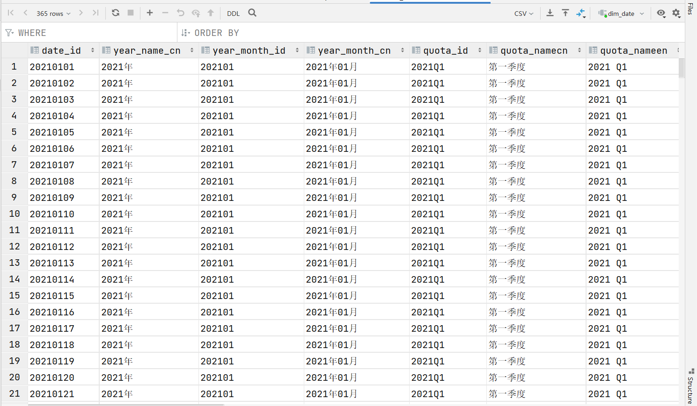
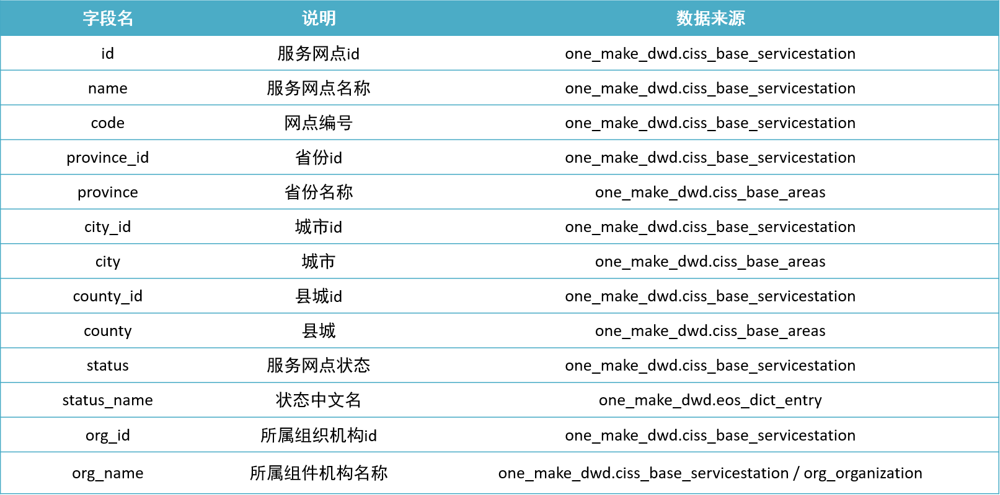
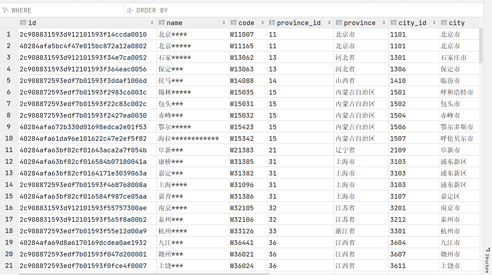
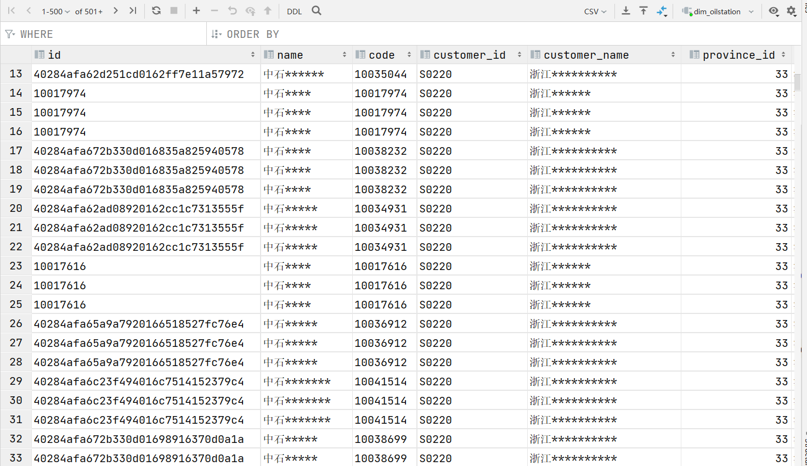
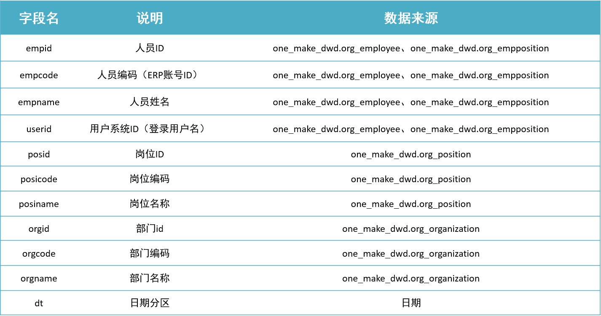

# DIM维度数据层构建

## I. 分层回顾

- **目标**：回顾一站制造项目分层设计

- **实施**

  

  - **ODS层** ：原始数据层, 存储从Oracle中同步过来的原始数据, 自动化构建
  - **DWD层**：明细数据层, 功能是实现对ODS层数据进行数据倾斜, 保证数据质量, 自动化构建
  - **DIM层**：维度数据层, 功能是存储维度数据表
  - **DWB层**：轻度汇总层, 功能是存储不同的主题事实表
  - **ST层**：数据应用层, 功能是将DWB层的是是关联DIM层的维度进行维度聚合得到不同主题每个维度的结果

- **小结**

  - 回顾一站制造项目分层设计

## II. DIM(DWS)层构建

### 1. 行政地区维度设计

- **目标**：**掌握行政地区维度的需求及设计**

- **路径**

  - step1：需求
  - step2：设计

- **实施**

  - **需求**：构建行政地区维度表，得到所有省份、城市、县区及乡镇维度信息

    - 每个省份的订单个数, 订单金额

    - 每个省份的每个城市订单个数, 订单金额

    - 省份维度表

      ```
      省份id	省份名称
      ```

    - 城市维度表

      ```
      省份id	省份名称	城市id	城市名称
      ```

    - 县区维度表

      ```
      省份id	省份名称	城市id	城市名称	县区id	县区名称
      ```

    - 乡镇维度表

      ```
      --省份id	省份名称	城市id	城市名称	县区id	县区名称	乡镇id	乡镇名称
      --11       北京市      1101     北京市      110108    海淀区    110108014  清华园街道
      ```

    - 统计不同地区维度下的网点个数、工单个数、报销金额等

    - 问题：为什么这里面地区维度表要构建多张呢？按照内容来讲，只要一张乡镇维度表不就有所有信息了？
    - 现象：高冗余
    - 设计：通过高冗余来避免对大量数据进行Join，直接关联对应的维度表，减少关联数据量，提高性能

  - **设计**

    - **数据来源**：one_make_dwd.ciss_base_areas

      ```
      select * from one_make_dwd.ciss_base_areas;
      ```

      - - id：当前这个地区对应的唯一id
        - areaname：当前这个地区对应的名称
        - shortname：当前这个地区对应的别名
        - parentid：当前这个地区对应父级行政区域的id
        - rank：标记当前这个地区对应的行政级别
          - 0：国家：country

      - 1：省份：province

        - 2：城市：city

      - 3：县区：county

        - 4：乡镇：town

        - 举例

        - 清华园街道：4

          

        - 海淀区：3

          

        - 北京市【市级】2

          

        - 北京市【省级】1

          

    - **实现思路**：以乡镇维度为例

      - 获取所有乡镇的信息

        ```sql
        select id area_id,areaname area,parentid from one_make_dwd.ciss_base_areas where rank = 4;
        ```

      - 获取所有县区的信息

        ```sql
        select id county_id,areaname county,parentid from one_make_dwd.ciss_base_areas where rank = 3;
        ```

      - 获取所有城市的信息

        ```sql
        select id city_id,areaname city,parentid from one_make_dwd.ciss_base_areas where rank = 2;
        ```

      - 获取所有省份的信息

        ```sql
        select id province_id,areaname province,parentid from one_make_dwd.ciss_base_areas where rank = 1;
        ```

      - 需求：获取每个镇的所有行政地区信息

        ```
        省份id	省份名称	城市id	城市名称	县区id	县区名称		乡镇id	乡镇名称
        ```

      - 实现：下一级地区的父id = 上一级地区的id

        ```sql
        select
            a.townid, townname,
            b.countyid, countyname,
            c.cityid, cityname,
            d.provinceid,d.provincename
        from
            (select id townid, areaname townname ,parentid from one_make_dwd.ciss_base_areas where rank = 4) a
        join
            (select id countyid, areaname countyname ,parentid from one_make_dwd.ciss_base_areas where rank = 3) b
        on a.parentid = b.countyid
        join
            (select id cityid, areaname cityname ,parentid  from one_make_dwd.ciss_base_areas where rank = 2)  c
        on b.parentid = c.cityid
        join
            (select id provinceid, areaname provincename ,parentid from one_make_dwd.ciss_base_areas where rank = 1) d
        on c.parentid = d.provinceid;
        ```

### 2. 行政地区维度构建

- **目标**：**实现行政地区维度表的构建**

- **实施**

  - **建维度库**

    ```sql
    create database if not exists one_make_dws;
    ```

  - **建维度表**

    - 区域粒度【乡镇】

      ```sql
      create external table if not exists one_make_dws.dim_location_areas(
          id string comment 'id'
          , province_id string comment '省份ID'
          , province string comment '省份名称'
          , province_short_name string comment '省份短名称'
          , city_id string comment '城市ID'
          , city string comment '城市'
          , city_short_name string comment '城市短名称'
          , county_id string comment '县城ID'
          , county string comment '县城'
          , county_short_name string comment '县城短名称'
          , area_id string comment '区域ID'
          , area string comment '区域名称'
          , area_short_name string comment '区域短名称'
      ) comment '区域维度区域级别表'
      stored as orc
      tblproperties ("orc.compress"="SNAPPY")
      location '/data/dw/dws/one_make/dim_location_areas';
      ```

    - 县区粒度

      ```sql
      create external table if not exists one_make_dws.dim_location_county(
          id string comment 'id'
          , province_id string comment '省份ID'
          , province string comment '省份名称'
          , province_short_name string comment '省份短名称'
          , city_id string comment '城市ID'
          , city string comment '城市'
          , city_short_name string comment '城市短名称'
          , county_id string comment '县城ID'
          , county string comment '县城'
          , county_short_name string comment '县城短名称'
      ) comment '区域维度表（县城粒度）'
      stored as orc
      tblproperties ("orc.compress"="SNAPPY")
      location '/data/dw/dws/one_make/dim_location_county';
      ```

  - **抽取数据**

    - 区域粒度

      ```sql
      insert overwrite table one_make_dws.dim_location_areas
      select
        /*+repartition(1) */
          t_area.id as id,
          t_province.id as province_id,
          t_province.areaname as province,
          t_province.shortname as province_short_name,
          t_city.id as city_id,
          t_city.areaname as city,
          t_city.shortname as city_short_name,
          t_county.id as county_id,
          t_county.areaname as county,
          t_county.shortname as county_short_name,
          t_area.id as area_id,
          t_area.areaname as area,
          t_area.shortname area_short_name
      from
          one_make_dwd.ciss_base_areas t_area
          inner join one_make_dwd.ciss_base_areas t_county on t_area.rank = 4 and t_area.parentid = t_county.id
          inner join one_make_dwd.ciss_base_areas t_city on t_county.parentid = t_city.id
          inner join one_make_dwd.ciss_base_areas t_province on t_city.parentid = t_province.id
          inner join one_make_dwd.ciss_base_areas t_nation on t_province.parentid = t_nation.id
      ;
      ```

    - 县区粒度

      ```sql
      insert overwrite table one_make_dws.dim_location_county
      select
        /*+repartition(1) */
          t_county.id as id,
          t_province.id as province_id,
          t_province.areaname as province,
          t_province.shortname as province_short_name,
          t_city.id as city_id,
          t_city.areaname as city,
          t_city.shortname as city_short_name,
          t_county.id as county_id,
          t_county.areaname as county,
          t_county.shortname as county_short_name
      from
          one_make_dwd.ciss_base_areas t_county
          inner join one_make_dwd.ciss_base_areas t_city on t_county.rank =3 and t_county.parentid = t_city.id
          inner join one_make_dwd.ciss_base_areas t_province on t_city.parentid = t_province.id
          inner join one_make_dwd.ciss_base_areas t_nation on t_province.parentid = t_nation.id
      ;
      ```

  - - 问题1：小文件比较多

      - 原因：分区多，每个分区的数据比较少

      - 解决：计算过程中数据如果经过了过滤或者聚合，要适当降低分区个数

      - 实现

        - SparkCore、SparkSQL：代码中repartition/coalesce实现分区个数调整

          ```
          rdd.coalesce(1)
          dataframe.coalesce(1)
          ```

    - 问题2：如果不是代码中，而是在SQL语句中怎么调整分区个数？

      - 解决：SQL语句隐式申明计算的分区数：/*+repartition(1) */

    - 问题3：repartition和coalesce区别和各自特点是什么？

      - repartition

        - 功能：调节分区个数

        - 场景：一般用于增大分区个数

        - 本质：调用的还是coalesce

        - 特点：一定会经过shuffle

        - 定义

          ```scala
          def repartition(numPartitions: Int) = coalesce(numPartitions, shuffle = true)
          ```

      - coalesce

        - 功能：调节分区个数

        - 场景：一般用于减少分区个数

        - 特点：可以自己选择是否经过shuffle，来调整分区数，默认不经过shuffle

        - 定义

          ```scala
          def coalesce(numPartitions: Int, shuffle: Boolean = false)
          
          // 示例
          rdd.coalesce(2) //将RDD的分区调整为2个分区
          rdd.coalesce(2,shuffle = true) //将RDD的分区数调整为2个分区，并且走shuffle过程
          ```

      - 问题4：为什么必须经过shuffle才能增大分区个数，而不经过shuffle就可以降低分区个数？

        - 重新分区

        - RDD1：3个分区

          ```
          part0：1 2 3
          part1：4 5 6
          part2：7 8 9
          ```

        - RDD2 = RDD1.repartition(4) => 宽依赖过程，通过Shuffle过程中的分区来实现

          ```
          part0：0 8
          part1：1 5 9
          part2：2 6
          part3：3 7
          ```

        - RDD3 = RDD2.coalesce(2) => 窄依赖过程，直接合并分区的数据即可

          ```
          part0：0 8 1 5 9
          part1：2 6 3 7
          ```

- **小结**

  - 实现行政地区维度表的构建
  - **自行完善城市粒度、省份粒度**

### 3. 日期时间维度设计

- **目标**：**掌握日期时间维度的需求与设计**

- **路径**

  - step1：需求
  - step2：设计

- **实施**

  - **特点**：时间维度表与其他维度表都不一样
    - 维度特征：一般很少或者不会发生变化
  - 实现同步：全量覆盖
    - 特殊情况：时间维度表一般不做全量覆盖，也不是从DWD层中抽取的，因为时间不可变
      - 2022 ~ 9999年每天的时间的信息都能知道
      - 时间维度一般是定期更新时间维度表：时间维度表一把会做分区，每一年做一个分区
      - 今年会把下一年的每一天对应的时间维度的信息放入对应的年分区中

  - **需求**：构建日期时间维度表，得到所有年、季度、月、周、日的维度信息

    | dateId             | String | 日期ID               | 20210101                     |
    | ------------------ | ------ | -------------------- | ---------------------------- |
    | yearNameCN         | String | 年份名称（中文）     | 2021年                       |
    | year               | Int    | 年份                 | 2021                         |
    | yearMonthId        | String | 年月ID               | 202101                       |
    | yearNameCN         | String | 年月（中文）         | 2021年01月                   |
    | quotaId            | String | 季度ID               | 2021Q1                       |
    | quotaNameCN        | String | 季度名称（中文）     | 第一季度                     |
    | quotaNameEN        | String | 季度名称（英文）     | 2021 Q1                      |
    | quotaShortNameEN   | String | 季度名称（英文简写） | Q1                           |
    | weekInYearId       | String | 周ID                 | 2021W1                       |
    | weekInYearNameCN   | String | 周（中文）           | 2021第1周                    |
    | weekInYearNameEN   | String | 周（英文）           | 2021 W1                      |
    | weekday            | Int    | 星期                 | 5                            |
    | weekdayCN          | String | 星期（中文）         | 星期五                       |
    | weekdayEN          | String | 星期（英文）         | Friday                       |
    | weekdayShortNameEN | String | 星期（英文缩写）     | Fri                          |
    | yyyyMMdd           | String | 日期(yyyy-mm-dd)     | 2021-01-01                   |
    | yyyyMMddCN         | String | 日期中文             | 2021年01月01日               |
    | isWorkday          | String | 是否工作日           | n                            |
    | isWeekend          | String | 是否周末             | n                            |
    | isHoliday          | String | 是否法定节假日       | y                            |
    | dateType           | String | 日期类型             | 法定节假日 \| 工作日 \| 周末 |

    - 统计不同时间维度下的呼叫次数、工单数、维修数、安装数、报销金额、核销数等

  - **设计**

    - 数据来源：提前通过程序生成构建，**不是从数据中抽取的**

      ```
      2021  2021-10	4	42周		星期日		2021-10-10		yes	 no		周末
      ```

    - 执行周期：每一年生成下一年的每一天的维度信息，**增量**同步到维度表的分区中

- **小结**

  - 掌握日期时间维度的需求与设计

### 4. 日期时间维度构建

- **目标**：**实现日期时间维度表的构建**

- **实施**

  - **建维度表**

    ```sql
    -- 创建日期维度表,日期维度表按照年份分区
    create external table if not exists one_make_dws.dim_date(
        date_id string comment '日期id'
        , year_name_cn string comment '年份名称（中文）'
        , year_month_id string comment '年月id'
        , year_month_cn string comment '年月（中文）'
        , quota_id string comment '季度id'
        , quota_namecn string comment '季度名称（中文）'
        , quota_nameen string comment '季度名称（英文）'
        , quota_shortnameen string comment '季度名称（英文简写）'
        , week_in_year_id string comment '周id'
        , week_in_year_name_cn string comment '周（中文）'
        , week_in_year_name_en string comment '周（英文）'
        , weekday int comment '星期'
        , weekday_cn string comment '星期（中文）'
        , weekday_en string comment '星期（英文）'
        , weekday_short_name_en string comment '星期（英文缩写）'
        , yyyymmdd string comment '日期_yyyy_mm_dd'
        , yyyymmdd_cn string comment '日期中文'
        , is_workday string comment '是否工作日'
        , is_weekend string comment '是否周末'
        , is_holiday string comment '是否法定节假日'
        , date_type string comment '日期类型'
    ) comment '时间维度表'
    partitioned by (year integer)
    stored as orc
    location '/data/dw/dws/one_make/dim_date'
    ;
    ```

  - **加载数据**

    - 进入Hadoop容器

    - HDFS创建路径

      ```shell
      docker exec -it hadoop bash
      hdfs dfs -mkdir -p /data/dw/dws/one_make/dim_date/2021
      ```

    - 可以使用rz方式

      ```
      yum install -y lrzsz
      rz
      hdfs dfs -put part-00000-cf2fc4b3-7485-4861-81e7-da0c3f76e6de-c000.snappy.orc /data/dw/dws/one_make/dim_date/2021/
      ```

      

    - 申明分区

      ```
      alter table one_make_dws.dim_date add if not exists partition (year='2021') location '/data/dw/dws/one_make/dim_date/2021';
      ```

    - 查看数据

      ```sql
      select * from one_make_dws.dim_date;
      ```

      

- **小结**

  - 实现日期时间维度表的构建

### 5. 服务网点维度设计

- **目标**：掌握服务网点维度的需求与设计

- **路径**

  - step1：需求
  - step2：设计

- **实施**

  - **需求**：构建服务网点维度表，得到服务网点id、网点名称、网点所属的地理区域、服务网点状态等

    

    - 统计不同服务网点的服务人员数、工单数、核销数等

  - **设计**

    - **数据来源**

      - ciss_base_servicestation：服务网点信息表

        ```sql
        select
            id, --网点id
            name, --网点名称
            code, --网点编号
            province, --所在省份id
            city, --所在城市id
            region, --所在地区id
            status, --网点状态
            org_id, --部门id
            org_name --部门名称
        from one_make_dwd.ciss_base_servicestation;
        ```

      - eos_dict_type：字典状态类别表，记录所有需要使用字典标记的表

        ```sql
        --字典类别表：字典类型id和字典类型名称
        select
               dicttypeid,dicttypename
        from one_make_dwd.eos_dict_type
        where dicttypename = '服务网点使用状态';
        ```

      - eos_dict_entry：字典状态明细表，记录所有具体的状态或者类别信息

        ```sql
        --字典明细表：字典类型id、具体的编号和值
        select
               dicttypeid,
               dictid,
               dictname
        from one_make_dwd.eos_dict_entry
        where dicttypeid = 'BUSS_SERVICE_STATION_STATUS';
        ```

      - ciss_base_areas：行政地区信息表

        - 通过具体的id关联所有地区信息

    - **实现设计**

      ```sql
      select
          id, --网点id
          name, --网点名称
          code, --网点编号
          province, --所在省份id
          b.provincename
          city, --所在城市id
          c.cityname
          region, --所在地区id
          d.countyname
          status, --网点状态id
          e.dictname as statusname,
          org_id, --部门id
          org_name --部门名称
      from one_make_dwd.ciss_base_servicestation a
      -- 关联省份数据，获取省份名称
      join (select id provinceid , areaname provincename from one_make_dwd.ciss_base_areas where rank = 1) b
      on a.province = b.provinceid
      join (select id cityid , areaname cityname from one_make_dwd.ciss_base_areas where rank = 2) c
      on a.city = c.cityid
      join (select id countyid , areaname countyname from one_make_dwd.ciss_base_areas where rank = 3) d
      on a.region = d.countyid
      join (select
             dictid, -- 状态id
             dictname -- 状态名称
      from one_make_dwd.eos_dict_entry where dicttypeid in (select dicttypeid from one_make_dwd.eos_dict_type where dicttypename = '服务网点使用状态') ) e
      on a.status = e.dictid;
      ```

- **小结**

  - 掌握服务网点维度的需求与设计

### 6. 服务网点维度构建

- **目标**：**实现服务网点维度的构建**

- **实施**

  - **建维度表**

    ```sql
    -- 服务网点维度表
    create external table if not exists one_make_dws.dim_srv_station(
        id string comment '服务网点id'
        , name string comment '服务网点名称'
        ,code string comment '网点编号'
        ,province_id string comment '省份id'
        ,province string comment '省份名称'
        ,city_id string comment '城市id'
        ,city string comment '城市'
        ,county_id string comment '县城id'
        ,county string comment '县城'
        ,status string comment '服务网点状态'
        ,status_name string comment '状态中文名'
        ,org_id string comment '所属组织机构id'
        ,org_name string comment '所属组件机构名称'
    )comment '服务网点维度表'
    partitioned by (dt string)
    stored as orc
    location '/data/dw/dws/one_make/dim_srv_station';
    ```

  - **加载数据**

    ```sql
    insert overwrite table one_make_dws.dim_srv_station partition(dt='20210101')
    select
        station.id
        , station.name
        , station.code
        , province.id as province_id
        , province.areaname as province
        , city.id as city_id
        , city.areaname as city
        , county.id as county_id
        , county.areaname as county
        , station.status as status
        , dict_e.dictname as status_name
        , station.org_id as org_id
        , station.org_name as org_name
    from one_make_dwd.ciss_base_servicestation station
    -- 关联省份RANK为1
    left join one_make_dwd.ciss_base_areas province on station.dt = '20210101' and station.province = province.id and province.rank = 1   
    -- 关联城市RANK为2
    left join one_make_dwd.ciss_base_areas city on station.city = city.id and city.rank = 2 
    -- 关联城市RANK为3
    left join one_make_dwd.ciss_base_areas county on station.region = county.id and county.rank = 3
    -- 关联字典父表（dict_t）
    cross join one_make_dwd.eos_dict_type dict_t  on dict_t.dt = '20210101' and dict_t.dicttypename = '服务网点使用状态'
    -- 关联字典子表（dict_e）
    left join one_make_dwd.eos_dict_entry dict_e on dict_e.dt = '20210101' and dict_t.dicttypeid = dict_e.dicttypeid and station.status = dict_e.dictid;
    ```

    - 查看结果

      

- **小结**

  - 实现服务网点维度的构建

### 7. 油站维度设计

- **目标**：掌握油站维度的需求与设计

- **路径**

  - step1：需求
  - step2：设计

- **实施**

  - **需求**：构建油站维度表，得到油站id、油站名称、油站所属的地理区域、所属公司、油站状态等

    

    

  - **设计**

    - **数据来源**

      - ciss_base_oilstation：油站信息表

        ```sql
        select
            id, --油站id
            name, --油站名称
            code, --油站编号
            customer_id, --客户id
            customer_name, --客户名称
            province, --油站所属省份id
            city, --油站所属城市id
            region, --油站所属县区id
            township, --油站所属乡镇id
            status, --油站状态id
            customer_classify, --客户类型id
            dt --日期
        from one_make_dwd.ciss_base_oilstation
        where id != '' and name is not null and name != 'null' and customer_id is not null;
        ```

      - 油站状态字典表获取

        ```sql
        select
             dictid, --状态id
             dictname  --状态名称
        from one_make_dwd.eos_dict_entry a
        join one_make_dwd.eos_dict_type b on a.dicttypeid = b.dicttypeid
        where b.dicttypename = '油站状态';
        ```

      - 客户分类字典表获取

        ```sql
          select
                 dictid, --类型id
                 dictname  --客户类型名称
          from one_make_dwd.eos_dict_entry a
          join one_make_dwd.eos_dict_type b on a.dicttypeid = b.dicttypeid
          where b.dicttypename = '客户类型';
        ```

      - ciss_base_customer：客户信息表【客户id、客户省份名称、所属公司ID】

        ```sql
          select
                 code,  --客户id
                 company,  --客户所属公司id
                 province  --客户所属省份名称
          from one_make_dwd.ciss_base_customer
          where province is not null;
        ```

      - ciss_base_baseinfo：客户公司信息表【公司ID、公司名称】

        ```sql
          select
            distinct companycode, --公司id
              companyname --公司名称
        from one_make_dwd.ciss_base_baseinfo where companycode is not null;
        ```

      - ciss_base_areas：行政地区信息表

        - 通过具体的id关联所有地区信息

    - **实现设计**【不能运行】

      - 所有表按照对应字段关联，获取对应的属性字段

        ```sql
        select
            id, --油站id
            name, --油站名称
            code, --油站编号
            customer_id, --客户id
            customer_name, --客户名称
            province, --油站所属省份id
            b.provincename
            city, --油站所属城市id
            c.cityname,
            region, --油站所属县区id
            d.countyname,
            township, --油站所属乡镇id
            e.townname,
            status, --油站状态id
            g.dictname as oid_sta_name,
            customer_classify, --客户类型id
            f.dictname as custom_classify_name,
            h.company, --公司id
            i.companyname, --公司名称
            h.provinceid, --客户的省份id
            h.province as provincename, --客户省份名称
            dt --日期
        from one_make_dwd.ciss_base_oilstation a
        join (select id provinceid , areaname provincename from one_make_dwd.ciss_base_areas where rank = 1) b
        on a.province = b.provinceid
        join (select id cityid , areaname cityname from one_make_dwd.ciss_base_areas where rank = 2) c
        on a.city = c.cityid
        join (select id countyid , areaname countyname from one_make_dwd.ciss_base_areas where rank = 3) d
        on a.region = d.countyid
        join (select id townid , areaname townname from one_make_dwd.ciss_base_areas where rank = 4) e
        on a.township = e.townid
        join (select
                 dictid, --类型id
                 dictname  --客户类型名称
            from one_make_dwd.eos_dict_entry a
            join one_make_dwd.eos_dict_type b on a.dicttypeid = b.dicttypeid
            where b.dicttypename = '客户类型') f
        on a.customer_classify = f.dictid
        join (select
                 dictid, --状态id
                 dictname  --状态名称
            from one_make_dwd.eos_dict_entry a
            join one_make_dwd.eos_dict_type b on a.dicttypeid = b.dicttypeid
            where b.dicttypename = '油站状态') g
        on a.status = g.dictid
        join (select
                 code,  --客户id
                 company,  --客户所属公司id
                 provinceid,--客户所属省份id
                 province  --客户所属省份名称
            from one_make_dwd.ciss_base_customer customer
            join (select id provinceid , areaname provincename from one_make_dwd.ciss_base_areas where rank = 1) province
            on customer.province = province.provincename
        where province is not null) h
        on h.code = a.customer_id
        join (select
              distinct companycode, --公司id
              companyname --公司名称
            from one_make_dwd.ciss_base_baseinfo where companycode is not null) i
        on h.company = i.companycode
        where id != '' and name is not null and name != 'null' and customer_id is not null;
        ```

- **小结**

  - 掌握油站维度的需求与设计

### 8. 油站维度构建

- **目标**：**实现油站维度的构建**

- **实施**

  - **建维度表**

    ```sql
    -- 创建油站维度表
    create external table if not exists one_make_dws.dim_oilstation(
        id string comment '油站ID'
        , name string comment '油站名称'
        , code string comment '油站编码'
        , customer_id string comment '客户ID'
        , customer_name string comment '客户名称'
        , province_id int comment '省份id'
        , province_name string comment '省份名称'
        , city_id int comment '城市id'
        , city_name string comment '城市名称'
        , county_id int comment '县城ID'
        , county_name string comment '县城名称'
        , area_id int comment '区域id'
        , area_name string comment '区域名称'
        , customer_classify_id string comment '客户分类ID'
        , customer_classify_name string comment '客户分类名称'
        , status int comment '油站状态（1、2）'
        , status_name string comment '油站状态名（正常、停用）'
        , company_id int comment '所属公司ID'
        , company_name string comment '所属公司名称'
        , customer_province_id int comment '客户所属省份ID'
        , customer_province_name string comment '客户所属省份'
    ) COMMENT '油站维度表'
    PARTITIONED BY (dt STRING)
    STORED AS TEXTFILE
    LOCATION '/data/dw/dws/one_make/dim_oilstation';
    ```

  - **抽取数据**

    ```sql
    insert overwrite table one_make_dws.dim_oilstation partition (dt ='20210101')
    select oil.id, oil.name, oil.code, customer_id, customer_name
           , oil.province province_id, p.areaname province_name
           , oil.city city_id, c.areaname city_name
           , oil.region county_id, county.areaname county_name
           , oil.township area_id, a.areaname area_name
           , oil.customer_classify customer_classify_id, ede.dictname customer_classify_name
           , oil.status status, eosde.dictname status_name
           , cbc.company company_id, binfo.companyname company_name
           , proname.id customer_province_id, proname.areaname customer_province_name
    from (
         select id, name, code, customer_id, customer_name, province, city, region, township, status, customer_classify, dt
         from one_make_dwd.ciss_base_oilstation where id != '' and name is not null and name != 'null' and customer_id is not null
    	 ) oil
         -- 油站所在地理信息
         left join (select id, areaname, parentid from one_make_dwd.ciss_base_areas where rank = 1) p on oil.province = p.id
         left join (select id, areaname, parentid from one_make_dwd.ciss_base_areas where rank = 2) c on oil.city = c.id
         left join (select id, areaname, parentid from one_make_dwd.ciss_base_areas where rank = 3) county on oil.region = county.id
         left join (select id, areaname, parentid from one_make_dwd.ciss_base_areas where rank = 4) a on oil.township = a.id
         -- 油站状态名称
         left join (select dictid, dictname  from one_make_dwd.eos_dict_entry) ede on oil.customer_classify = ede.dictid
         left join (select dictid, dictname from one_make_dwd.eos_dict_entry t1  left join one_make_dwd.eos_dict_type t2 on t1.dicttypeid = t2.dicttypeid where t2.dicttypename = '油站状态') eosde on oil.status = eosde.dictid
         -- 客户id，客户所属公司id，所属省份名称
         left join (select code, province, company from one_make_dwd.ciss_base_customer) cbc on oil.customer_id = cbc.code
         -- 客户所属省份名称
         left join (select id, areaname from one_make_dwd.ciss_base_areas where rank = 1 and id != 83) proname on cbc.province = proname.areaname
         -- 客户所属公司名称
         left join (select distinct companycode, companyname from one_make_dwd.ciss_base_baseinfo where companycode is not null) binfo on cbc.company = binfo.companycode where dt = '20210101';
    ```

- 查看结果

  

- **小结**

  - 实现油站维度的构建

### 9. 组织机构

- **目标**：**实现组织机构维度的设计及构建**

- **路径**

  - step1：需求
  - step2：设计
  - step3：实现

- **实施**

  - **需求**：实现组织机构维度表的构建，得到每个工程师对应的组织机构信息

    

    - 统计不同服务人员的工单数、核销数等

  - **设计**

    - org_employee：员工信息表【员工id、员工编码、员工名称、用户系统id】

      ```sql
      select
         empid, --员工id
         empcode, --员工编码
         empname, --员工名称
         userid --用户系统id
      from one_make_dwd.org_employee;
      ```

    - org_empposition：员工岗位信息表【员工id、岗位id】

      ```sql
      select
        empid, --员工id
        positionid --岗位id
      from one_make_dwd.org_empposition;
      ```

    - org_position：岗位信息表【岗位id、岗位编码、岗位名称、部门id】

      ```sql
      select
             positionid, --岗位id
             posicode, --岗位编码
             posiname, --岗位名称
             orgid --部门id
      from one_make_dwd.org_position;
      ```

    - org_organization：部门信息表【部门id、部门编码、部门名称】

      ```sql
      select
             orgid, --部门id
             orgcode, --部门编码
             orgname --部门名称
      from one_make_dwd.org_organization;
      ```

  - **实现**

    - **建维度表**

      ```sql
      -- 创建组织机构维度表，组织机构人员是经常变动的，所以按照日期分区
      create external table if not exists one_make_dws.dim_emporg(
          empid string comment '人员id'   
          , empcode string comment '人员编码(erp对应的账号id)'
          , empname string comment '人员姓名'
          , userid string comment '用户系统id（登录用户名）'
          , posid string comment '岗位id'
          , posicode string comment '岗位编码'
          , posiname string comment '岗位名称'
          , orgid string comment '部门id'
          , orgcode string comment '部门编码'
          , orgname string comment '部门名称'
      ) comment '组织机构维度表'
      partitioned by (dt string)
      stored as orc
      location '/data/dw/dws/one_make/dim_emporg';
      ```

    - **抽取数据**

      ```sql
      -- 先根据dwd层的表进行关联，然后分别把数据取出来
      insert overwrite table one_make_dws.dim_emporg partition(dt='20210101')
      select
          emp.empid as empid
          , emp.empcode as empcode
          , emp.empname as empname
          , emp.userid as userid
          , pos.positionid as posid
          , pos.posicode as posicode
          , pos.posiname as posiname
          , org.orgid as orgid
          , org.orgcode as orgcode
          , org.orgname as orgname
      from  one_make_dwd.org_employee emp
      left join one_make_dwd.org_empposition emppos
          on emp.empid = emppos.empid and emp.dt = '20210101' and emppos.dt = '20210101'
      left join one_make_dwd.org_position pos
          on emppos.positionid = pos.positionid and pos.dt = '20210101'
      left join one_make_dwd.org_organization org
          on pos.orgid = org.orgid and org.dt = '20210101';
      ```

- **小结**

  - 实现组织机构维度的设计及构建

### 10. 仓库, 物流

- **目标**：**实现仓库维度、物流维度的构建**

- **路径**

  - step1：仓库维度
  - step2：物流维度

- **实施**

  - **仓库维度**

    - 建表

      ```sql
      -- 仓库维度表
      create external table if not exists one_make_dws.dim_warehouse(
          code string comment '仓库编码'
          , name string comment '仓库名称'
          , company_id string comment '所属公司'
          , company string comment '公司名称'
          , srv_station_id string comment '所属服务网点ID'
          , srv_station_name string comment '所属服务网点名称'
      )comment '仓库维度表'
      partitioned by (dt string)
      stored as orc
      location '/data/dw/dws/one_make/dim_warehouse';
      ```

    - 加载

      ```sql
      insert overwrite table one_make_dws.dim_warehouse partition(dt='20210101')
      select
          warehouse.code as code
          , warehouse.name as name
          , warehouse.company as company_id
          , cmp.compmay as compmay
          , station.id as srv_station_id
          , station.name as srv_station_name
      --仓库信息表
      from
          one_make_dwd.ciss_base_warehouse warehouse
      -- 关联公司信息表
      left join (
           select
                 ygcode as company_id, max(companyname) as compmay
           from one_make_dwd.ciss_base_baseinfo where dt='20210101'
           -- 需要对company信息进行分组去重，里面有一些重复数据
           group by ygcode) cmp
           on warehouse.dt = '20210101' and cmp.company_id = warehouse.company
      -- 关联服务网点和仓库关系表
      left join one_make_dwd.ciss_r_serstation_warehouse station_r_warehouse
           on station_r_warehouse.dt = '20210101' and station_r_warehouse.warehouse_code = warehouse.code
      -- 关联服务网点表
      left join one_make_dwd.ciss_base_servicestation station
           on station.dt = '20210101' and station.id = station_r_warehouse.service_station_id;
      ```

  - **物流维度**

    - 建表

      ```sql
      -- 物流维度表(和服务属性表类似)
      create external table if not exists one_make_dws.dim_logistics(
          prop_name string comment '字典名称'
          , type_id string comment '属性id'
          , type_name string comment '属性名称'
      )comment '物流维度表'
      partitioned by (dt string)
      stored as orc
      location '/data/dw/dws/one_make/dim_logistics';
      ```

    - 加载

      ```sql
      insert overwrite table one_make_dws.dim_logistics partition(dt = '20210101')
      select
          dict_t.dicttypename as prop_name
          , dict_e.dictid as type_id
          , dict_e.dictname as type_name
      from  one_make_dwd.eos_dict_type dict_t
      inner join one_make_dwd.eos_dict_entry dict_e
          on dict_t.dt = '20210101'
              and dict_e.dt = '20210101'
              and dict_t.dicttypeid = dict_e.dicttypeid
              and dict_t.dicttypename in (
                  '物流公司'
                  , '物流类型'
              )
      order by dict_t.dicttypename, dict_e.dictid;
      ```

- **小结**

  - 实现仓库维度、物流维度的构建

## 附: 常见问题

### 1. 未开启Cross Join

- 报错

  ```
  Exception in thread "main" org.apache.spark.sql.AnalysisException: Detected implicit cartesian product for INNER join between logical plans.Use the CROSS JOIN syntax to allow cartesian products between these relations
  ```

- Spark2.x默认不允许执行笛卡尔积，除非**显示申明cross join**或者开启属性：`spark.sql.crossJoin.enabled  true`

### 2. Unable to move source

```
Error: org.apache.spark.sql.AnalysisException: org.apache.hadoop.hive.ql.metadata.HiveException: Unable to move source hdfs://hadoop.bigdata.cn:9000/data/dw/dws/one_make/dim_warehouse/.hive-staging_hive_2020-12-23_04-26-01_363_5663538019799519260-16/-ext-10000/part-00000-63069107-6405-4e31-a55a-6bdeefcd7d9b-c000 to destination hdfs://hadoop.bigdata.cn:9000/data/dw/dws/one_make/dim_warehouse/dt=20210101/part-00000-63069107-6405-4e31-a55a-6bdeefcd7d9b-c000; (state=,code=0)
```

- 重启SparkSQL的ThriftServer，与MetaStore构建新的会话连接