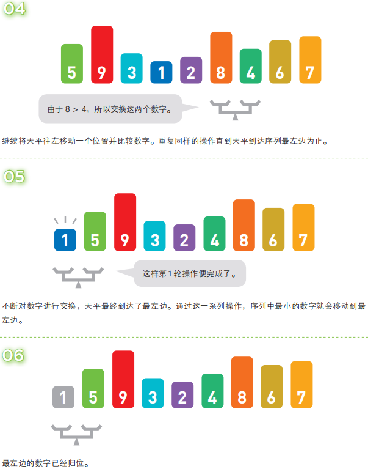
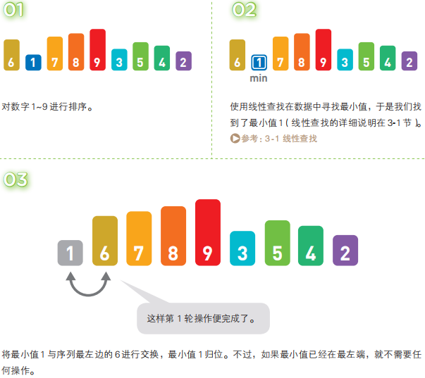
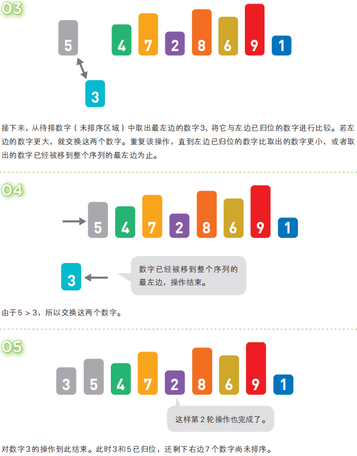
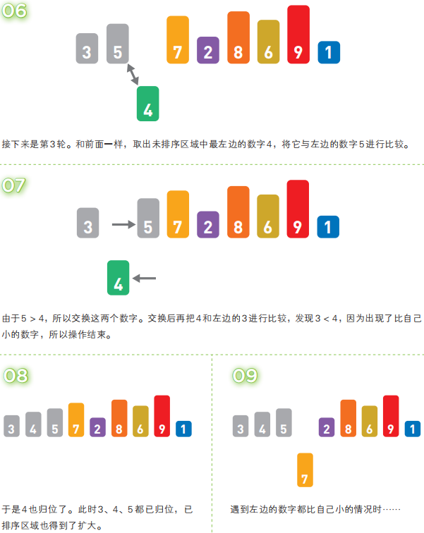

# 排序

## I. 什么是排序

排序就是将输入的数字按照从小到大的顺序进行排序. 


如果只有十个数字, 手动排序也能轻松完成, 但如果有10000个数据, 排序就不那么容易了, 这时, 使用高效率的排序算法便是解决问题的关键.

各种各样的排序算法

由于排序是一个比较基础的问题, 所以排序算法的种类也比较多. 在接下来的说明中, 输入的数字个数都设定为n.

## II. 冒泡排序

### 概念

冒泡排序就是重复"从序列右边开始比较相邻两个数字的大小, 再根据结果交换两个数字的位置"这一操作的算法. 在这个过程中, 数字也会像泡泡一样, 慢慢从右往左"浮"到序列的顶端, 所以这个算法才被称作"冒泡排序".





在冒泡排序中, 第1轮需要比较==**n - 1**==次, 第2轮需要比较n - 2次......第n - 1轮需要比较1次. 因此, 总的比较次数为(n -1) + (n - 2) + ...... + 1 ≈ n²/2. 这个比较次数恒定为该数值, 和输入数据的排列顺序无关.

不过, 交换数字的次数和输入数据的排列顺序有关. 假设出现某种极端情况, 如输入数据正好以从小到大的顺序排列, 那么便不需要进行任何交换; 反过来, 输入数据要是以从大到小的顺序排列, 那么每次比较数字后便都要进行交换. 因此, 冒泡排序的时间复杂度为O(n²).

### Python代码实现

```python
def bubbleSort(nums):
    for i in range(len(nums) - 1, 1, -1):
        for j in range(i - 1, -1, -1):
            if nums[j + 1] < nums[j]:
                nums[j + 1], nums[j] = nums[j], nums[j + 1]
    return nums
```

## III. 选择排序

### 概念

选择排序就是重复"从待排序的数据中寻找最小值, 将其与序列最左边的数字进行交换"这一操作的算法. 在序列中寻找最小值时使用的是线性查找




选择排序使用了线性查找来寻找最小值, 因此在第1轮中需要比较n - 1个数字, 第2轮需要比较n - 2个数字......到第n - 1轮的时候就只需比较1个数字了. 因此, 总的比较次数与冒泡排序的相同, 都是n²/2次.

每轮中交换数字的次数最多为1次, 如果输入数据就是按从小到大的顺序排列的, 便不需要进行任何交换. 选择排序的时间复杂度也和冒泡排序的一样, 都为O(n²)

### Python代码实现

```python
def selectionSort(arr):
    # 从头遍历待排序序列
    for i in range(len(arr) - 1):
        # 设当前i为最小值索引
        min_index = i
        # 从i后一位开始遍历
        for j in range(i + 1, len(arr)):
            # 若遍历到的数比最小值索引位置值小则设遍历到的索引为最小值索引
            if arr[j] < arr[min_index]:
                min_index = j
        # 循环结束若最小值索引发生改变
        if min_index != i:
            # 交换arr[min_index]和arr[i]
            arr[min_index], arr[i] = arr[i], arr[min_index]
    # 返回排序后序列
    return arr
```

## IV. 插入排序

### 概念

插入排序是一种从序列左端开始一次对数据进行排序的算法. 在排序过程中, 左侧的数据陆续归位, 而右侧留下的就是还未被排序的数据. 插入排序的思路就是从右侧的未排序区域内取出一个数据, 然后将它插入到已排序区域内合适的位置上







最差情况下, 第k轮需要比较k - 1次, 因此, 时间复杂度和冒泡排序的一样, 都为O(n²).

### Python代码实现

```python
def insertionSort(arr):
    for i in range(len(arr)):
        pre_index = i - 1
        cur_num = arr[i]
        while pre_index >= 0 and cur_num < arr[pre_index]:
            arr[pre_index + 1] = arr[pre_index]
            pre_index -= 1
        arr[pre + 1] = cur_num
    return arr
```

## V. 堆排序

### 概念


### Python代码实现

```python

```


## VI. 归并排序

### 概念


### Python代码实现

```python

```

## VII. 快速排序

### 概念


### Python代码实现

```python

```

