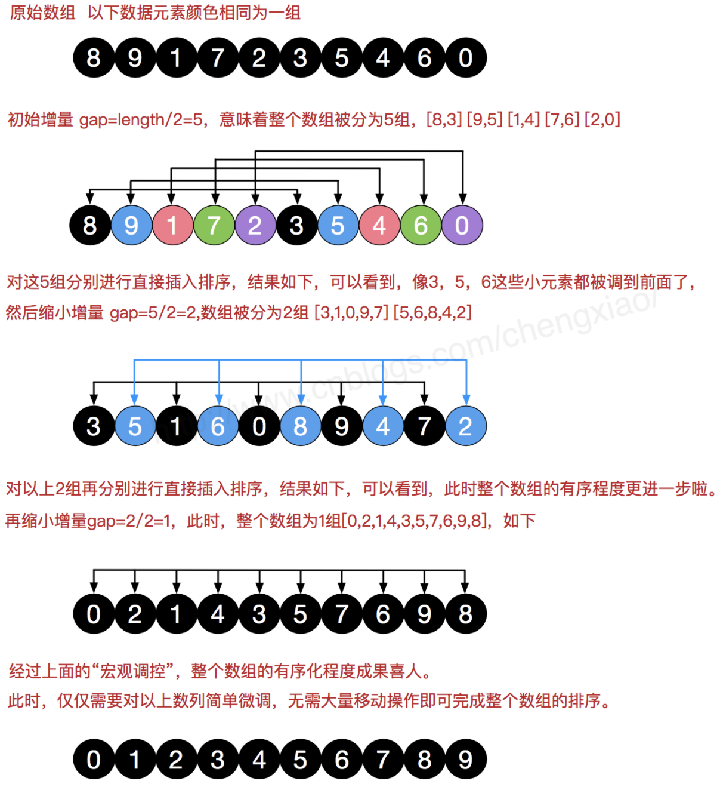

# 十大排序算法修炼

## I. 插入排序

> ##### 插入排序是一种最简单直观的排序算法, 它的工作原理是通过构建有序序列, 对于未排序数据, 在已排序序列中从后向前扫描, 找到相应位置并插入.

1. ### 算法步骤:

    将待排序序列第一个元素看做是一个有序序列, 把第二个元素到最后一个元素当成是未排序序列. 从头到尾依次扫描未排序序列, 将扫描到的每个元素插入有序序列的适当位置. 

    如果待插入的元素与有序序列中的某个元素相等, 则将插入元素插入到相等元素的后面.

    形象地理解就是打牌理牌的过程.

2. ### 代码实现:

    ```python
    def insertionSort(arr):
        # 从头遍历arr
        for i in range(len(arr)):
            # 取当前遍历到的位置前一个位置作为向前遍历的起点
            pre_index = i - 1
            # 取当前位置的数字
            cur_num = arr[i]
            # 当之前位置可取且当前位置数小于之前位置数时
            while pre_index >= 0 and cur_num < arr[pre_index]:
                # 将当前位置用之前位置数填上
                arr[pre_index + 1] = arr[pre_index]
                # 向左遍历一位
                pre_index -= 1
            # 当pre_index已经遍历到头或是当前数字大于pre_index位置的数时
            arr[pre_index + 1] = cur_num
        return arr
    ```


## II. 希尔排序

> ##### 希尔排序也称为递减增量排序算法, 是插入排序的一种更高效的改进版本.
>
> ##### 先将整个待排序的记录序列分割成为若干子序列分别进行直接插入排序, 待整个序列中的记录基本有序时, 再对全体记录进行依次直接插入排序.

1. ### 算法步骤:

    

2. ### 代码实现:

    ```python
    
    ```

    