# 项目需求与技术架构

## 1. 大数据业务需求

- 需求本质

  通过对相关数据的处理和分析，提取隐藏在数据中的价值，为公司==赚更多的钱==。

  这也是公司为什么愿意花钱招人、买装备投入大数据的核心原因。

- 数据分析

  ```shell
  对公司中的业务数据进行分析处理，根据业务需求计算出各种指标，实现运营支撑。
  赚取的实现途径：买卖产品或服务。
  
  #1、需要更多新客户
  	方式：推广拉新
  	指标：广告播放量、点击量、注册量、推广渠道成本占比、转化比等
  
  #2、让新用户消费
  	方式：优惠券、现金券等优惠活动(首单优惠30%、满100减20)
  	指标：登录次数、收藏次数、加入购物车次数、首单转化率
  	
  	推荐系统：基于对用户数据的分析，构建用户画像，精准把握用户需求，实现精准推荐。
  	#兴趣爱好：颜色、品牌、价格区间、之前购买信息、当前搜索浏览信息
  
  #3、让老用户留存
  	方式：解决用户痛点、迎合用户兴趣点
  	指标：退款次数、好评数、差评数、留存率、不同终端成交占比
  
  #4、降低运营成本
  	指标：销售收入、成交额、退款额，再细分为不同维度不同粒度（不同渠道、不同终端、不同地区、不同日期）
  	
  	风控系统：安全领域、金融领域
  	#统计分析一个恶意访问，拦截和屏蔽恶意访问
  	#信用风控
  ```

## 2. 新零售背景介绍

> ==零售（Retailing）==：直接将商品或服务销售给个人消费者或最终消费者的商业活动。
>
> 随着经济和技术的发展，经历了多种不同形式的发展。

- 地摊、卖货郎
- 百货商店
- 超级市场
- 连锁商店
- 电子商务
- 新零售

## 3. 新零售项目业务流程

### 3.1. 商品上架, 单店铺订单

商品上架

```shell
==SPU==(Standard Product Unit)：标准化产品单元。是商品信息聚合的最小单位，是一组可复用、易检索的标准化信息的集合，该集合描述了一个产品的特性。

==SKU==(Stock Keeping Unit)：库存量单位。可以是以件、盒、托盘等为单位。SKU是物理上不可分割的最小存货单元。

举个栗子：

SPU：是拿来给用户购买商品==查询==的，比如: iPhone X。SPU只是代表型号，与规格，颜色和款式无关;
SKU：是用户点击进来展示的，==加上颜色,尺寸等属性==。一部手机一个SKU，如iPhone X 土豪金 64G 和 iPhone X 土豪金 128G的SKU是不同的。
```


```properties
1、平台发布统一的商品分类信息、品牌信息和商品SPU信息；
2、店铺商家在发布商品SKU时，可以通过系统查询类似的平台SPU商品；
3、如果存在SPU，可直接复制商品信息后进行完善；如果不存在SPU则需要商家自己填写商品详情；
4、完善商品SKU信息后，商家需要提交给平台进行审核；
5、审核通过后即可发布此商品，否则需要重新编辑并提交审核；
```

- 单店铺订单

  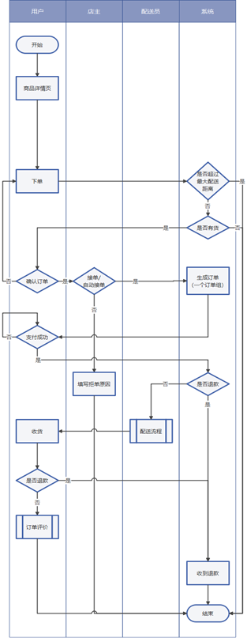

  ```properties
  1、用户在商品详情页直接下单；
  2、校验订单，是否超出最大配送距离、商品是否有货等；
  3、用户确认订单，商家手动接单或自动接单；如果拒绝接单，填写拒单原因后订单结束；
  4、系统生成订单：一个订单组下包含多个订单；
  5、用户进行支付，支付失败则重新发起支付；
  6、进入配送流程之前，先判断是否已发起退款，如申请退款则进入退款流程，否则进入配送流程；
  7、当配送员送达订单时，配送流程结束。在用户确认收货时，如发现包裹（损坏、漏发、不想要）可申请退款，并交
  8、由系统确认并直接退款；否则用户进行确认收货，对配送服务和商品进行评价，订单结束
  ```

### 3.2. 购物车订单, 配送

- 购物车订单

  

  ```properties
  1、用户将多个店铺的商品添加到购物车后，在购物车下单；
  2、校验订单，是否超出最大配送距离、商品是否有货等；
  3、用户确认订单，商家手动接单或自动接单；如果拒绝接单，填写拒单原因后订单结束；
  4、系统生成订单组：为了方便订单的优惠规则和配送费计算，一个店铺的商品生成一个子订单，多个子订单组成一个订单组；
  5、用户进行支付，支付失败则重新发起支付；
  6、进入配送流程之前，先判断是否已发起退款，如申请退款则进入退款流程，否则进入配送流程；
  7、当配送员送达订单时，配送流程结束。在用户确认收货时，如发现包裹（损坏、漏发、不想要）可申请退款，并交由系统确认并直接退款；否则用户进行确认收货，对配送服务和商品进行评价，订单结束。
  ```

- 配送

  

  ```properties
  1、商圈圈主设定配送规则(平台审核)：最低配送费用、每公里增加配送费用、最大配送距离等；
  2、用户下单，系统判定是否满足最大配送距离，不满足则下单失败；
  3、配送员接单，系统发送收货码给用户；
  4、配送员到店取货，系统记录状态；
  5、配送员送货到家，索取用户的收货码，并确认送达；或由客户主动完成订单；
  6、订单结束。
  ```

### 3.3. 退款退货

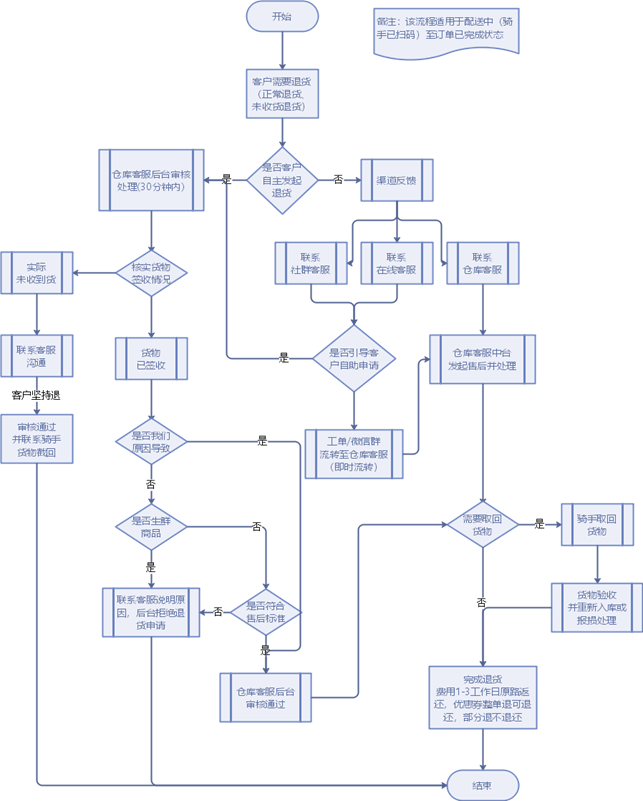

```properties
1、客户下单后且已处于配送中
2、如果用户因未收到货或正常退货原因而主动发起退货申请则交给仓库审核实际签收情况，如果是已签收申请退货，则判断是否因为卖方原因导致（是生鲜则拒绝退款，非生鲜时判断是否符合售后标准，不符合拒绝退款，符合售后标准时审核通过，判断是否取回货物，如果已取回则完成退货，如未取回则由骑手取回并验收重新入库已完成退货）；如果未收到货则联系客户（重新发），此时客户坚持退款，则由仓库联系骑手截回货物再完成退货
3、如果非用户主动取消订单则交给渠道，并由渠道反映到客服（社群、400客服和仓客服），如果是社群客服和400客服时则引导用户自助取消订单，成功引导客户自助取消订单时（按照第2步流程走），否则由智齿工单或微缩群实时提交到仓客服，然后仓客服则通过中台系统来发起售后，并判断是否已取回货物，如未取回则联系骑手取回并验货重新入库已完成退货
```

## 4. 新零售项目原始数据

- 概念

  ```properties
  原始数据:指的就是业务数据，原始这个说法是相对大数据应用而言的。
  
  原始数据按照子系统划分:订单模块、支付模块、店铺模块、商品模块、用户模块、系统配置模块、广告模块、促销模块和配送模块等。
  
  首先面临的问题是:业务系统的开展会源源不断产生很多业务数据，存储在哪里？什么样的系统适合存储业务数据？支撑业务的顺利开展？
  ```

- 存储问题

  ```properties
  操作型处理: 联机事务处理OLTP（On-Line Transaction Processing，），也可以称面向交易的处理系统，它是针对具体业务在数据库联机的日常操作，通常对少数记录进行查询、修改。
  
  在OLTP系统中，用户较为关心操作的响应时间、数据的安全性、完整性和并发支持的用户数等问题。
  
  传统的关系型数据库系统（RDBMS）作为数据管理的主要手段，主要用于操作型处理。
  ```

  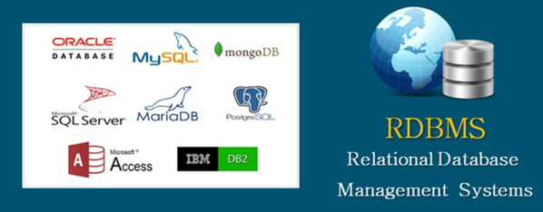

  > OLTP系统可以直接开展数据分析吗？==**可以，但是没必要**==。

  ```properties
  1、OLTP系统的核心是面向业务，支持业务，支持事务。所有的业务操作可以分为读、写两种操作，一般来说读的压力明显大于写的压力。
  
  2、如果在OLTP环境直接开展各种分析，有以下问题需要考虑：
  	数据分析也是对数据进行读取操作，会让读取压力倍增；
  	OLTP仅存储数周或数月的数据；
  	数据分散在不同系统不同表中，字段类型属性不统一；
  ```

- 相关表信息

  

  > 业务系统最大特点：表很多，表关系很复杂。可以根据主题相关性进行梳理。

  - 订单相关

  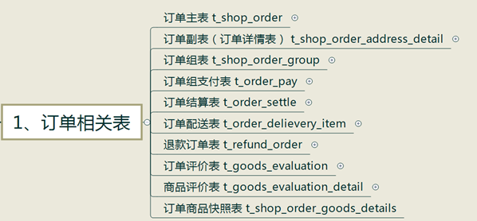

  - 店铺相关

    

  - 商品相关

    

  - 用户、配置相关

    

    

## 5. 新零售项目业务需求

- 研发阶段

  ```properties
  第一阶段
  
  	目标
  		1．完成10个hadoop集群节点的搭建工作
  		2．完成调度平台的搭建工作
  		3．完成基础数据迁移 mysql--> Hadoop平台
  		4．完成:销售模块的数据建模
  		5．能够满足业务对于基础销售的需求
  		
  	资源
  		1．人员
      		项目经理一名
  			数据开发工程师三名
  			数据分析师2名
  		2．时间
  			3个月
  -----------------------------------------------------------------------------------
  第二阶段
  	目标
  		1．完成32个hadoop节点的扩容工作
  		2．完成相应内存计算平台presto集群的搭建
  		3．完成整个源系统的数据抽取工作
  		4．完成:销售模块、用户模块、商品模块、促销模块数据建模工作
  		5．满足公司日常运营的80%的数据需求和报表需求
  		6．支撑财务的成本和利润的核算
  		7．完成准实时数据的数据应用开发工作
  	资源
  		1．人员
      		项目经理一名
  			数据开发工程师四名
  			数据分析师3名
  		2．时间
  			4个月
  
  课程中主要讲解销售、商品和用户三个模块。
  ```

- 主题报表需求

  - 销售主题

    ```properties
    可分析的主要指标有:销售收入、平台收入、配送成交额、小程序成交额、安卓APP成交额、苹果APP成交额、PC商城成交额、订单量、参评单量、差评单量、配送单量、退款单量、小程序订单量、安卓APP订单量、苹果APP订单量、PC商城订单量。
    
    维度有:日期、城市、商圈、店铺、品牌、大类、中类、小类。
    ```

  - 商品主题

    ```properties
    主要指标有:下单次数、下单件数、下单金额、被支付次数、被支付金额、被退款次数、被退款件数、被退款金额、被加入购物车次数、被加入购物车件数、被收藏次数、好评数、中评数、差评数。
    
    维度有:商品、日期。
    ```

  - 用户主题

    ```properties
    主要指标有:登录次数、收藏店铺数、收藏商品数、加入购物车次数、加入购物车金额、下单次数、下单金额、支付次数、支付金额。
    
    维度有:用户、日期。
    ```

- 数据与集群规模

  ```properties
  性能指标
  	对于报表展现的内容刷新，页面数据的请求到展现的过程总体时间不能超过5秒。
  	
  	对于大数据处理，如果需要短时间内获取结果，应该怎么做？
  		1、不用离线处理 用实时计算  基于内存计算  Spark Flink
  		2、预计算  提前把所有理论组合的结果都处理计算好 保存起来  获取结果的时候需要什么返回
  	
  	
  数据量
  	1 全量 
  		经过4年左右的业务发展，整个数据平台的数据为35T左右，冗余存储量为105T。
  	2 增量
  		每日增量25G左右。
  集群规模 
  	40台服务器
  	操作系统	CentOS 7.5 x86 74
  
  软件版本
  	java	1.8
  	hadoop	3.0.0+cdh6.2.1
  	hdfs	3.0.0+cdh6.2.1
  	Hive	2.1.1+cdh6.2.1
  	yarn	3.0.0+cdh6.2.1
  	zookeeper	3.4.5-cdh6.2.1
  	presto	0.245.1
  ```

## 6. 大数据处理流程

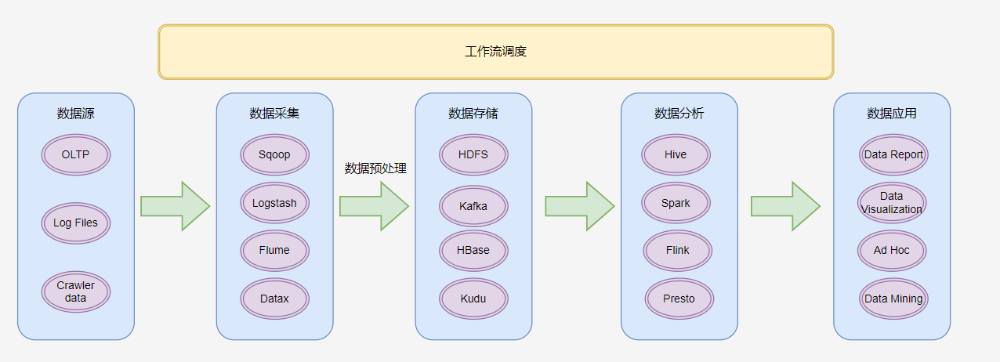

- 数据源

  > 需要大家掌握，当下企业中，可供开展数据分析的数据到底有哪些种类，来自于哪里。

  ```properties
  OLTP系统
  	典型代表:RDBMS(关系型数据库管理系统 如MySQL ORACLE)
  	存储:用于支撑业务平台顺利实施的各种业务数据
  	内容:用户数据、商品数据、订单存储、评论数据等
  	
  Log Files(日志文件)	
  	用户行为数据:用户在平台上所有的操作行为,如注册、登陆、浏览、收藏、添加购物车、搜索、支付等
  	(埋点收集用户行为)
  	服务器或应用日志数据:程序应用运行日志  服务器运行日志
  	
  Crawler Data(爬虫数据)
  	组根据实际的数据需求，爬取其他网站的数据
  	存储格式:文件、关系型数据库表
  ```

- 数据采集

  > 关于具体含义要结合语境具体分析，明白语境中具体含义即可。

  ```properties
  数据采集概念，目前行业会有两种解释
  
  	一是:数据从无到有产生的过程（服务器打印的log、传感器采集的数据等）叫做数据采集；
  	二是:把通过使用Flume等工具把数据采集搬运到指定位置的这个过程叫做数据采集。
  ```

- 数据存储

  > 大数据应用下，几乎都是分布式存储软件。
  >
  > 多台机器共同存储，分区机制、副本机制是核心的概念。

- 数据分析

  

  ```properties
  数据分析是指用适当的分析方法及工具，对处理过的数据进行分析，提取有价值的信息，形成有效结论的过程。
  
  由于数据分析多是通过软件来完成的，这就要求数据分析师不仅要掌握各种数据分析方法，还要熟悉数据分析软件的操作。
  
  ```

- 数据应用

  ```properties
  Data Report:数据报表，用表格、图型等格式来动态显示数据。
    
  Data Visualization:数据可视化主要旨在借助于图形化手段，清晰有效地传达与沟通信息。
    
  Ad Hoc:即席查询。是用户根据自己的需求，灵活的选择查询条件，系统能够根据用户的选择生成相应的统计报表。即席查询与普通应用查询最大的不同是普通的应用查询是定制开发的，而即席查询是由用户自定义查询条件的。
    
  Data Mining:数据挖掘。是指从大量的数据中通过算法搜索隐藏于其中信息的过程。数据挖掘通常与计算机科学有关，并通过统计、在线分析处理、情报检索、机器学习、专家系统（依靠过去的经验法则）和模式识别等诸多方法来实现上述目标。
  ```

- 工作流调度

  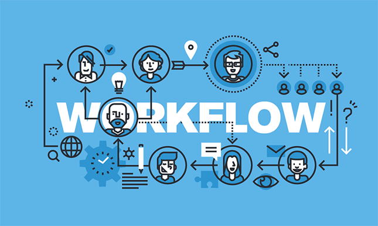

  ```properties
  指业务过程的部分或整体在计算机应用环境下的自动化。
  是对工作流程及其各操作步骤之间业务规则的抽象、概括描述。
  
  关键字:周期性执行 重复性执行
  ```

## 7. 大数据常用技术选型

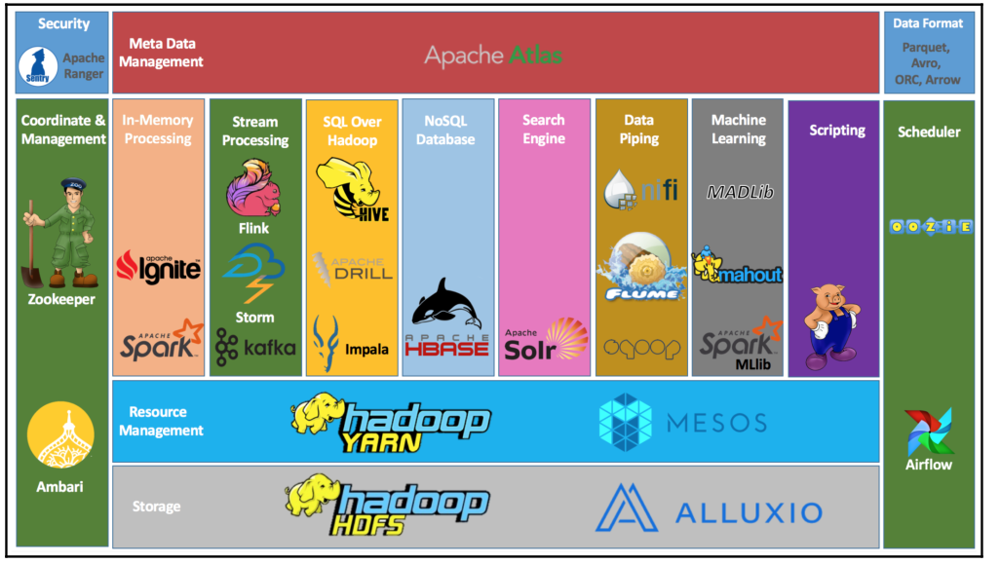

```properties
一、数据采集
	Apache Flume:实时数据流采集  实时采集日志文件   tail -f
	Apache Sqoop:离线数据库采集  
	ali Canal:实时数据库采集  MySQL binlog 实时增量采集
	ali Datax:离线数据同步工具/平台 
	Logstash:全场景数据采集工具  ELK Stack   https://www.elastic.co/cn/what-is/elk-stack

	
二、数据存储
	Zookeeper:分布式协调服务，本质依旧是一个存储系统，只能存储少量数据。本职工作还是协调服务。
	HDFS:分布式文件系统，以文件的方式来管理数据
	Hive:数据仓库，将结构化数据文件映射成为表，提供类SQL查询分析功能。
	
	#实时领域
	Hbase（Hadoop database）:基于Hadoop的一个按列存储的NoSQL数据库  BigTable
	Redis:纯内存式的KV结构的NoSQL数据库
	Kafka:分布式实时消息队列(MQ)
	
	ElasticSearch:全文检索引擎
	MySQL:关系型业务数据库

三、数据分析
	MapReduce:离线批处理系统，第一代计算引擎
	Hive:基于SQL的MapReduce/Tez/Spark引擎
	Spark:分布式技术栈
		Core：类似于MapReduce
		SQL：类似于Hive
		Streaming：流式实时计算
		Structured Streaming 结构化流  实时计算
	Flink:实时计算工具  也可以做离线计算
	
	Impala、Presto、Kylin:OLAP分析工具 查询速度快
	
四、其他工具
	统一可视化终端UI:Hue
	集群管理维护:Cloudera Manager、Ambari
	任务流调度:Oozie、Azkaban、AirFlow
	元数据管理:Atlas
```

## 8. 大数据平台架构

- ==Lambda架构==：离线和实时是两套架构

  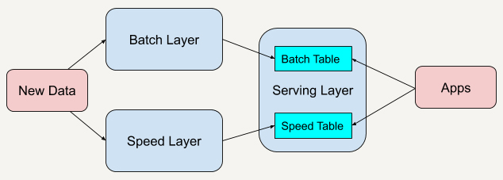

  ```properties
  Lambda 架构（Lambda Architecture）是由 Twitter 工程师南森·马茨（Nathan Marz）提出的大数据处理架构。这一架构的提出基于马茨在 BackType 和 Twitter 上的分布式数据处理系统的经验。
  
  Lambda架构总共由三层系统组成：
  	批处理层（Batch Layer）
  	速度处理层（Speed Layer）
  	用于响应查询的服务层（Serving Layer）
  	
  =批处理层存储管理主数据集（不可变的数据集）和预先批处理计算好的。
  =速度处理层会实时处理新来的大数据。速度层通过提供最新数据的实时视图来最小化延迟。
  =所有在批处理层和速度层处理完的结果都输出存储在服务层中，服务层通过返回预先计算的数据视图或从速度层处理构建好数据视图来响应查询。
  
  虽然 Lambda 架构使用起来十分灵活，并且可以适用于很多的应用场景，但在实际应用的时候，Lambda 架构也存在着一些不足，主要表现在它的维护很复杂。
  
  使用Lambda架构时，架构师需要维护两个复杂的分布式系统，并且保证他们逻辑上产生相同的结果输出到服务层中。
  ```

- ==Kappa架构==：流批一体架构

  

  ```properties
  Kappa 架构是由 LinkedIn 的前首席工程师杰伊·克雷普斯（Jay Kreps）提出的一种架构思想。克雷普斯是几个著名开源项目（包括 Apache Kafka 和 Apache Samza 这样的流处理系统）的作者之一，也是现在 Confluent 大数据公司的 CEO。
  
  Kappa 架构去掉了批处理层这一体系结构，而只保留了速度层。你只需要在业务逻辑改变又或者是代码更改的时候进行数据的重新处理。
  
  因为 Kappa 架构只保留了速度层而缺少批处理层，在速度层上处理大规模数据可能会有数据更新出错的情况发生，这就需要我们花费更多的时间在处理这些错误异常上面。
  ```

## 9. 新零售项目架构

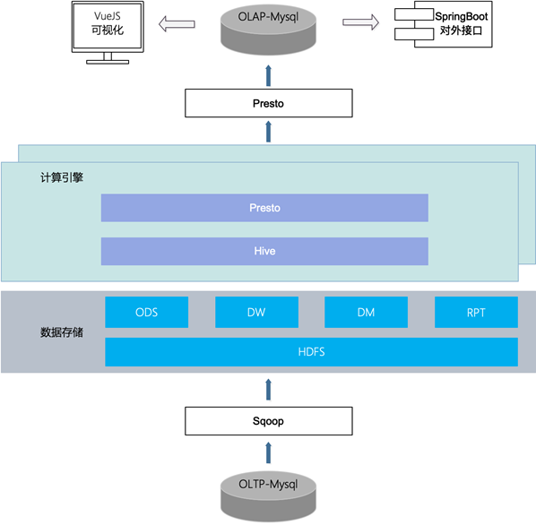

```properties
数据源:业务系统的Mysql数据库

数据抽取:使用Sqoop实现关系型数据库和大数据集群的双向同步

数据存储:HDFS

计算引擎:Hive、Presto

数据同步:Sqoop

工作流调度:Oozie
```

> 几乎所有的大数据离线项目都是这一套数仓架构。核心就是数仓搭建、分层与模型。

## 10. 大数据平台搭建方式

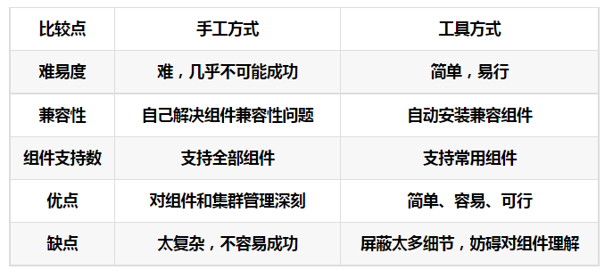

- 手动部署

  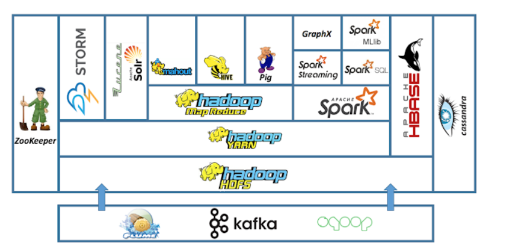

  ```properties
  优点
  	灵活性和安全性、自定义的程度最高
  缺点
  	如果集群的机器比较多，安装和管理就比较麻烦
  	如果有一台的配置改变了，其他的都要手动同步
  	版本之间的兼容性问题考虑十分棘手 木桶短板效应
  	要求运维人员精通计算机底层和大数据应用
  ```

- 集群管理工具部署

  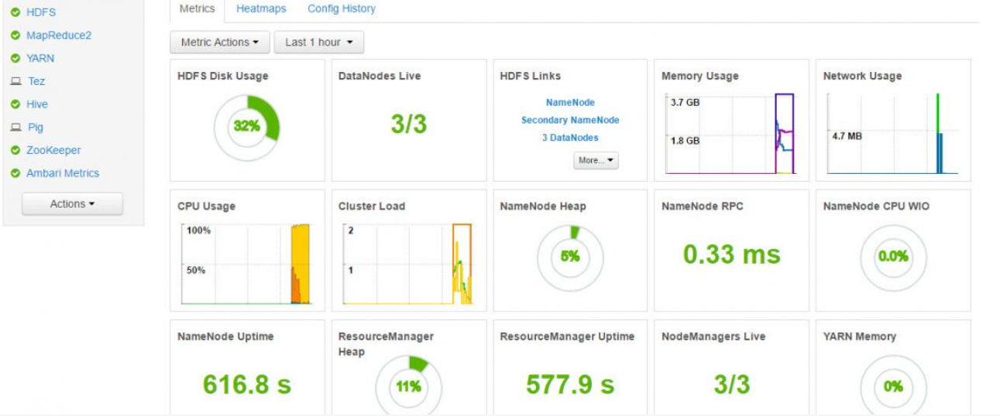

  ```properties
  优点
  	由管理工具来实现批量化的同步操作：安装、配置
  	有监控管理：进程监控、资源监控
  	可以所有程序管理：不需要命令行，通过可视化界面来管理所有服务
  	
  缺点
  	Cloudera Manager：对很多非Cloudera公司的产品不兼容  大规模商业部署收费
  	Apache Ambari：Bug比较多，兼容性较差  魔改
  ```

## 11. Cloudera Manager


https://www.cloudera.com/products/product-components/cloudera-manager.html

> 首先需要区分3个单词
>
> 1、==Cloudera==   商业公司名字  排名第一的大数据商业公司
>
> 2、Cloudera  Manager（==CM==） 集群安装部署软件
>
> 3、Cloudera’s Distribution Including Apache Hadoop（==CDH==）  Cloudera发布商业版本的大数据软件
>
> ==只要软件的CDH版本号一致 ，那么软件之间一定是兼容的==。

- 介绍

  ```properties
  Cloudera Manager(简称CM)是Cloudera公司开发的一款大数据集群安装部署利器.
  这款利器具有集群自动化安装、中心化管理、集群监控、报警等功能，使得安装集群从几天的时间缩短在几小时以内，运维人员从数十人降低到几人以内，极大的提高集群管理的效率。
  
  cloudera manager有四大功能：
  	（1）管理：对集群进行管理，如添加、删除节点等操作。
  	（2）监控：监控集群的健康情况，对设置的各种指标和系统运行情况进行全面监控。
  	（3）诊断：对集群出现的问题进行诊断，对出现的问题给出建议解决方案。
  	（4）集成：对hadoop的多组件进行整合。
  ```

- CM架构

  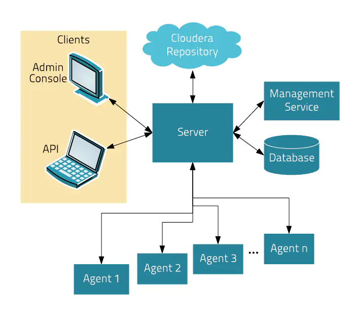

  ```properties
  Server:Cloudera Manager的核心是Cloudera Manager Server。提供了统一的UI和API方便用户和集群上的CDH以及其它服务进行交互，能够安装配置CDH和其相关的服务软件，启动停止服务，维护集群中各个节点服务器以及上面运行的进程。
  
  Agent:安装在每台主机上的代理服务。它负责启动和停止进程，解压缩配置，触发安装和监控主机 
  
  Management Service:执行各种监控、报警和报告功能的一组角色的服务
  
  Database:CM自身使用的数据库，存储配置和监控信息
  
  Cloudera Repository:云端存储库，提供可供Cloudera Manager分配的软件 
  
  Client:用于与服务器进行交互的接口，包含Admin Console和API
  	(1)	Admin Console：管理员可视化控制台 
  	(2)	API：开发人员使用API可以创建自定义的Cloudera Manager应用程序
  ```

