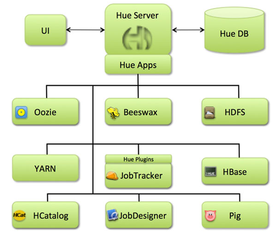

# 数仓生态圈辅助工具

## 1. 数据分析交互平台Hue

### 1.1. Hue介绍

```properties
HUE=Hadoop User Experience

	Hue是一个开源的Apache Hadoop UI系统，由Cloudera Desktop演化而来，最后Cloudera公司将其贡献给Apache基金会的Hadoop社区，它是基于Python Web框架Django实现的。
	通过使用Hue，可以在浏览器端的Web控制台上与Hadoop集群进行交互，来分析处理数据，例如操作HDFS上的数据，运行MapReduce Job，执行Hive的SQL语句，浏览HBase数据库等等。
```

### 1.2. Hue功能

通过使用Hue，可以在浏览器端的Web控制台上与Hadoop集群进行交互，来分析处理数据，例如操作HDFS上的数据，运行MapReduce Job，执行Hive的SQL语句，浏览HBase数据库等等。

### 1.3. Hue架构原理

```properties
	Hue是一个友好的界面集成框架，可以集成各种大量的大数据体系软件框架，通过一个界面就可以做到查看以及执行所有的框架。
	Hue提供的这些功能相比Hadoop生态各组件提供的界面更加友好，但是一些需要debug的场景可能还是要使用原生系统才能更加深入的找到错误的原因。
```



### 1.4. Hue安装与Web UI界面

- Hue安装

  - 官方下载源码包、手动编译安装

    ```
    最大的挑战在于软件之间的兼容性问题。
    ```

  - 使用CM集群在线安装

- Hue Web UI页面

  - 从CM集群页面进入

    http://hadoop01:7180/cmf  用户名密码：admin

    

    

  - 浏览器直接进入

    http://hadoop02:8889/hue   用户名密码：hue

  

### 1.5. Hue操作HDFS

- 进入HDFS管理页面

  

  

  

- 新建文件、文件夹

- 上传、下载文件

- 查看文件内容

- 在线实时编辑文件内容

- 删除文件

- 修改文件权限

### 1.6.  Hue操作Hive

- 进入Hive面板

  

- SQL编写、执行

## 2. 数据迁移同步工具Sqoop

### 2.1. 如何理解ETL

- ETL定义

  > 百科定义：ETL（Extract-Transform-Load）是将数据从来源端经过==抽取（extract）==、==转换（transform）==、==加载（load）==至目的端的过程。
  >
  > ETL较常用在数据仓库中，是将原始数据经过抽取（Extract）、清洗转换（Transform）之后加载（Load）到数据仓库的过程，目的是将企业中的分散、零乱、标准不统一的数据整合到一起，为企业的决策提供分析依据。

  

  - 数据抽取(E)

    ```shell
    确定数据源，需要确定从哪些源系统进行数据抽取;
    定义数据接口，对每个源文件及系统的每个字段进行详细说明;
    确定数据抽取的方法：是主动抽取还是由源系统推送？
    是增量抽取还是全量抽取？是按照每日抽取还是按照每月抽取？
    
    
    常见的抽取源系统：
    #1、从RDBMS抽取数据
    	通常OLTP系统采用RDBMS存储业务操作数据，从RDBMS抽取操作型数据是最多一种数据抽取方式。
    数据从RDBMS抽取后通常会先以文件的方式存储到分布式文件系统中（例如HDFS），方便ETL程序读取原始数据。也有的是将抽取后的数据直接存储到数据仓库中，采用第二种方法需要提前在数据仓库创建与原始数据相同结构的数据仓库模型。
    
    #2、从日志文件抽取
    	OLTP系统通过日志系统将用户的操作日志、系统日志等存储在OLTP服务器上，由专门的采集程序从服务器上采集日志文件信息。
    
    #3、从数据流接口抽取
    	OLTP系统提供对外输出数据的接口（比如telnet），采集系统与该接口对接，从数据流接口抽取需要的数据。
    ```

  - 数据转换(T)

    ```shell
    	数据转换也叫做数据清洗转换。是将采集过来的原始数据（通常原始数据存在一定的脏数据）清洗（过虑）掉不符合要求的脏数据，并且根据数据仓库的要求对数据格式进行转换。
    	通常经过数据清洗转换后是符合数据仓库要求的数据。
    
    #具体包括
    剔除错误：明显和需求无关的数据进行剔除处理
    空值处理：可捕获字段空值，进行加载或替换为其他含义数据
    数据标准：统一标准字段、统一字段类型定义  date  timestamp
    数据拆分：依据业务需求做数据拆分，如身份证号，拆分区划、出生日期、性别等
    数据验证：时间规则、业务规则、自定义规则
    数据转换：格式转换或者内容转换
    数据关联：关联其他数据或数学，保障数据完整性
    
    #栗子
    	枚举 :有穷数据的集合
    	星期：1 2 3 4 5 6 7
    	颜色：a b c d e f g
    		 a--红色
    		 b--绿色
        省份:  31  32  33  34  35		 
    ```

  - 数据加载(L)

    ```shell
    数据加载就是清洗转换后的数据存储到数据仓库中，数据加载的方式包括：全量加载、增量加载。
    
    #全量加载：
    	全量加载相当于覆盖加载的方式，每个加载都会覆盖原始数据将数据全部加载到数据仓库。此类加载方式通常用于维度数据。
    #增量加载：
    	增量加载按照一定的计划（通常是时间计划）逐步的一批一批的将数据加载到数据仓库，此类加载方式通常用于OLTP的业务操作数据。
    ```

- ETL与ELT的区别

  - ETL

    ```
    	按其字面含义理解就是按照E-T-L这个顺序流程进行处理：先抽取、然后转换、完成后加载到目标中。
    	在ETL架构中，数据的流向是从源数据流到ETL工具，ETL工具是一个单独的数据处理引擎，一般会在单独的硬件服务器上，实现所有数据转化的工作，然后将数据加载到目标数据仓库中。
    	如果要增加整个ETL过程的效率，则只能增强ETL工具服务器的配置，优化系统处理流程（一般可调的东西非常少）。
    ```

    

  - ELT

    ```
    	ELT架构则把“L”这一步工作提前到“T”之前来完成：先抽取、然后加载到目标数据库中、在目标数据库中完成转换操作。
    	比如Hive作为数据仓库工具，本身就具备通过SQL对数据进行各种转换的操作。（insert+select ）
    ```

    

- 结论

  - 如果是做传统的数仓  需要 一款专门专业ETL工具  完成数据抽取转换加载动作  而且是在进入数仓之前完成

  - 大数据时代的数仓发生了改变 把转换动作放置在数仓中完成  因此在数仓之前只需要抽取和加载即可。

    这样的话ETL工具职责就可以大大降低了。

  - 当下的语境中，把ETL的范围描述更大：从数据产生开始到最终应用之前，经历的各种调整转换都叫着ETL。因此有的公司把数仓工程师叫做==ETL工程师==（包括离线和实时）

### 2.2. Apache Sqoop介绍与工作机制

- Sqoop介绍

  ```properties
  sqoop是apache旗下一款“Hadoop和关系数据库服务器之间传送数据”的工具。
  导入数据：MySQL，Oracle导入数据到Hadoop的HDFS、HIVE、HBASE等数据存储系统；
  导出数据：从Hadoop的HDFS、HIVE中导出数据到关系数据库mysql等。
  
  sqoop  sql+hadoop
  ```

  

- Sqoop工作机制

  ```
  Sqoop工作机制是将导入或导出命令翻译成mapreduce程序来实现。
  在翻译出的mapreduce中主要是对inputformat和outputformat进行定制。
  ```

  

- sqoop安装、测试

  ```shell
  sqoop list-databases --connect jdbc:mysql://localhost:3306/ --username root --password 123456
  
  #也可以这么写  \表示命令未完待续 下一行还有命令参数  否则遇到回车换行就会自动提交执行
  sqoop list-databases \
  --connect jdbc:mysql://localhost:3306/ \
  --username root \
  --password 123456
  
  
  sqoop list-databases \
  --connect jdbc:mysql://localhost:3306/ \
  --username root \
  --password 123456
  ```

### 2.3. 增量数据与全量数据

- 全量数据（Full data）

  > 就是全部数据，所有数据。如对于表来说，就是表中的所有数据。

- 增量数据（Incremental data）

  > 就是上次操作之后至今产生的新数据。

- 数据子集

  > 也叫做部分数据。整体当中的一部分。

### 2.4. Sqoop数据导入至HDFS


### 2.5 Sqoop数据导入至Hive


### 2.6. Sqoop数据导入至Hive--HCatalog API


### 2.7. Sqoop数据导入--条件部分导入


### 2.8. Sqoop数据导入--增量导入


### 2.9. Sqoop数据导出


## 3. 工作流调度工具Oozie

### 3.1. 工作流介绍


### 3.2. Apache Oozie介绍与架构


### 3.3. Oozie工作流类型


### 3.4. Oozie使用案例


