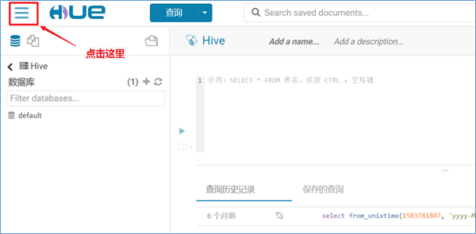
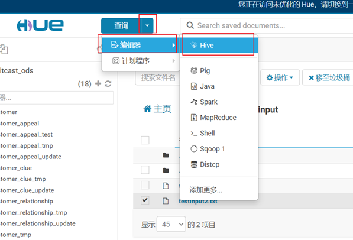
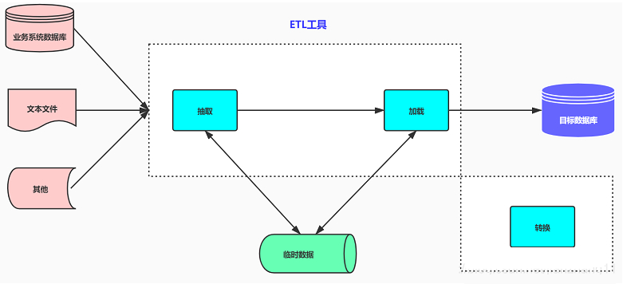
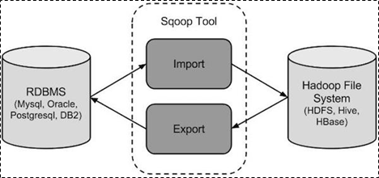
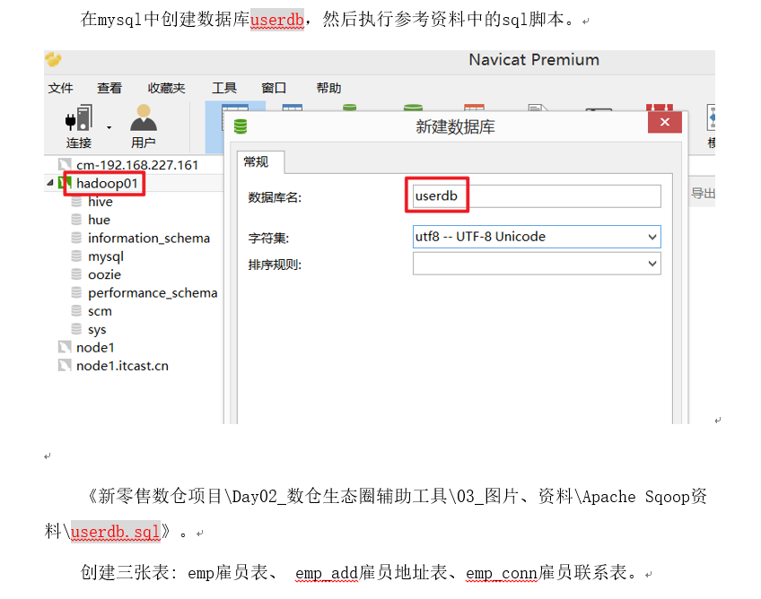
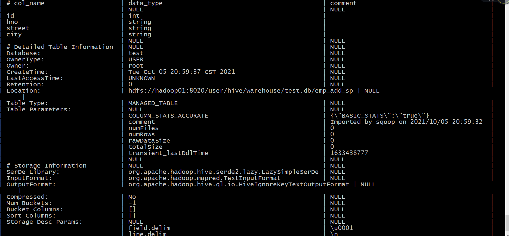

# 数仓生态圈辅助工具

## 1. 数据分析交互平台Hue

### 1.1. Hue介绍

```properties
HUE=Hadoop User Experience

	Hue是一个开源的Apache Hadoop UI系统，由Cloudera Desktop演化而来，最后Cloudera公司将其贡献给Apache基金会的Hadoop社区，它是基于Python Web框架Django实现的。
	通过使用Hue，可以在浏览器端的Web控制台上与Hadoop集群进行交互，来分析处理数据，例如操作HDFS上的数据，运行MapReduce Job，执行Hive的SQL语句，浏览HBase数据库等等。
```

### 1.2. Hue功能

通过使用Hue，可以在浏览器端的Web控制台上与Hadoop集群进行交互，来分析处理数据，例如操作HDFS上的数据，运行MapReduce Job，执行Hive的SQL语句，浏览HBase数据库等等。

### 1.3. Hue架构原理

```properties
	Hue是一个友好的界面集成框架，可以集成各种大量的大数据体系软件框架，通过一个界面就可以做到查看以及执行所有的框架。
	Hue提供的这些功能相比Hadoop生态各组件提供的界面更加友好，但是一些需要debug的场景可能还是要使用原生系统才能更加深入的找到错误的原因。
```


### 1.4. Hue安装与Web UI界面

- Hue安装

  - 官方下载源码包、手动编译安装

    ```
    最大的挑战在于软件之间的兼容性问题。
    ```

  - 使用CM集群在线安装

- Hue Web UI页面

  - 从CM集群页面进入

    http://hadoop01:7180/cmf  用户名密码：admin

    

    

  - 浏览器直接进入

    http://hadoop02:8889/hue   用户名密码：hue

  

### 1.5. Hue操作HDFS

- 进入HDFS管理页面

  

  

  

- 新建文件、文件夹

- 上传、下载文件

- 查看文件内容

- 在线实时编辑文件内容

- 删除文件

- 修改文件权限

### 1.6.  Hue操作Hive

- 进入Hive面板

  

- SQL编写、执行

## 2. 数据迁移同步工具Sqoop

### 2.1. 如何理解ETL

- ETL定义

  > 百科定义：ETL（Extract-Transform-Load）是将数据从来源端经过==抽取（extract）==、==转换（transform）==、==加载（load）==至目的端的过程。
  >
  > ETL较常用在数据仓库中，是将原始数据经过抽取（Extract）、清洗转换（Transform）之后加载（Load）到数据仓库的过程，目的是将企业中的分散、零乱、标准不统一的数据整合到一起，为企业的决策提供分析依据。

  

  - 数据抽取(E)

    ```shell
    确定数据源，需要确定从哪些源系统进行数据抽取;
    定义数据接口，对每个源文件及系统的每个字段进行详细说明;
    确定数据抽取的方法：是主动抽取还是由源系统推送？
    是增量抽取还是全量抽取？是按照每日抽取还是按照每月抽取？
    
    
    常见的抽取源系统：
    #1、从RDBMS抽取数据
    	通常OLTP系统采用RDBMS存储业务操作数据，从RDBMS抽取操作型数据是最多一种数据抽取方式。
    数据从RDBMS抽取后通常会先以文件的方式存储到分布式文件系统中（例如HDFS），方便ETL程序读取原始数据。也有的是将抽取后的数据直接存储到数据仓库中，采用第二种方法需要提前在数据仓库创建与原始数据相同结构的数据仓库模型。
    
    #2、从日志文件抽取
    	OLTP系统通过日志系统将用户的操作日志、系统日志等存储在OLTP服务器上，由专门的采集程序从服务器上采集日志文件信息。
    
    #3、从数据流接口抽取
    	OLTP系统提供对外输出数据的接口（比如telnet），采集系统与该接口对接，从数据流接口抽取需要的数据。
    ```

  - 数据转换(T)

    ```shell
    	数据转换也叫做数据清洗转换。是将采集过来的原始数据（通常原始数据存在一定的脏数据）清洗（过虑）掉不符合要求的脏数据，并且根据数据仓库的要求对数据格式进行转换。
    	通常经过数据清洗转换后是符合数据仓库要求的数据。
    
    #具体包括
    剔除错误：明显和需求无关的数据进行剔除处理
    空值处理：可捕获字段空值，进行加载或替换为其他含义数据
    数据标准：统一标准字段、统一字段类型定义  date  timestamp
    数据拆分：依据业务需求做数据拆分，如身份证号，拆分区划、出生日期、性别等
    数据验证：时间规则、业务规则、自定义规则
    数据转换：格式转换或者内容转换
    数据关联：关联其他数据或数学，保障数据完整性
    
    #栗子
    	枚举 :有穷数据的集合
    	星期：1 2 3 4 5 6 7
    	颜色：a b c d e f g
    		 a--红色
    		 b--绿色
        省份:  31  32  33  34  35		 
    ```

  - 数据加载(L)

    ```shell
    数据加载就是清洗转换后的数据存储到数据仓库中，数据加载的方式包括：全量加载、增量加载。
    
    #全量加载：
    	全量加载相当于覆盖加载的方式，每个加载都会覆盖原始数据将数据全部加载到数据仓库。此类加载方式通常用于维度数据。
    #增量加载：
    	增量加载按照一定的计划（通常是时间计划）逐步的一批一批的将数据加载到数据仓库，此类加载方式通常用于OLTP的业务操作数据。
    ```

- ETL与ELT的区别

  - ETL

    ```
    	按其字面含义理解就是按照E-T-L这个顺序流程进行处理：先抽取、然后转换、完成后加载到目标中。
    	在ETL架构中，数据的流向是从源数据流到ETL工具，ETL工具是一个单独的数据处理引擎，一般会在单独的硬件服务器上，实现所有数据转化的工作，然后将数据加载到目标数据仓库中。
    	如果要增加整个ETL过程的效率，则只能增强ETL工具服务器的配置，优化系统处理流程（一般可调的东西非常少）。
    ```

    

  - ELT

    ```
    	ELT架构则把“L”这一步工作提前到“T”之前来完成：先抽取、然后加载到目标数据库中、在目标数据库中完成转换操作。
    	比如Hive作为数据仓库工具，本身就具备通过SQL对数据进行各种转换的操作。（insert+select ）
    ```

    

- 结论

  - 如果是做传统的数仓  需要 一款专门专业ETL工具  完成数据抽取转换加载动作  而且是在进入数仓之前完成

  - 大数据时代的数仓发生了改变 把转换动作放置在数仓中完成  因此在数仓之前只需要抽取和加载即可。

    这样的话ETL工具职责就可以大大降低了。

  - 当下的语境中，把ETL的范围描述更大：从数据产生开始到最终应用之前，经历的各种调整转换都叫着ETL。因此有的公司把数仓工程师叫做==ETL工程师==（包括离线和实时）

### 2.2. Apache Sqoop介绍与工作机制

- Sqoop介绍

  ```properties
  sqoop是apache旗下一款“Hadoop和关系数据库服务器之间传送数据”的工具。
  导入数据：MySQL，Oracle导入数据到Hadoop的HDFS、HIVE、HBASE等数据存储系统；
  导出数据：从Hadoop的HDFS、HIVE中导出数据到关系数据库mysql等。
  
  sqoop  sql+hadoop
  ```

  

- Sqoop工作机制

  ```
  Sqoop工作机制是将导入或导出命令翻译成mapreduce程序来实现。
  在翻译出的mapreduce中主要是对inputformat和outputformat进行定制。
  ```

  

- sqoop安装、测试

  ```shell
  sqoop list-databases --connect jdbc:mysql://localhost:3306/ --username root --password 123456
  
  #也可以这么写  \表示命令未完待续 下一行还有命令参数  否则遇到回车换行就会自动提交执行
  sqoop list-databases \
  --connect jdbc:mysql://localhost:3306/ \
  --username root \
  --password 123456
  ```

### 2.3. 增量数据与全量数据

- 全量数据（Full data）

  > 就是全部数据，所有数据。如对于表来说，就是表中的所有数据。

- 增量数据（Incremental data）

  > 就是上次操作之后至今产生的新数据。

- 数据子集

  > 也叫做部分数据。整体当中的一部分。

### 2.4. Sqoop数据导入至HDFS

- 测试数据准备

  

- ==全量==导入MySQL数据到HDFS

  ```shell
  sqoop import \
  --connect jdbc:mysql://192.168.88.80:3306/userdb \
  --username root \
  --password 123456 \
  --target-dir /sqoop/result1 \
  --table emp --m 1
  
  #sqoop把数据导入到HDFS  默认字段之间分隔符是,
  ```

- 指定分隔符

  ```shell
  sqoop import \
  --connect jdbc:mysql://192.168.88.80:3306/userdb \
  --username root \
  --password 123456 \
  --target-dir /sqoop/result2 \
  --fields-terminated-by '\001' \
  --table emp --m 1
  
  #--fields-terminated-by 可以用于指定字段之间的分隔符
  
  ```

- 指定任务并行度（maptask个数）

  ```shell
  sqoop import \
  --connect jdbc:mysql://192.168.88.80:3306/userdb \
  --username root \
  --password 123456 \
  --target-dir /sqoop/result3 \
  --fields-terminated-by '\t' \
  --split-by id \
  --table emp --m 2
  
  #请结合一下的日志信息感受如何进行切片的
  BoundingValsQuery: SELECT MIN(`id`), MAX(`id`) FROM `emp`
  Split size: 2; Num splits: 2 from: 1201 to: 1205
  mapreduce.JobSubmitter: number of splits:2
  
  #下面这个命令是错误的  没有指定切割的判断依据
  sqoop import \
  --connect jdbc:mysql://192.168.88.80:3306/userdb \
  --username root \
  --password 123456 \
  --target-dir /sqoop/result3 \
  --fields-terminated-by '\t' \
  --table emp --m 2
  
  
  #扩展知识点
  关于mr输出的结果文件名称
  
  part-r-00000  r表示reducetask 说明这个mr程序是一个标准的两个阶段的程序
  part-m-00000  m表示maptask   说明这个mr是一个只有map阶段没有reduce阶段的程序
  ```

### 2.5 Sqoop数据导入至Hive

- 测试准备

  ```sql
  --Hive中创建测试使用的数据库
  create database test;
  ```

- 方式一：先复制表结构、再导入数据

  ```shell
  #将关系型数据的表结构复制到hive中
  sqoop create-hive-table \
  --connect jdbc:mysql://192.168.88.80:3306/userdb \
  --table emp_add \
  --username root \
  --password 123456 \
  --hive-table test.emp_add_sp
  
  #其中 
  --table emp_add为mysql中的数据库sqoopdb中的表   
  --hive-table emp_add_sp 为hive中新建的表名称。如不指定，将会在hive的default库下创建和MySQL同名表
  ```

  可以在Hive中查看表结构信息

  ```sql
  desc formatted emp_add_sp;
  ```

  

  > 可以发现此时表的很多属性都是采用默认值来设定的。

  然后执行数据导入操作

  ```shell
  sqoop import \
  --connect jdbc:mysql://192.168.88.80:3306/userdb \
  --username root \
  --password 123456 \
  --table emp_add \
  --hive-table test.emp_add_sp \
  --hive-import \
  --m 1
  ```

- 方式二：直接导入数据（包括建表）

  ```shell
  sqoop import \
  --connect jdbc:mysql://192.168.88.80:3306/userdb \
  --username root \
  --password 123456 \
  --table emp_conn \
  --hive-import \
  --m 1 \
  --hive-database test
  ```

### 2.6. Sqoop数据导入至Hive--HCatalog API

- sqoop API 原生方式

  > 所谓sqoop原生的方式指的是sqoop自带的参数完成的数据导入。
  >
  > 但是有什么不好的地方呢？请看下面案例

  ```sql
  --手动在hive中建一张表
  create table test.emp_hive(id int,name string,deg string,salary int ,dept string) 
  row format delimited fields terminated by '\t'
  stored as orc;
  --注意，这里指定了表的文件存储格式为ORC。
  --从存储效率来说，ORC格式胜于默认的textfile格式。
  ```

  ```shell
  sqoop import \
  --connect jdbc:mysql://192.168.88.80:3306/userdb \
  --username root \
  --password 123456 \
  --table emp \
  --fields-terminated-by '\t' \
  --hive-database test \
  --hive-table emp_hive \
  -m 1
  ```

  > 执行之后，可以发现虽然针对表emp_hive的sqoop任务成功，但是==Hive表中却没有数据==。

  

  

- ==HCatalog== API方式

  > Apache HCatalog是基于Apache Hadoop之上的数据表和存储管理服务。
  >
  > 包括：
  >
  > - 提供一个共享的模式和数据类型的机制。
  > - 抽象出表，使用户不必关心他们的数据怎么存储，底层什么格式。
  > - 提供可操作的跨数据处理工具，如Pig，MapReduce，Streaming，和Hive。

  sqoop的官网也做了相关的描述说明，使用HCatalog支持ORC等数据格式。

  

  ```shell
  sqoop import \
  --connect jdbc:mysql://192.168.88.80:3306/userdb \
  --username root \
  --password 123456 \
  --table emp \
  --fields-terminated-by '\t' \
  --hcatalog-database test \
  --hcatalog-table emp_hive \
  -m 1
  ```

  > 可以发现数据导入成功，并且底层是使用ORC格式存储的。

- sqoop原生API和 HCatalog区别

  ```shell
  #数据格式支持（这是实际中使用HCatalog的主要原因，否则还是原生的灵活一些）
  	Sqoop方式支持的数据格式较少;
  	HCatalog支持的数据格式多，包括RCFile, ORCFile, CSV, JSON和SequenceFile等格式。
  
  #数据覆盖
  	Sqoop方式允许数据覆盖，HCatalog不允许数据覆盖，每次都只是追加。
  
  #字段名匹配
  	Sqoop方式比较随意，不要求源表和目标表字段相同(字段名称和个数都可以不相同)，它抽取的方式是将字段按顺序插入，比如目标表有3个字段，源表有一个字段，它会将数据插入到Hive表的第一个字段，其余字段为NULL。
  	但是HCatalog不同，源表和目标表字段名需要相同，字段个数可以不相等，如果字段名不同，抽取数据的时候会报NullPointerException错误。HCatalog抽取数据时，会将字段对应到相同字段名的字段上，哪怕字段个数不相等。
  ```

### 2.7. Sqoop数据导入--条件部分导入

> 所谓的条件部分指的就是数据的子集。一部分。

- where过滤

  ```shell
  sqoop import \
  --connect jdbc:mysql://192.168.88.80:3306/userdb \
  --username root \
  --password 123456 \
  --where "city ='sec-bad'" \
  --target-dir /sqoop/result4 \
  --table emp_add --m 1
  ```

  

- query查询

  ```shell
  sqoop import \
  --connect jdbc:mysql://192.168.88.80:3306/userdb \
  --username root \
  --password 123456 \
  --target-dir /sqoop/result5 \
  --query 'select id,name,deg from emp WHERE  id>1203 and $CONDITIONS' \
  --fields-terminated-by '\001' \
  --m 1
  ```

  > 使用sql query语句来进行查找时，==不能加参数--table==；
  >
  > 并且==必须要添加where条件==；
  >
  > 并且where条件后面==必须带一个$CONDITIONS==这个字符串；
  >
  > 并且这个sql语句==必须用单引号==，不能用双引号。

  

### 2.8. Sqoop数据导入--增量导入

- 方式一：sqoop自带参数实现

  > 设计思路：对某一列值进行判断，只要大于上一次的值就会导入。
  >
  > 所谓的增量实现，肯定需要一个判断的依据，上次到哪里了，这次从哪里开始。

  ```shell
     --check-column <column>        Source column to check for incremental
                                    change
     --incremental <import-type>    Define an incremental import of type
                                    'append' or 'lastmodified'
     --last-value <value>           Last imported value in the incremental
                                    check column
     
   #增量导入3个相关参数
    	--check-column：以哪一列的值作为增量的基准
  	--last-value：指定上一次这一列的值是什么
  	--incremental：指定增量的方式
     		- append模式
     		- lastmodified模式
  ```

  

  - ==append==模式

    > - 要求：必须有一列自增的值，按照==自增的int值==进行判断
    > - 特点：只能导入增加的数据，**无法导入更新的数据**

    ```shell
    #首先执行以下指令先将我们之前的数据导入
    sqoop import \
    --connect jdbc:mysql://192.168.88.80:3306/userdb \
    --username root \
    --password 123456 \
    --target-dir /sqoop/appendresult \
    --table emp --m 1
    
    #查看生成的数据文件，发现数据已经导入到hdfs中.
    
    #然后在mysql的emp中插入2条数据:
    insert into `userdb`.`emp` (`id`, `name`, `deg`, `salary`, `dept`) values ('1206', 'allen', 'admin', '30000', 'tp');
    insert into `userdb`.`emp` (`id`, `name`, `deg`, `salary`, `dept`) values ('1207', 'woon', 'admin', '40000', 'tp');
    
    #执行如下的指令，实现增量的导入:
    sqoop import \
    --connect jdbc:mysql://192.168.88.80:3306/userdb \
    --username root \
    --password 123456 \
    --table emp --m 1 \
    --target-dir /sqoop/appendresult \
    --incremental append \
    --check-column id \
    --last-value 1205
    
    
    ####如果想实现sqoop自动维护增量记录  可以使用sqoop job作业来实现
    21/10/09 15:03:37 INFO tool.ImportTool:  --incremental append
    21/10/09 15:03:37 INFO tool.ImportTool:   --check-column id
    21/10/09 15:03:37 INFO tool.ImportTool:   --last-value 1207
    21/10/09 15:03:37 INFO tool.ImportTool: (Consider saving this with 'sqoop job --create')
    ```

    

    > 并且还可以结合sqoop job作业，实现sqoop自动记录维护last-value值，详细可以参考课程资料。

    

  - lastmodifield模式

    > - 要求：==**必须包含动态时间变化这一列**==，按照数据变化的时间进行判断
    > - 特点：既导入新增的数据也导入更新的数据

    ```shell
    # 首先我们要在mysql中创建一个customer表，指定一个时间戳字段
    create table customertest(id int,name varchar(20),last_mod timestamp default current_timestamp on update current_timestamp);
    #此处的时间戳设置为在数据的产生和更新时都会发生改变. 
    
    #插入如下记录:
    insert into customertest(id,name) values(1,'neil');
    insert into customertest(id,name) values(2,'jack');
    insert into customertest(id,name) values(3,'martin');
    insert into customertest(id,name) values(4,'tony');
    insert into customertest(id,name) values(5,'eric');
    
    #此时执行sqoop指令将数据导入hdfs:
    sqoop import \
    --connect jdbc:mysql://192.168.88.80:3306/userdb \
    --username root \
    --password 123456 \
    --target-dir /sqoop/lastmodifiedresult \
    --table customertest --m 1
    
    #再次插入一条数据进入customertest表
    insert into customertest(id,name) values(6,'james');
    #更新一条已有的数据，这条数据的时间戳会更新为我们更新数据时的系统时间.
    update customertest set name = 'Neil' where id = 1;
    
    
    #执行如下指令，把id字段作为merge-key:
    sqoop import \
    --connect jdbc:mysql://192.168.88.80:3306/userdb \
    --username root \
    --password 123456 \
    --table customertest \
    --target-dir /sqoop/lastmodifiedresult \
    --check-column last_mod \
    --incremental lastmodified \
    --last-value "2022-01-03 12:13:56" \
    --m 1 \
    --merge-key id 
    
    #由于merge-key这种模式是进行了一次完整的mapreduce操作，
    #因此最终我们在lastmodifiedresult文件夹下可以发现id=1的name已经得到修改，同时新增了id=6的数据
    ```

- 方式二：用户条件过滤实现

  > - 通过where对字段进行过滤
  > - 指定分区目录

  ```shell
  sqoop import \
  --connect jdbc:mysql://192.168.88.80:3306/userdb \
  --username root \
  --password 123456 \
  --query "select * from emp where id>1203 and  \$CONDITIONS" \
  --fields-terminated-by '\001' \
  --hcatalog-database test \
  --hcatalog-table emp_hive \
  -m 1
  ```

### 2.9. Sqoop数据导出

> sqoop导出操作最大的特点是，==目标表需要自己手动提前创建==。

- 全量数据导出

  ```shell
  #step1:MySQL中建表
  mysql> use userdb;
  mysql> create table employee ( 
     id int not null primary key, 
     name varchar(20), 
     deg varchar(20),
     salary int,
     dept varchar(10));
     
  #step2:从HDFS导出数据到MySQL
  sqoop export \
  --connect jdbc:mysql://192.168.88.80:3306/userdb \
  --username root \
  --password 123456 \
  --table employee \
  --export-dir /sqoop/result1/
  
  
  sqoop export \
  --connect jdbc:mysql://192.168.88.80:3306/userdb \
  --username root \
  --password 123456 \
  --table employee \
  --export-dir /sqoop/result2/
  #启动jobhistory服务 日志显示java.lang.RuntimeException: Can't parse input data: '1205kranthiadmin20000TP' 
  解析数据失败  失败的原因在于HDFS上sqoop默认分隔符是, 而数据中是\001 所以需要指定分隔符。
  
  
  sqoop export \
  --connect jdbc:mysql://192.168.88.80:3306/userdb \
  --username root \
  --password 123456 \
  --table employee \
  --input-fields-terminated-by '\001' \
  --export-dir /sqoop/result2/
  
  
  
  #step3:从Hive导出数据到MySQL
  #首先清空MySQL表数据
  truncate table employee;
  
  sqoop export \
  --connect jdbc:mysql://192.168.88.80:3306/userdb \
  --username root \
  --password 123456 \
  --table employee \
  --hcatalog-database test \
  --hcatalog-table emp_hive \
  --input-fields-terminated-by '\t' \
  -m 1 
  
  #注意，如果Hive中的表底层是使用ORC格式存储的，那么必须使用hcatalog API进行操作。
  ```

- 增量数据导出

  > - updateonly：只增量导出更新的数据
  > - allowerinsert：既导出更新的数据，也导出新增的数据

  - updateonly模式

    ```shell
    #在HDFS文件系统中/sqoop/updateonly/目录的下创建一个文件updateonly_1.txt
    hadoop fs -mkdir -p /sqoop/updateonly/
    hadoop fs -put updateonly_1.txt /sqoop/updateonly/
    
    1201,gopal,manager,50000
    1202,manisha,preader,50000
    1203,kalil,php dev,30000
    
    #手动创建mysql中的目标表
    mysql> USE userdb;
    mysql> CREATE TABLE updateonly ( 
       id INT NOT NULL PRIMARY KEY, 
       name VARCHAR(20), 
       deg VARCHAR(20),
       salary INT);
    
    #先执行全部导出操作：
    sqoop export \
    --connect jdbc:mysql://192.168.88.80:3306/userdb \
    --username root \
    --password 123456 \
    --table updateonly \
    --export-dir /sqoop/updateonly/updateonly_1.txt
    
    #新增一个文件updateonly_2.txt：修改了前三条数据并且新增了一条记录
    1201,gopal,manager,1212
    1202,manisha,preader,1313
    1203,kalil,php dev,1414
    1204,allen,java,1515
    
    hadoop fs -put updateonly_2.txt /sqoop/updateonly/
    
    #执行更新导出：
    sqoop export \
    --connect jdbc:mysql://192.168.88.80:3306/userdb \
    --username root \
    --password 123456 \
    --table updateonly \
    --export-dir /sqoop/updateonly/updateonly_2.txt \
    --update-key id \
    --update-mode updateonly
    ```

  - allowinsert模式

    ```shell
    #手动创建mysql中的目标表
    mysql> USE userdb;
    mysql> CREATE TABLE allowinsert ( 
       id INT NOT NULL PRIMARY KEY, 
       name VARCHAR(20), 
       deg VARCHAR(20),
       salary INT);
       
    #先执行全部导出操作
    sqoop export \
    --connect jdbc:mysql://192.168.88.80:3306/userdb \
    --username root \
    --password 123456 \
    --table allowinsert \
    --export-dir /sqoop/updateonly/updateonly_1.txt
    
    
    #执行更新导出
    sqoop export \
    --connect jdbc:mysql://192.168.88.80:3306/userdb \
    --username root --password 123456 \
    --table allowinsert \
    --export-dir /sqoop/updateonly/updateonly_2.txt \
    --update-key id \
    --update-mode allowinsert
    ```

## 3. 工作流调度工具Oozie

### 3.1. 工作流介绍


### 3.2. Apache Oozie介绍与架构


### 3.3. Oozie工作流类型


### 3.4. Oozie使用案例


