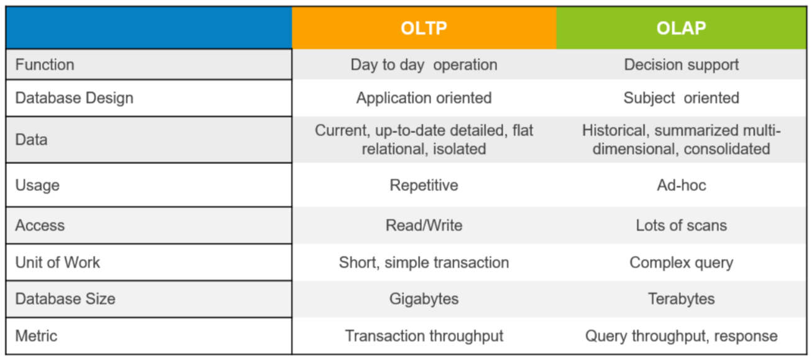
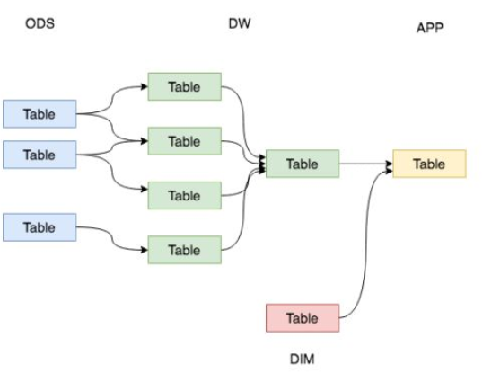
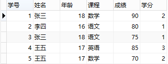
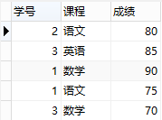
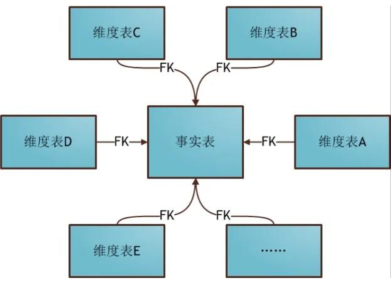
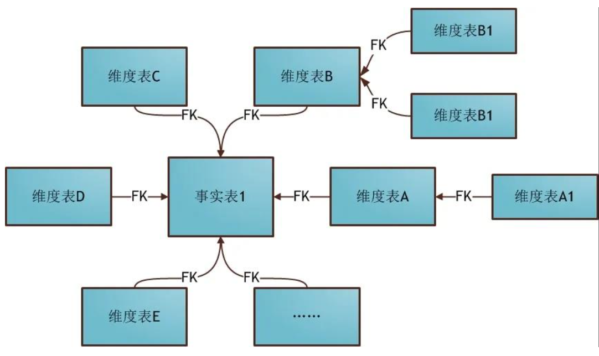
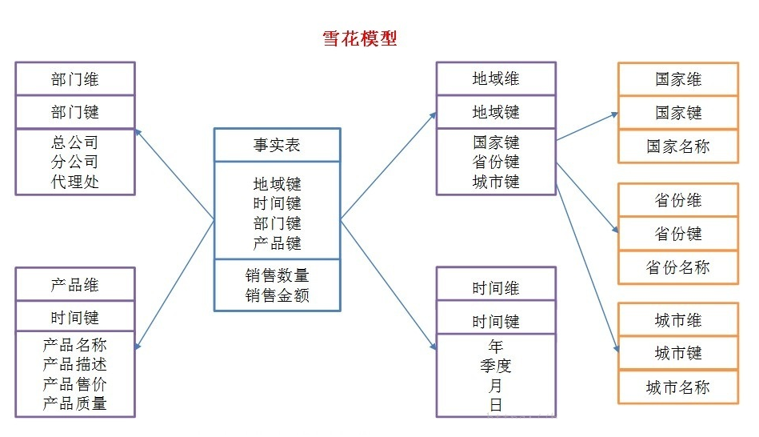
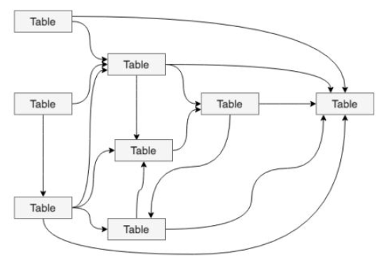
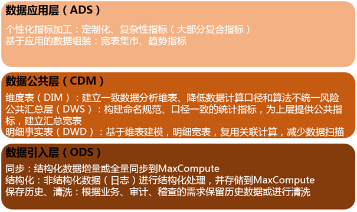
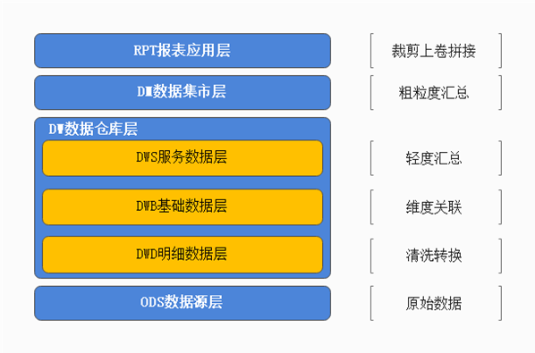

# 数据仓库

## I. 数据仓库基础知识

### 1. 数据仓库概念, 由来, 特点

- 数据仓库概念

  > 数据仓库，中文简称==数仓==。英文叫做Data WareHouse,简称==DW==。
  >
  > 数据仓库是==**面向分析**==的==集成化==数据平台，分析的结果给企业提供==**决策支持**==。
  >
  > 应用场景：**满足企业中所有数据的统一化存储，通过规范化的数据处理来实现企业的数据分析应用。**

  

- 数仓的由来

  > 为了更好的==分析数据而来==。正确的废话。

  ```shell
  1、公司建立、开展业务
  2、业务数据存储（事务支持）---->数据库DB
  3、经营发展中想赚更多的钱
  4、分析业务数据
  5、DB直接分析影响读性能，干扰业务开展，得不偿失
  6、其他系统、类型的数据也需要一起分析  彼此异构
  7、搭建统一、集成化数据分析平台
  8、建立模型和规范 愉快的进行各种分析
  ```

- 数仓的4大核心特点

  - ==**面向主题性**==

    > 主题(Subject) 是在较高层次上将企业信息系统中某一分析对象（重点是分析的对象）的数据进行整合、归类并分析的一种范围，属于一个抽象概念。

    ```properties
    1、数据库:面向业务划分数据  以业务流程为导向组织数据
    	财务部门：ERP财务管理系统  https://www.kingdee.com/role/finance  金蝶
    		-现金流量数据表
    		-汇率调整表
    		-凭证事务表
    		
        客户部门：CRM客户关系管理系统 https://www.salesforce.com/cn/crm/?bc=OTH
        	-客户基本信息表
        	-市场营销计划表
        	-投诉信息表
    
    2、数据仓库:面向主题划分数据  以分析需要为导向组织数据
    	 商品主题
    	 供应商主题
    	 顾客主题
         订单主题
    ```

  - ==**集成性**==

    > 数据仓库不产生数据也不使用数据
    >
    > 只会实现存储和加工

    ```
    	因为同一个主题的数据可能来自不同的数据源，它们之间会存在着差异（异构数据）：字段同名不同意、单位不统一、编码不统一；
    	因此在集成的过程中需要进行ETL(Extract抽取  Transform转换 load加载)
    ```

  - ==**非易失性**==（不可更新性）

    > 数仓上面的数据几乎没有修改操作，都是查询分析的操作。
    >
    > 数仓是分析数据规律的平台 不是创造数据规律的平台。
    >
    > 注意：改指的数据之间的规律不能修改。

  - ==**时变性**==

    > 数仓是一个持续维护建设的东西。
    > 站在==时间的角度，数仓的数据成批次变化更新==。一天一分析（T+1） 一周一分析（T+7）

### 2. OLTP和OLAP的区别

- OL==T==P（On-Line ==**Transaction**== Processing）
  - 概念：联机事务处理系统
  - 核心：事务支持
  - 特点
    - 数据安全
    - 数据完整
    - 操作响应效率、时间
    - 并发支持
    - CRUD操作
  - 应用场景
    - 用户注册，注册信息保存在哪里？
    - 用户下单，订单数据保存在哪里？很多人同时下单，能不能快速、安全、稳定的保存？
    - .......各种业务背后的数据存储。
  - 用户：业务操作人员
  - 典型代表
    - RDBMS关系型数据库管理系统，比如MySQL、ORACLE。
    - 注意：Nosql不满足OLTP系统的某些要求。
- OL==A==P（On-Line ==**Analytical**== Processing）
  - 概念：联机分析处理系统
  - 核心：分析支持
  - 特点
    - 数据量大
    - 事务性要求不高
    - 支撑满足不同程度分析需求
    - 查询操作
  - 用户：数据分析人员
  - 典型代表
    - 数据仓库、数据集市、面向分析的数据库系统



## II. 数仓系统的架构与核心流程

> 数据仓库提供企业决策分析的数据环境，数据从哪里获取？数据如何存储到数据仓库？决策分析系统如何从数据仓库获取数据进行分析？
>
> 把==数据从获取、存储到数据仓库、数据分析的所有部分==称为一个==数据仓库系统==


- 核心1：==ETL(Extract, Transfer, Load)==

  ```shell
  #1、抽取
  	数据抽取是从各个业务系统、外部系统等源数据处采集源数据。
  	
  #2、转换
  	采集过来的源数据如果要存储到数据仓库需要按照一定的数据格式对源数据进行转换。
  	常见的转换方式有数据类型转换、格式转换、缺失值补充、数据综合等。
  	
  #3、装载
  	转换后的数据就可以存储到数据仓库中，这个过程叫装载。
  	数据装载通常是按一定的频率进行的，比如每天装载前一天的订单数据、每星期装载客户信息等。
  
  ```

  

- 核心2：==数仓分层==

  - 将各种数据的处理流程进行规范化。

    

    

  - 分层的实现

    ```
    当使用Hive作为数据仓库工具的时候，分层是在Hive中逻辑划分实现的。
    常见的做法是：
       1、不同的分层创建不同的database（推荐）
    		ods.t_order
    		ods.t_user
    		dw.t_order_detail
    	2、同一个库中使用不同的前缀来区分不同的分层
        	jd.ods_t_order
        	jd.dw_t_user_detail
        	
        	
        逻辑和物理的区别: 逻辑是虚拟的, 物理是真实的
    ```

- 核心3：==数仓建模==

  - 决定了数据存储的方式，表的设计。
  - 比如：有哪些表，表中有哪些字段？表之间有什么关系等等。
  - 当下数仓建模理论有两个
    - 一个是基于数据库的范式建模理论   ER模型
    - 一个是基于分析方便的==维度建模理论== 这是当下的主流

## III. 数据分析方式 -- 维度分析

### 1. 指标设计

> 假如业务要求要去分析网站访问情况的好坏情况，请问分析什么？
>
> 访问人数？点击次数？搜索次数？
>
> 新用户注册率？老用户回头率？

- a、指标的概念

  > ==指标是衡量事物发展的标准，也叫度量==，如价格，销量等；指标可以求和、求平均值等计算；
  >
  > 指标分为绝对数值和相对数值：
  >
  > ==绝对数值==反映具体的大小和多少，如价格、销量、分数等；
  >
  > ==相对数值==反映一定的程度，如及格率、购买率、涨幅等。
  >
  > 对数据统计分析得到的结果，就是指标，是一个度量值，也称为指数。

- b、指标的功能

  > 通过指标来衡量事实的结果，反映事实的好坏。
  >
  > 比如：今天的网站访问情况和昨天相比如何？如何比？比什么？
  >
  > 比较指标：新老访客数、回头率、页面点击数

- c、常见的指标

  ```properties
  每个行业的需求不同，指标也不同
  	- 教育行业：旷课率
  	- 游戏行业：通关率
  	- 金融行业：还款率
  	
  #基础指标
  	比如网站访问分析中，常见的UV、PV、IP指标
  	比如电商购物分析中，常见的下单数、回购率、退单率
  	
  #关键指标
  	关键指标就是运营管理者最关心的指标，比如市场总监提出的产品销量、新增客户等指标；财务经理提出的营业额、利润率等。
  ```

- Q：指标体系怎么构建的？谁负责这个事？

  > https://www.zhihu.com/question/23774081/answer/1191077182
  >
  > 推荐书籍《数据产品经理修炼手册》                                                                                                                         

### 2. 维度设计

> 假如业务要求要去分析网站访问情况的好坏情况，分析出指标之后，如何评价判断好坏？
>
> 可以从时间角度分析网站访问量，分析每天、每小时的网站访问量；
>
> 也可以从地域角度来分析网站访问量，分析每个省、每个市分类的访问量。
>
> 也可以时间、地域两个角度组合起来分析，比如分析每个省每天的访问量。
>
> 请问：上述中从==不同的角度分析访问量指标，这个角度如何理解==？

- a、维度的概念

  > 维度是事物的特征，如颜色、区域、时间等，可以根据不同的维度来对指标进行分析对比。

  ```properties
  通俗解释:维度就是看待分析问题的角度。
  	比如根据区域维度来分析不同区域的产品销量
  		上海  北京  广州  深圳
  		1000  800  900   500
  	再比如根据时间来分析每个月产品的销量
  		1月   2月  3月  4月
  		3000 2500 3200 1420
  	同一个产品销量指标从不同的维度分析会得出不同的结果。
  
  上面所讲的是从一个维度去分析得出指标。也可以多个维度组合起来进行分析。
  	比如根据区域、时间维度来分析产品销量
  		上海 1月 1000
  		上海 2月 1200
  		上海 3月 1150
  		北京 1月 3211
  		北京 2月 2412
  ```

- b、维度的功能

  > ==**细化指标，不同角度审视指标**，更加精确的发现问题==

  ```properties
  老板说：咱们这个月呀，销售额明显下降了，你去查查什么原因？
  我心想：这原因也忒多了。到底是什么原因导致的销售额这个指标跟上个月相比下降了呢？
  
  此时可以考虑从不同的维度，甚至维度的组合来进行分析，比如
  从产品的维度分析，看看哪个产品销售额下降了？
  从地域的维度分析，看看哪个区域的销售额下降了？
  从时间的维度分析，看看这个月哪些天下降了？
  甚至，从时间和地域维度组合分析。
  ```

- c、常见的维度

  - 时间维度：年 月 天
  - 地域维度：国 省 市 县
  - 产品维度
  - 终端维度：PC 移动 windows MAC
  - ........

- d、下钻与上卷

  - 下钻：当前基于一个大的维度进行分析，要下钻到一个更细的维度进行分析
    - 先按年分析
    - 然后按照月分析
  - 上卷：当前我的分析是基于一个小的维度进行分析，要上卷到一个大的颗粒维度来进行分析
    - 先按每个小时分析
    - 然后按照每天分析

- 总结：==维度和指标在SQL层面是一个怎样的关系==？

  ```sql
  --指标：聚合统计分析的一个结果，数值
  
  --维度：分组字段
  
  Table:student
  	num  name  age  sex  province
  	1    james  18  M    shanghai
  	2    tony   24  M    shanghai
  	3    anna   15  W    beijing
  
  需求：统计每个省男女各有多少人？
  select province,sex,count(num) as cnts from student group by province,sex;
  
  --维度：省 性别
  --指标：人数
  ```

## IV. 数仓建模

### 1. 数据库建模 -- ER模型

- a、ER模型概念

  > ==ER模型==也称==实体-关系图==(Entity Relationship Diagram)，由Peter Chen（陈品山）于1976年提出；
  >
  > ER模型围绕真实世界的实体和它们之间的关系展开，被认为是设计数据库的好选择。

  ```properties
  ER模型三要素
  	实体(entity):数据模型中的数据对像。例如，学生，教师，成绩都可以被视为实体。	
  
  	属性(attribute):实体所具有的属性，例如学生具有姓名、学号、年级等属性。
  
  	关系(relationship):用来表现数据对象与数据对象之间的联系，例如学生的实体和成绩表的实体之间有一定的联系，每个学生都有自己的成绩表，这就是一种关系。
  ```

  

- b、ER模型的应用

  > 一般用于==RDBMS系统中来实现业务数据库的建模==。

  ```properties
  数据仓库之父Bill Inmon提出的数据仓库建模方法是自上而下的，从全企业的高度设计一个符合3NF的数据模型，用实体关系（Entity Relationship,ER）模型描述企业的业务。
  
  但是这里存在争议，在现实当中，大多数企业的数据仓库系统更接近Ralph Kimball所倡导的方式：数据仓库是企业内所有数据集市的集合，信息总是被存储在多维模型当中。
  ```

- c、ER模型的构建流程

  > step1：找到所有**实体**，以及每个实体的**属性**
  >
  > step2：找到所有实体之间的**关系**
  >
  > step3：建表，**每个实体**与**每个关系**都是一张表

  ```properties
  业务:allen在一品生鲜买了波士顿龙虾4只。
  
  需求:建立表模型把上述业务流程记录下来。
  
  - 实体
  		 allen：用户实体	
  			=用户id	 用户name		用户age		  手机		          密码
     		 	 00001     allen         18          18866886688         password
  		 
  		 商店：店铺实体
  			=店铺id	   	店铺名称			营业执照	  经营范围	  地址
  			12300014     一品生鲜浦东旗舰店    shpd_121     生鲜       航都路18号
  
  		 龙虾：商品实体
      		=商品id	  	商品名称		尺寸		颜色		价格
      		 8866225      波士顿龙虾      5斤      红发黑     3元
  
  - 关系
  		订单：实体之间的购买关系
      		=订单id	用户id	店铺id		商品id		订单价格		支付方式	   
  
  - 建表
    - 实体：用户表、商品表、店铺表
    - 关系：订单表
  ```

- d、ER模型优缺点

  - 优点：符合**数据库**的**设计==规范==**，没有冗余数据，保证性能，业务的需求把握的比较全面。
  - 缺点：设计时候非常复杂，必须找到所有实体和关系，才能构建。

#### 三范式

第一范式: 保证每列的原子性:

​	数据库表中的所有字段都是不可分解的原子值

第二范式: 保证一张表只描述一件事情






​	将学生信息表与课程信息表通过成绩表进行关联

第三范式: 保证每列都和主键直接相关

### 2. 维度建模

- a、维度建模概念

  > 维度建模是专门用于分析型数据库、数据仓库、数据集市建模的方法。
  >
  > 维度模型是数据仓库领域大师Ralph Kimall所倡导，他的《数据仓库工具箱》，是数据仓库工程领域最流行的数仓建模经典。
  >
  > 维度建模==以分析决策的需求出发==构建模型，构建的数据模型为分析需求服务，因此它重点解决用户如何更快速完成分析需求，同时还有较好的大规模复杂查询的响应性能。
  >
  > 在维度建模中，牵扯到两个基本的名词：==维度==，==事实==。

  ```properties
  1、事实就是你要关注的内容；
  2、维度就是你观察该事物的角度，是从哪个角度去观察这个内容的。
  
  例如，某地区商品的销量。是从地区这个角度观察商品销量的。事实就是销量表，维度就是地区表。
  ```

- b、维度建模的构建流程

  > step1：确定事实表
  >
  > step2：构建维度表

  ```properties
  业务行为：昨天早上张三在京东LV官方店花费20000元购买了一个皮包.
  
  业务数据记录：t_order订单表
  	orderid   userid   shopid   productid   num  order_price  time
  	订单编号    用户编号  店铺编号  商品编号     个数   订单价格      时间
  
  订单表的功能：
  	记录在现实中发生的一次操作型事件，每完成一个订单，就会在订单表中增加一条记录。
  
  
  事实表：
  	表示对分析主题的度量。当我们分析订单主题时，订单就是我们关注的内容。订单表的数据就不可或缺。
  	发生在现实世界中的操作型事件，其所产生的可度量数值（个数、订单价格），存储在事实表中。
  	因此上面的订单表就是一个事实表。
  	
  维度表：分析事实的角度。
  	用户维度
  	店铺维度
  	商品维度
  	时间维度
  
  事实表通过外键与维度表进行了关联。
  ```

- c、维度建模与ER建模的区别

  - 实体-关系建模是面向应用，遵循第三范式，以消除数据冗余为目标的设计技术。
  - 维度建模是面向分析，==为了提高查询性能可以增加数据冗余==，==反规范化==的设计技术。

### 3. 事实表

- a、事实表的概念

  > 事实表作为数据仓库维度建模的核心，紧紧围绕着业务过程来设计。
  >
  > 事实表通过获取描述业务过程的度量（指标）来表达业务过程，包含了==引用的维度==和与==业务过程有关的度量（指标）==。2

  ```properties
  订单事实表：
  	orderid   userid   shopid   productid   num  order_price  time
  	订单编号    用户编号  店铺编号  商品编号     个数   订单价格      时间
  	000001     10086   sp_123   pd_0012     2      12.34     20211010
  	000002     10010   sp_211   hd_jhas     21     25.25     20211011
    	000003     10010   sp_211   hd_jhas     21     25.25     20211011  
    	
  引用的维度
  	orderid   userid   shopid   productid   time
  	
  业务过程有关的度量（指标值）
  	num  order_price
  ```

- b、事实表的特点

  - 事实表包含了与各维度表相关联的**外键**，可与维度表**关联**；
  - 表里没有存放实际的内容，是一堆主键的集合，这些主键ID分别能对应到**维度表**中的一条记录；
  - 事实表的度量（指标）通常是数值类型；
  - 事实表**记录数会不断增加，表数据规模迅速增长**。

- c、事实表度量（指标）分类

  ```properties
  1:可加数值类型
  	度量可以按照和事实表关联的任一维度进行汇总。
  	比如订单价格，可以按照用户维度、店铺维度汇总平均值和总价格等等。
  	A用户平均每单金额、B店铺订单总价格等。
  
  2:半可加数值类型
  	度量在某些维度下不可进行汇总，或者说汇总起来没有意义。
  	比如说余额，余额在时间维度下的汇总就没有意义。
  	记录静态数据（库存数据，金融账户余额）的所有度量针对于日期属性等维度天然具有非可加性，但是例如库存数据针对产品种类或者商店维度进行汇总，是可加的，所以这种数据就是半可加事实。
  	1号： 库存1000
  	2号： 库存800
  	那么在时间的维度上：1000+800有什么意义？？
  	但是在商店维度就有意义了。
  	A店铺：库存8000
  	B店铺：库存5000
  	从店铺的维度分析总库存：8000+5000
  
  3:不可加数值类型
  	度量在所有与该事实表关联的维度下都不可进行汇总。
  	比如说比率型数据，对于这种数据，如果确实是有汇总的必要，可以将其分子分母分别存储，然后在最后汇总之后再进行除法操作，从而得到“汇总”后的比率型数据。
  	
  ```

- d、事实表的分类

  - ==事务事实表==(Transaction fact table)

    > - 事务事实表记录着事务层面的事实，保存的是最原子的数据，也称“原子事实表”或“交易事实表”；
    > - 事务事实表中的数据在事务事件发生后产生，==数据的粒度通常是每个事务一条记录==；
    > - 一旦事务被提交，事实表数据被插入，数据就不再进行更改，其更新方式为增量更新；
    > - ==日常沟通中常说的事实表，大多指的是事务事实表==。

    ```properties
    =订单事实表：
    	orderid   userid   shopid   productid   num  order_price  time
    	订单编号    用户编号  店铺编号  商品编号     个数   订单价格      时间
    
    =每完成一个订单，就会在订单事实表中增加一条记录。
    ```

  - 周期快照事实表(Periodic snapshot fact table)

    > - 周期快照事实表以具==有规律性的、可预见的时间间隔来记录事实==；时间间隔如每天、每月、每年等等，典型的例子如销售日快照表、库存日快照表等；
    > - 周期快照事实表的==粒度是每个时间段一条记录==，通常比事务事实表的粒度要粗，是在事务事实表之上建立的聚集表。比如说时间周期是1周，那么这个周期快照事实表的一条记录就是这一周的对于某个度量的统计值。
    > - 周期快照事实表的维度个数比事务事实表要少。
    > - 周期快照事实表的日期维度通常是记录时间段的终止日，记录的事实是这个时间段内一些聚集事实值。

    ```properties
    =销售月快照表
    	time   			 total_order   		total_price
    	时间     			订单总个数      		订单总价格
    	202111             3455                24563
    	202112             5412                147855
    	202201             4685                568756
    	
    =报名日快照表
    	time      java    pd       ui   
    	20210202  5000    3000    2000
    	20210203  3222    4322    222300
    	20210204  235000  223000  2000
    	20210205  5000    3000    2000
    ```

- 累积快照事实表(Accumulating snapshot fact table)

  > - 周期快照事实表记录的确定的周期的数据，而==累积快照事实表记录的不确定的周期的数据==。 
  > - 累积快照事实表代表的是完全==覆盖一个事务或产品的生命周期的时间跨度==，它通常具有多个日期字段，用来记录整个生命周期中的关键时间点。例如订单累计快照事实表会有付款日期，发货日期，收货日期等时间点。
  > - 事务事实表中一个完整的交易记录会有一系列不同状态的数据来记录整个交易过程；而累积快照事实表只会有一条记录，数据会一直更新直到过程结束。

  ```properties
    =订单累积快照事实表
    	订单id		提交成功		支付成功	 发货状态	 收货状态		退货状态
    	order001 	12:00:00	    12:01:00   13:00:00   00:00:00    	
  ```

- 无事实事实表

  > - 没有事实发生，没有度量值（指标），都是一堆外键;
  > - 作用：梳理==维度之间的对应关系==，并且能更快获得关系数据。
  > - 常被用于回答“==什么未发生==”这样的问题

  ```properties
    =促销范围无事实事实表
    
    =功能：处于促销状态但尚未销售的产品包括哪些？
    =总共参与促销的产品有100个，商品编号从1---100。
    
    =表字段：促销范围无事实事实表	
    	日期             产品ID
    	20201010      1-59,76-78,80-100
    	20201011      1-32,88-100
    	20201012      1
  ```

### 4. 维度表

- a、维度表概念

  > - 维度表示要对事实数据进行分析时所用的一个量，一个角度；
  > - 比如你要分析产品销售情况，你可以选择按类别进行分析,或按区域分析。这样的按…分析就构成一个维度。
  > - 每个维度表都包含单一的主键列。维度表的主键可以作为与之关联的任何**事实表**的外键，当然，维度表行的描述环境应与事实表行完全对应。

- b、维度的功能

  > ==**细化指标**，更加精确的发现问题==

  ```properties
  老板说：咱们这个月呀，销售额明显下降了，你去查查什么原因？
  我心想：这原因也忒多了。到底是什么原因导致的销售额这个指标跟上个月相比下降了呢？
  
  此时可以考虑从不同的维度，甚至维度的组合来进行分析，比如
  	从产品的维度分析，看看哪个产品销售额下降了？
  	从地域的维度分析，看看哪个区域的销售额下降了？
  	从时间的维度分析，看看这个月哪些天下降了？
  	甚至，从时间和地域维度组合分析。
  ```

- c、维度表分类

  - ==高基数维度数据（行多）==：一般是用户资料表、商品资料表类似的资料表。数据量可能是千万级或者上亿级别。
  - ==低基数维度数据==（行少）：一般是配置表，比如枚举值对应的中文含义，或者日期维表、地理维表等。数据量可能是个位数或者几千条几万条。

  ```shell
  #枚举值对应的中文含义
  
  1、什么叫枚举？enumerate  enum
    有穷的数据集合。  通俗来说，就是指集合的元素个数有限。
    星期枚举 ={1、2，3，4，5，6，7}
    颜色枚举 ={a,b,c,d,e,f,g,h}
    
  2、业务中使用枚举做什么？
    t_order
    orderid userid  shopid  productid  num price week
                                                  2
                                                  3
                                                  2
                                                  1
                                                  2
                                                  7
                                                  2
                                                  3
    
  
  3、数据分析的时候需要对枚举做什么？
  	业务计算周末和非周末的订单数。
  
  创建一个表：枚举字典表
  id  		type 		 num 		 hanyi（含义）
  0001        week      	 1           周一
  0002        week      	 2           周二
  0003        week      	 3           周三
  ```

  维度建模概况总结：    

  **事实表的设计是以能够正确记录历史信息为准则。**

  **维度表的设计是以能够以合适的角度来聚合主题内容为准则。**

### 5. 常见模型

- 概述

  > 通过维度建模的理论探讨分析，可以发现事实表中会存在着维度表关联的外键，以此来实现从不同的维度分析事实数据内容。
  >
  > 具体关联起来的模型可以分为：星型、雪花、星座3种。

- ==星型模型==

  > 星形模式(Star Schema)是最常用的维度建模方式。
  >
  > 星型模式是==以事实表为中心，所有的维度表直接连接在事实表上，像星星一样==。
  >
  > ```shell
  > a. 维表只和事实表关联，维表之间没有关联；
  > b. 每个维表主键为单列，且该主键放置在事实表中，作为两边连接的外键；
  > c. 以事实表为核心，维度表围绕核心呈星形分布；
  > ```

  

  

- 雪花模型

  > 雪花模式(Snowflake Schema)是对星形模式的扩展。
  >
  > 雪花模式的==维度表可以拥有其他维度表的==，虽然这种模型相比星型更规范一些。
  >
  > 但是由于这种模**型不太容易理解，维护成本比较高**，而且性能方面需要关联多层维表，**性能**也比星型模型要**低**。所以一般不是很常用。
  >
  > 最大缺点：关联层次比较多，数据大的情况下，底层层层Join，查询数据性能降低。

  

  

- 星座模型

  > 星座模式是星型模式延伸而来，星型模式是基于一张事实表的，而星座模式是基于多张事实表的，而且==共享维度信息==。
  >
  > 很多时候维度空间内的事实表不止一个，而一个维表也可能被多个事实表用到。
  >
  > 在业务==发展后期，绝大部分维度建模都采用的是星座模式==。

  

### 6. 渐变维SCD(Slowly Changing Dimension)

- 背景

  > - 渐变维也叫==缓慢渐变维度==。
  >
  > ```
  > 比如客户信息，某个客户一开始在A城市，但某时间点之后，搬家到了B城市。在跟踪这个客户的消费行为的时候必然要考虑其在不同地区的差异。因此需要记录客户的之前和现在的状态。
  > ```
  >
  > - ==大多数维度表随时间的迁移是缓慢变化的==，修改更新个属性字段值啥的，因此在设计维度和使用维度的过程中，就要考虑到缓慢变化维度的处理。
  > - 当然也有不变的维度和剧烈变化的维度：例如一个人的相关信息，身份证号、姓名和性别等信息数据属于不变的部分，政治面貌和婚姻状态属于缓慢变化部分，而工作经历、工作单位和培训经历等在某种程度上属于急剧变化字段。

- 案例

  - 顾客信息表，2012年1月1日起，BIWORK居住在北京

    

  - 2012年3月12日以后搬去了三亚居住，因此该条数据进行了更新

    

  - 问题来了

    - 需要对2012年的居住在北京的数据进行统计，这条数据是否参与统计？ 必须参加统计
    - 但是如果参与统计，数据中这条信息已经没有了，无法统计，因为现在记录的就是住在三亚。
    - 历史状态没有了。

- 解决方案

  > 关注两点：
  >
  > ​	1、历史状态要不要维护
  >
  > ​	2、维护历史状态的时候尽量避免数据冗余

  - SCD1（缓慢渐变类型1）

    - 通过更新维度记录**直接覆盖已存在的值**。不维护记录的历史。一般用于修改错误的数据。

    - 上述的例子就是SCD1。

      

  - ==SCD2（缓慢渐变类型2）--拉链表==

    - 在源数据发生变化时，给维度记录建立一个新的“版本”记录，从而**维护维度历史**。
    - SCD2不删除、不修改已存在的数据。SCD2也叫拉链表。
    - 常见的维护历史状态的做法是：==在表中添加两个字段，表示该条数据状态的起始时间、结束时间==。
    - stratTime    endTime
    - valid From  Valid To

    

    ```sql
    | 用户id | 所在的地区 | 时间标记：startTime | 时间标记：endTime |
    | ------ | ---------- | --------------- | ------------- |
    | 1001   | beijing    | 2018-01-01      | 2020-01-01    |
    | 1001   | sanya      | 2020-01-01      | 2021-01-01    |
    | 1001   | meiguo     | 2021-01-01      | 2022-01-01    |
    | 1001   | yilake     | 2022-01-01      | 9999-12-31    |
    
    
    --工作中的需求是可以指定日期查询对应的状态
     where startTime >= 2019 and endTime < 2020
    --默认应该处理最新的状态：通过9999-12-31，来标记这是最新的状态
     where endTime = 9999-12-31
    ```

  - SCD3（缓慢渐变类型3）

    - SCD3希望只维护更少的历史记录。

    ```properties
    比如说把要维护的历史字段新增一列，然后每次只更新Current Column和Previous Column。
    这样，只保存了最近两次的历史记录。
    但是如果要维护的字段比较多，就比较麻烦，因为要更多的Current和Previous字段。
    所以SCD3用的还是没有SCD1和SCD2那么普遍。
    它只适用于数据的存储空间不足并且用户接受有限维度历史的情况。
    ```

    

## V. 数仓分层

### 1. 数仓分层设计

- 分层的背景

  > 用图说话，你喜欢哪种开发环境？

  

  

  ```properties
  希望数据能够有秩序地流转，数据的整个生命周期能够清晰明确被设计者和使用者感知到。直观来讲就是层次清晰、依赖关系直观。
  
  但是，大多数情况下，我们完成的数据体系却是依赖复杂、层级混乱的。在不知不觉的情况下，我们可能会做出一套表依赖结构混乱，甚至出现循环依赖的数据体系。
  
  因此，需要一套行之有效的数据组织和管理方法来让我们的数据体系更有序，这就是谈到的数据分层。
  ```

- 分层的依据

  > 数仓不是生产数据的平台，也不是最终消费应用数据的平台。
  >
  > 那么围绕数仓开展数据分析，势必会存在==数据流入、流出的过程==。

- 分层的方法--3层数仓经典架构

  

  - ==**ODS**==

    ```properties
    名称:操作型数据存储、源数据层、贴源层、数据暂存层、数据引入层
    
    功能:此层数据无任何更改，直接沿用外围系统数据结构和数据，不对外开放；为临时存储层，是各个数据源数据的临时存储区域，为后一步的数据处理做准备。
    
    说明:在大数据的数仓体系中，更多进行的是ELT的操作。因为数据源的数据不出意外几乎都是结构化的数据了，那么不妨首先将数据load加载至数仓，然后经过层层的T转换。
    
    实际应用:ODS为Hive数仓中的一个逻辑分层，比如专门创建一个database库，名字叫做ods.存储从各个数据源加载过来的数据，做临时存储。
    ```

  - ==**DW**==

    ```properties
    名称:数据仓库层
    
    功能:DW层的数据由ODS层数据加工而成,主要完成数据加工与整合。DW层的数据应该是一致的、准确的、干净的数据。
    
    说明:实际应用中，为了更加清晰、明了、便捷的开展数据分析，会对DW层进行更加细化的分层。比如：数仓明细层DWD、数仓基础数据层DWB、数仓服务数据层DWS、数据集市层DM、维度数据层DIM
    ```

  - ==**DA(APP、ADS)**==

    ```properties
    名称:数据应用层
    
    功能:面向最终用户，面向业务定制提供给产品和数据分析使用的数据。
    
    常见的数据应用:数据报表 数据可视化 数据挖掘  即席查询
    ```

- 分层的好处

  ```shell
  #1、清晰数据结构
  每一个数据分层都有它的作用域，在使用表的时候能更方便地定位和理解。
  
  #2、数据血缘追踪
  简单来说，我们最终给业务呈现的是一个能直接使用业务表，但是它的来源有很多，如果有一张来源表出问题了，我们希望能够快速准确地定位到问题，并清楚它的危害范围。
  
  #3、减少重复开发
  规范数据分层，开发一些通用的中间层数据，能够减少极大的重复计算。
  
  #4、把复杂问题简单化
  将一个复杂的任务分解成多个步骤来完成，每一层只处理单一的步骤，比较简单和容易理解。而且便于维护数据的准确性，当数据出现问题之后，可以不用修复所有的数据，只需要从有问题的步骤开始修复。
  
  #5、屏蔽原始数据的异常
  屏蔽业务的影响，不必改一次业务就需要重新接入数据
  ```

### 2. DW层细化

- 概述

  > 在数仓3层的分层架构中，处于中间的DW数据仓库层应该是核心中的核心。
  >
  > 实际应用中，为了更加清晰、便捷、高效的分析数据，会对DW进行更进一步的细化分层。
  >
  > 至于具体再细化几层，怎么细化，则没有统一的标准。

- 栗子

  ```properties
  1．明细层DWD（Data Warehouse Detail）：存储明细数据，此数据是最细粒度的事实数据。该层一般保持和ODS层一样的数据粒度，并且提供一定的数据质量保证。同时，为了提高数据明细层的易用性，该层会采用一些维度退化手法，将维度退化至事实表中，减少事实表和维表的关联。
  
  2．中间层DWM（Data WareHouse Middle）：存储中间数据，为数据统计需要创建的中间表数据，此数据一般是对多个维度的聚合数据，此层数据通常来源于DWD层的数据。
  
  3．业务层DWS（Data WareHouse Service）：存储宽表数据，此层数据是针对某个业务领域的聚合数据，应用层的数据通常来源与此层，为什么叫宽表，主要是为了应用层的需要在这一层将业务相关的所有数据统一汇集起来进行存储，方便业务层获取。此层数据通常来源与DWD和DWM层的数据。
  
  ```

### 3. 案例

> 通过此案例，希望能够理解案例中分层设计的实现

- 电商平台案例

  

- 阿里巴巴数仓分层案例

  

- **美团点评酒旅数据仓库建设实践**

  - https://tech.meituan.com/2017/05/26/hotel-dw-layer-topic.html

- **携程数仓设计**

  - https://mp.weixin.qq.com/s/CfxNcMJIl6irunrTNTs25g

> 每个行业，每家公司都可以根据自己的需求去添加、删除分层的个数。
>
> ==没有好的分层架构、只有适合自己的架构==。
>
> 它山之石可以攻玉。

### 4. 新零售项目数仓分层

> ==**烂熟于心。能说会道。理解再复述。**==

- 新零售分层架构图

  

- ODS（数据临时存储层）

  ```properties
  功能:将各个数据源的原始数据几乎无处理地存放在数据仓库系统中，结构上与源系统基本保持一致，是数据仓库的数据准备区。这一层的主要职责是将基础数据同步至数仓。
  
  做法:Hive数仓创建ODS数据库，逻辑分层。
  
  友情提示:在实时数仓中，常常使用kafka这样的分布式消息队列作为ODS层的存储工具。各个数据源作为生产者把数据写入kafka,然后使用flink等实时计算引擎进行各种ETL，结果保存至诸如Redis、HBase的实时存储中。
  ```

- DW

  - DWD（==明细==数据层  Data Warehouse ==Detail==）

    ```properties
    功能:数据来自于ODS，一般保持和ODS层数据一样的粒度；并且提供一定的数据质量保证，对来自ODS数据层做一些数据清洗和规范化的操作，提供更干净的数据。
    
    此外: 区分ODS中各个数据到底是属于事实(Fact Table)，还是属于维度(Dimension Table)。
    ```

  - DWB（==基础==数据层 Data Warehouse ==Base==）

    ```properties
    功能:基础数据层一般用作中间层。多张表数据关联在一起，降维操作，形成一张大宽表。DWB层表数据量较少，只需要保留一定周期内的数据，当前有效的数据。
    
    说明: 宽表指的的表的字段多。不同表的内容形成一张宽表，已经明显不符合三范式设计要求了。合并成宽表的目的就是提高计算时的效率。（查询多张表和查询一张表的性能差异）
    ```

  - DWS（==服务==数据层 Data Warehouse ==Service== ）

    ```properties
    功能: 基于DWB上的基础数据，整合汇总成分析某一个主题域的服务数据，一般是宽表。
    
    作用: 基于分析主题根据相关指标 维度进行提前统计聚合操作(提前聚合), 形成宽表统计结果数据
    
    例如:需要统计每天 每月 每年的 销售总额, 此时为了后续统计分析, 可以在DWS层, 先按照每天将销售总额统计出来即可。这样, 后续在统计每月 每年的时候, 就可以基于每天的结果进行汇总合并即可。
    	     
    说明: 根据主题划分。
    ```

- DM（数据集市层 Data Mart）

  ```properties
  功能职责:进行细粒度统计操作, 基于DWS层, 进行上卷维度统计操作, 形成大的主题统计宽表  (一般来说是一个主题对应一个统计宽表)
  ```

- RPT（报表应用层  DA）

  ```properties
  作用: 存储分析的结果表, 会对DM层统计宽表, 根据需求要求, 从宽表中获取想要的数据, 将这些数据灌入到DA层
  ```