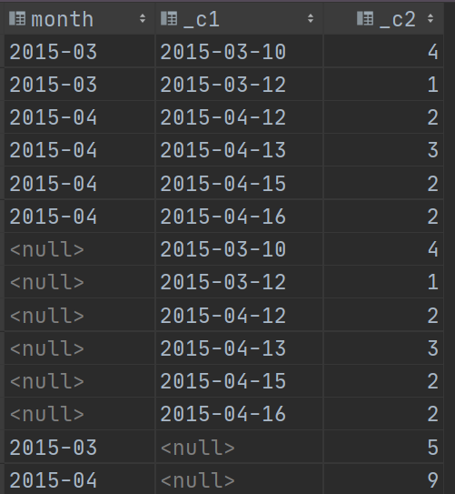
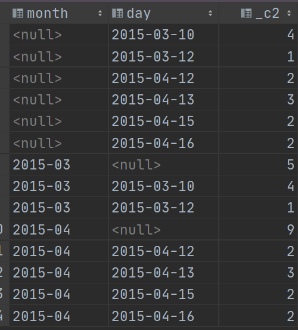
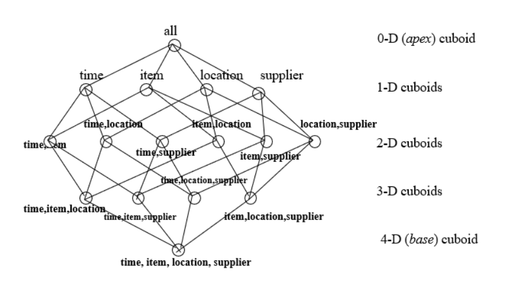

# DWS层建设实战I

## I. 聚合函数增强

### 1. grouping sets

- 背景

  - 数据环境准备

    ```sql
    --在hive中建表操作
    use test;
    
    create table test.t_cookie(
        month string, 
        day string, 
        cookieid string) 
    row format delimited fields terminated by ',';
    
    
    --数据样例
    2015-03,2015-03-10,cookie1
    2015-03,2015-03-10,cookie5
    2015-03,2015-03-12,cookie7
    2015-04,2015-04-12,cookie3
    2015-04,2015-04-13,cookie2
    2015-04,2015-04-13,cookie4
    2015-04,2015-04-16,cookie4
    2015-03,2015-03-10,cookie2
    2015-03,2015-03-10,cookie3
    2015-04,2015-04-12,cookie5
    2015-04,2015-04-13,cookie6
    2015-04,2015-04-15,cookie3
    2015-04,2015-04-15,cookie2
    2015-04,2015-04-16,cookie1
    ```

  - 需求

    > 分别按照==月==（month）、==天==（day）、==月和天==（month,day）统计**来访用户cookieid个数**，并获取三者的结果集（一起插入到目标宽表中）。
    >
    > 目标表：month   day   cnt_nums

    ```sql
    --3个分组统计而已，简单。统计完再使用union all合并结果集。
    --注意union all合并结果集需要各个查询返回字段个数、类型一致，因此需要合理的使用null来填充返回结果。
    select month,
           null,
           count(cookieid)
    from test.t_cookie
    group by month
    
    union all
    
    select null,
           day,
           count(cookieid)
    from test.t_cookie
    group by day
    
    union all
    
    select month,
           day,
           count(cookieid)
    from test.t_cookie
    group by month,day;
    ```

  - 执行结果如下

    > 思考一下，这样有什么不妥的地方吗？
    >
    > 首先感受就是==执行时间很长，很长==；
    >
    > 另外从sql层面分析，会对test.t_cookie==查询扫描3次==，因为是3个查询的结果集合并。
    >
    > 假如这是10个维度的所有组合计算同一个指标呢？？
    >
    > 2^10  * 1    条select查询 union all？？？？？

    

- grouping sets功能

  > ==根据不同的维度组合进行聚合==，等价于将不同维度的GROUP BY结果集进行UNION ALL。

  ```sql
  select 
      month,day,count(cookieid) 
  from test.t_cookie 
      group by month,day 
  grouping sets (month,day,(month,day));
  ```

  

  > 1、使用grouping sets，==执行结果==与使用多个分组查询union合并结果集==一样==；
  >
  > 2、grouping sets==查询速度吊打==分组查询结果union all。大家可以使用explain执行计划查看两条sql的执行逻辑差异。
  >
  > 3、使用grouping sets只==会对表进行一次扫描==。

- hive中grouping sets语法

  > https://cwiki.apache.org/confluence/display/Hive/Enhanced+Aggregation%2C+Cube%2C+Grouping+and+Rollup#EnhancedAggregation,Cube,GroupingandRollup-GROUPINGSETSclause

  

  > 特别注意：==**Presto的grouping sets语法和hive略有差异**==。

  ```sql
  ---下面这个是Hive SQL语法支持
  select 
      month,day,count(cookieid) 
  from test.t_cookie 
      group by month,day 
  grouping sets (month,day,(month,day));
  
  ----下面这个是Presto SQL语法支持
  select 
      month,day,count(cookieid) 
  from test.t_cookie 
      group by
  grouping sets (month,day,(month,day));
  
  --区别就是在presto的语法中，group by后面不要再加上字段了。
  ```

### 2. cube, roll up

- ==**cube**==

  - cube翻译过来叫做立方体，data cubes就是数据立方体。

  - cube的功能：==实现多个任意维度的查询==。也可以理解为所有维度组合。

    > 公式：假如说有==**N个维度，那么所有维度的组合的个数：2^N**==
    >
    > 下面这个图，就显示了4个维度所有组合构成的数据立方体。

    

  - 语法

    ```sql
    select month,day,count(cookieid)
    from test.t_cookie
    group by
    cube (month, day);
    
    --上述sql等价于
    select month,day,count(cookieid)
    from test.t_cookie
    group by
    grouping sets ((month,day), month, day, ());
    ```

    

- ==**rollup**==

  - 语法功能：实现==从右到左递减==多级的统计,显示统计某一层次结构的聚合。

    > 即：rollup((a),(b),(c))等价于grouping sets((a,b,c),(a,b),(a),())。

  ```sql
  select month,day,count(cookieid)
  from test.t_cookie
  group by
  rollup (month,day);
  
  --等价于
  select month,day,count(cookieid)
  from test.t_cookie
  group by
  grouping sets ((month,day), (month), ());
  ```

  

### 3. grouping


### 4. 功能: 针对分组聚合操作进行优化


## II. DWS层搭建

### 1. 目标与需求


### 2. 销售主题统计宽表 -- 简易模型分析


### 3. 销售主题统计宽表 -- 复杂模型分析


### 4. 新零售项目销售主题统计宽表的实现

