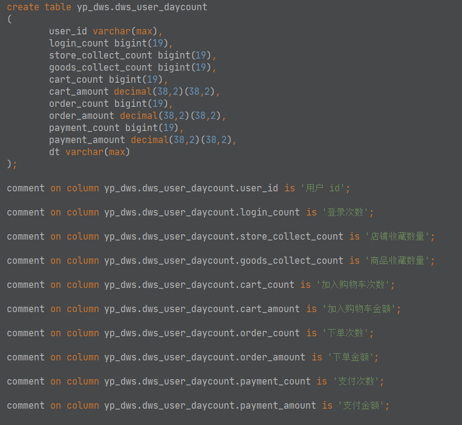
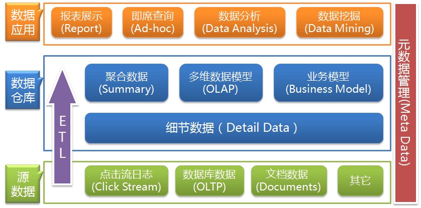
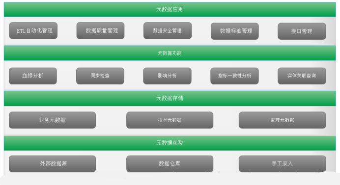
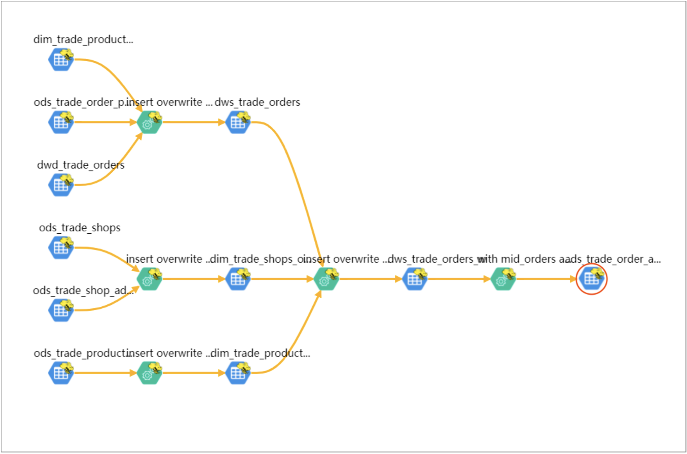

# DM层建设实战

## I. DM层架构

### 目标与需求

- 新零售数仓分层图

  

- DM

  - 名称：数据集市层 Data Market

  - 功能：基于DWS层日统计宽表，==上卷==出周、月、年等统计宽表，即==粗粒度汇总==。

  - 解释

    - 从理论层面来说，数据集市是一个小型的部门或工作组级别的数据仓库。
    - 一些公司早期的数据集市后期可能会演变成为数仓系统。
    - 本项目中在数据集市层面主要进行粗粒度汇总，也可以将这些功能下放至DWS层完成。抛弃DM.

    百科数据集市：https://baike.baidu.com/item/%E6%95%B0%E6%8D%AE%E9%9B%86%E5%B8%82/607135?fr=aladdin

    

- 使用DataGrip在Hive中创建dm层

  > 注意，==**对于建库建表操作，需直接使用Hive**==，因为Presto只是一个数据分析的引擎，其语法不一定支持直接在Hive中建库建表。

  ```sql
  create database if not exists yp_dm;
  ```

### 1. 销售主题统计宽表构建

#### 1.1. 建模

- 概述

  > DM层销售主题宽表，基于DWS层销售主题日统计宽表的值，**上卷统计出年、月、周的数据**。
  >
  > 指标和DWS一致。

- 指标

  ```properties
  销售收入、平台收入、配送成交额、小程序成交额、安卓APP成交额、苹果APP成交额、PC商城成交额、订单量、参评单量、差评单量、配送单量、退款单量、小程序订单量、安卓APP订单量、苹果APP订单量、PC商城订单量
  ```

- 维度

  ```properties
  日期:天(已经统计过), 周,  月, 年
  日期+城市
  日期+商圈
  日期+店铺
  日期+品牌
  日期+大类
  日期+中类
  日期+小类
  ```

- 建表

  > 整个表和DWS层销售主题统计宽表dws_sale_daycount的区别就在于==多了开头的时间粒度字段==。
  >
  > 用于标识后面的指标是哪个时间粒度统计出来的指标。

  ```sql
  CREATE TABLE yp_dm.dm_sale(
     date_time string COMMENT '统计日期,不能用来分组统计',
     time_type string COMMENT '统计时间维度：year、month、week、date(就是天day)',
     year_code string COMMENT '年code',
     year_month string COMMENT '年月',
     month_code string COMMENT '月份编码', 
     day_month_num string COMMENT '一月第几天', 
     dim_date_id string COMMENT '日期',
     year_week_name_cn string COMMENT '年中第几周',
     
     group_type string COMMENT '分组类型：store，trade_area，city，brand，min_class，mid_class，max_class，all',
     city_id string COMMENT '城市id',
     city_name string COMMENT '城市name',
     trade_area_id string COMMENT '商圈id',
     trade_area_name string COMMENT '商圈名称',
     store_id string COMMENT '店铺的id',
     store_name string COMMENT '店铺名称',
     brand_id string COMMENT '品牌id',
     brand_name string COMMENT '品牌名称',
     max_class_id string COMMENT '商品大类id',
     max_class_name string COMMENT '大类名称',
     mid_class_id string COMMENT '中类id', 
     mid_class_name string COMMENT '中类名称',
     min_class_id string COMMENT '小类id', 
     min_class_name string COMMENT '小类名称',
     --   =======统计=======
     --   销售收入
     sale_amt DECIMAL(38,2) COMMENT '销售收入',
     --   平台收入
     plat_amt DECIMAL(38,2) COMMENT '平台收入',
     -- 配送成交额
     deliver_sale_amt DECIMAL(38,2) COMMENT '配送成交额',
     -- 小程序成交额
     mini_app_sale_amt DECIMAL(38,2) COMMENT '小程序成交额',
     -- 安卓APP成交额
     android_sale_amt DECIMAL(38,2) COMMENT '安卓APP成交额',
     --  苹果APP成交额
     ios_sale_amt DECIMAL(38,2) COMMENT '苹果APP成交额',
     -- PC商城成交额
     pcweb_sale_amt DECIMAL(38,2) COMMENT 'PC商城成交额',
     -- 成交单量
     order_cnt BIGINT COMMENT '成交单量',
     -- 参评单量
     eva_order_cnt BIGINT COMMENT '参评单量comment=>cmt',
     -- 差评单量
     bad_eva_order_cnt BIGINT COMMENT '差评单量negtive-comment=>ncmt',
     -- 配送成交单量
     deliver_order_cnt BIGINT COMMENT '配送单量',
     -- 退款单量
     refund_order_cnt BIGINT COMMENT '退款单量',
     -- 小程序成交单量
     miniapp_order_cnt BIGINT COMMENT '小程序成交单量',
     -- 安卓APP订单量
     android_order_cnt BIGINT COMMENT '安卓APP订单量',
     -- 苹果APP订单量
     ios_order_cnt BIGINT COMMENT '苹果APP订单量',
     -- PC商城成交单量
     pcweb_order_cnt BIGINT COMMENT 'PC商城成交单量'
  )
  COMMENT '销售主题宽表' 
  ROW format delimited fields terminated BY '\t' 
  stored AS orc tblproperties ('orc.compress' = 'SNAPPY');
  ```

#### 1.2. 表关系梳理

- 销售主题各种指标的数据支撑

  - ==**dws_sale_daycount**==

  

- 时间粒度的数据支撑

  - ==**dwd.dim_date  时间维表**==

  > 企业中，时间维表数据是怎么维护的呢?
  >
  > 1、维护频率：一次性生成1年或者多年的时间数据。
  >
  > 2、使用java、Python代码实现数据的生成。

  

- 关联条件

  ```sql
  yp_dws.dws_sale_daycount dc
      left join yp_dwd.dim_date d on dc.dt = d.data_code
  ```

#### 1.3. 按年统计

> 在dws层已经统计出天的指标数据了，现在需要在其之上上卷计算出周、月、年的数据。
>
> 这里并不是简单的分组+sum求和即可，需要考虑到分组的类别。

- step1：确定分组字段

  > 年
  >
  > 年 + 城市
  >
  > 年 + 商圈
  >
  > 年 + 店铺
  >
  > 年 + 品牌
  >
  > 年 + 大类
  >
  > 年 + 中类
  >
  > 年 + 小类
  >
  > （对于销售主题 在DM层  分析的维度不变  时间的粒度改变）

  ```sql
  group by
  grouping sets (
      (d.year_code),
      (d.year_code, city_id, city_name),
      (d.year_code, city_id, city_name, trade_area_id, trade_area_name),
      (d.year_code, city_id, city_name, trade_area_id, trade_area_name, store_id, store_name),
      (d.year_code, brand_id, brand_name),
      (d.year_code, max_class_id, max_class_name),
      (d.year_code, max_class_id, max_class_name,mid_class_id, mid_class_name),
      (d.year_code, max_class_id, max_class_name,mid_class_id, mid_class_name,min_class_id, min_class_name))
  ;
  ```

- step2：分组聚合

  ```sql
  -- 统计值
      sum(dc.sale_amt) as sale_amt,
      sum(dc.plat_amt) as plat_amt,
      sum(dc.deliver_sale_amt) as deliver_sale_amt,
      sum(dc.mini_app_sale_amt) as mini_app_sale_amt,
      sum(dc.android_sale_amt) as android_sale_amt,
      sum(dc.ios_sale_amt) as ios_sale_amt,
      sum(dc.pcweb_sale_amt) as pcweb_sale_amt,
      sum(dc.order_cnt) as order_cnt,
      sum(dc.eva_order_cnt) as eva_order_cnt,
      sum(dc.bad_eva_order_cnt) as bad_eva_order_cnt,
      sum(dc.deliver_order_cnt) as deliver_order_cnt,
      sum(dc.refund_order_cnt) as refund_order_cnt,
      sum(dc.miniapp_order_cnt) as miniapp_order_cnt,
      sum(dc.android_order_cnt) as android_order_cnt,
      sum(dc.ios_order_cnt) as ios_order_cnt,
      sum(dc.pcweb_order_cnt) as pcweb_order_cnt
  ```

- step3：返回字段细节处理

  ```sql
      --统计日期，不是分组的日期 所谓统计就是记录你哪天干的这个活
      '2022-03-07' date_time,
      'year' time_type,
       year_code,
  --     year_month,
  --     month_code,
  --     day_month_num,
  --     dim_date_id,
  --     year_week_name_cn,
  
      -- 产品维度类型：store，trade_area，city，brand，min_class，mid_class，max_class，all
     CASE WHEN grouping(dc.city_id, dc.trade_area_id, dc.store_id)=0
           THEN 'store'
           WHEN grouping(dc.city_id, dc.trade_area_id)=0
           THEN 'trade_area'
           WHEN grouping(dc.city_id)=0
           THEN 'city'
           WHEN grouping(dc.brand_id)=0
           THEN 'brand'
           WHEN grouping(dc.max_class_id, dc.mid_class_id, dc.min_class_id)=0
           THEN 'min_class'
           WHEN grouping(dc.max_class_id, dc.mid_class_id)=0
           THEN 'mid_class'
           WHEN grouping(dc.max_class_id)=0
           THEN 'max_class'
           ELSE 'all'
           END as group_type,
  ```

- step4：最终完整sql

  ```sql
  --按年统计，销售主题指标
  select
      --统计日期，不是分组的日期 所谓统计就是记录你哪天干的这个活
      '2022-03-07' date_time,
      'year' time_type,
       year_code,
  --     year_month,
  --     month_code,
  --     day_month_num,
  --     dim_date_id,
  --     year_week_name_cn,
  
      -- 产品维度类型：store，trade_area，city，brand，min_class，mid_class，max_class，all
     CASE WHEN grouping(dc.city_id, dc.trade_area_id, dc.store_id)=0
           THEN 'store'
           WHEN grouping(dc.city_id, dc.trade_area_id)=0
           THEN 'trade_area'
           WHEN grouping(dc.city_id)=0
           THEN 'city'
           WHEN grouping(dc.brand_id)=0
           THEN 'brand'
           WHEN grouping(dc.max_class_id, dc.mid_class_id, dc.min_class_id)=0
           THEN 'min_class'
           WHEN grouping(dc.max_class_id, dc.mid_class_id)=0
           THEN 'mid_class'
           WHEN grouping(dc.max_class_id)=0
           THEN 'max_class'
           ELSE 'all'
           END as group_type,
      city_id,
      city_name,
      trade_area_id,
      trade_area_name,
      store_id,
      store_name,
      brand_id,
      brand_name,
      max_class_id,
      max_class_name,
      mid_class_id,
      mid_class_name,
      min_class_id,
      min_class_name,
      sum(dc.sale_amt) as sale_amt,
      sum(dc.plat_amt) as plat_amt,
      sum(dc.deliver_sale_amt) as deliver_sale_amt,
      sum(dc.mini_app_sale_amt) as mini_app_sale_amt,
      sum(dc.android_sale_amt) as android_sale_amt,
      sum(dc.ios_sale_amt) as ios_sale_amt,
      sum(dc.pcweb_sale_amt) as pcweb_sale_amt,
      sum(dc.order_cnt) as order_cnt,
      sum(dc.eva_order_cnt) as eva_order_cnt,
      sum(dc.bad_eva_order_cnt) as bad_eva_order_cnt,
      sum(dc.deliver_order_cnt) as deliver_order_cnt,
      sum(dc.refund_order_cnt) as refund_order_cnt,
      sum(dc.miniapp_order_cnt) as miniapp_order_cnt,
      sum(dc.android_order_cnt) as android_order_cnt,
      sum(dc.ios_order_cnt) as ios_order_cnt,
      sum(dc.pcweb_order_cnt) as pcweb_order_cnt
  from yp_dws.dws_sale_daycount dc
      left join yp_dwd.dim_date d
      on dc.dt = d.date_code
  group by
  grouping sets (
      (d.year_code),
      (d.year_code, city_id, city_name),
      (d.year_code, city_id, city_name, trade_area_id, trade_area_name),
      (d.year_code, city_id, city_name, trade_area_id, trade_area_name, store_id, store_name),
      (d.year_code, brand_id, brand_name),
      (d.year_code, max_class_id, max_class_name),
      (d.year_code, max_class_id, max_class_name,mid_class_id, mid_class_name),
      (d.year_code, max_class_id, max_class_name,mid_class_id, mid_class_name,min_class_id, min_class_name))
  ;
  ```

#### 1.4. 完整实现

- step0：针对时间维表数据进行查询  CTE引导为临时结果集

  > 原因是：并不是时间维表中的每一个字段在本次查询的时候都有用。

  ```sql
  -- 获取日期数据（周、月的环比/同比日期）
  with dt1 as (
    select
     dim_date_id, date_code
      ,date_id_mom -- 与本月环比的上月日期
      ,date_id_mym -- 与本月同比的上年日期
      ,year_code
      ,month_code
      ,year_month     --年月
      ,day_month_num --几号
      ,week_day_code --周几
      ,year_week_name_cn  --年周
  from yp_dwd.dim_date
  )
  ```

- step1：编写grouping sets

  > 提示：在==grouping sets中养成不管分组字段是一个还是多个，都使用小括号括起来的习惯==。
  >
  > 因为grouping sets认为只要是小括号，就是一个分组条件。

  ```sql
  from yp_dws.dws_sale_daycount dc
     left join dt1 on dc.dt = dt1.date_code
  group by
  grouping sets (
  -- 年
     (dt1.year_code),
     (dt1.year_code, city_id, city_name),
     (dt1.year_code, city_id, city_name, trade_area_id, trade_area_name),
     (dt1.year_code, city_id, city_name, trade_area_id, trade_area_name, store_id, store_name),
      (dt1.year_code, brand_id, brand_name),
      (dt1.year_code, max_class_id, max_class_name),
      (dt1.year_code, max_class_id, max_class_name,mid_class_id, mid_class_name),
      (dt1.year_code, max_class_id, max_class_name,mid_class_id, mid_class_name,min_class_id, min_class_name),
      
  --  月
     (dt1.year_code, dt1.month_code, dt1.year_month),
     (dt1.year_code, dt1.month_code, dt1.year_month, city_id, city_name),
     (dt1.year_code, dt1.month_code, dt1.year_month, city_id, city_name, trade_area_id, trade_area_name),
     (dt1.year_code, dt1.month_code, dt1.year_month, city_id, city_name, trade_area_id, trade_area_name, store_id, store_name),
      (dt1.year_code, dt1.month_code, dt1.year_month, brand_id, brand_name),
      (dt1.year_code, dt1.month_code, dt1.year_month, max_class_id, max_class_name),
      (dt1.year_code, dt1.month_code, dt1.year_month, max_class_id, max_class_name,mid_class_id, mid_class_name),
      (dt1.year_code, dt1.month_code, dt1.year_month, max_class_id, max_class_name,mid_class_id, mid_class_name,min_class_id, min_class_name),
      
  -- 日
     (dt1.year_code, dt1.month_code, dt1.day_month_num, dt1.dim_date_id),
     (dt1.year_code, dt1.month_code, dt1.day_month_num, dt1.dim_date_id, city_id, city_name),
     (dt1.year_code, dt1.month_code, dt1.day_month_num, dt1.dim_date_id, city_id, city_name, trade_area_id, trade_area_name),
     (dt1.year_code, dt1.month_code, dt1.day_month_num, dt1.dim_date_id, city_id, city_name, trade_area_id, trade_area_name, store_id, store_name),
      (dt1.year_code, dt1.month_code, dt1.day_month_num, dt1.dim_date_id, brand_id, brand_name),
      (dt1.year_code, dt1.month_code, dt1.day_month_num, dt1.dim_date_id, max_class_id, max_class_name),
      (dt1.year_code, dt1.month_code, dt1.day_month_num, dt1.dim_date_id, max_class_id, max_class_name,mid_class_id, mid_class_name),
      (dt1.year_code, dt1.month_code, dt1.day_month_num, dt1.dim_date_id, max_class_id, max_class_name,mid_class_id, mid_class_name,min_class_id, min_class_name),
  
  --  周
     (dt1.year_code, dt1.year_week_name_cn),
     (dt1.year_code, dt1.year_week_name_cn, city_id, city_name),
     (dt1.year_code, dt1.year_week_name_cn, city_id, city_name, trade_area_id, trade_area_name),
     (dt1.year_code, dt1.year_week_name_cn, city_id, city_name, trade_area_id, trade_area_name, store_id, store_name),
      (dt1.year_code, dt1.year_week_name_cn, brand_id, brand_name),
      (dt1.year_code, dt1.year_week_name_cn, max_class_id, max_class_name),
      (dt1.year_code, dt1.year_week_name_cn, max_class_id, max_class_name,mid_class_id, mid_class_name),
      (dt1.year_code, dt1.year_week_name_cn, max_class_id, max_class_name,mid_class_id, mid_class_name,min_class_id, min_class_name)
  )
  ;
  ```

- step2：查询返回维度字段的处理

  > 对照目标表，一个一个处理。

  ```sql
  -- 统计日期 你哪天干活的
     '2022-03-07' as date_time,
  -- 时间维度 year、month、date
   case 
   when grouping(dt1.year_code, dt1.month_code, dt1.day_month_num, dt1.dim_date_id) = 0
        then 'date'
   when grouping(dt1.year_code, dt1.year_week_name_cn) = 0
        then 'week'
   when grouping(dt1.year_code, dt1.month_code, dt1.year_month) = 0
        then 'month'
   when grouping(dt1.year_code) = 0
        then 'year'
   end as time_type,
     dt1.year_code,
     dt1.year_month,
     dt1.month_code,
     dt1.day_month_num, --几号
     dt1.dim_date_id,
      dt1.year_week_name_cn,  --第几周
  -- 产品维度类型：store，trade_area，city，brand，min_class，mid_class，max_class，all
     CASE WHEN grouping(dc.city_id, dc.trade_area_id, dc.store_id)=0
           THEN 'store'
           WHEN grouping(dc.city_id, dc.trade_area_id, dc.store_id)=1
           THEN 'trade_area'
           WHEN grouping(dc.city_id, dc.trade_area_id, dc.store_id)=3
           THEN 'city'
           WHEN grouping(dc.brand_id)=0
           THEN 'brand'
           WHEN grouping(dc.max_class_id, dc.mid_class_id, dc.min_class_id)=0
           THEN 'min_class'
           WHEN grouping(dc.max_class_id, dc.mid_class_id)=0
           THEN 'mid_class'
           WHEN grouping(dc.max_class_id)=0
           THEN 'max_class'
           ELSE 'all'
           END as group_type,
     dc.city_id,
     dc.city_name,
     dc.trade_area_id,
     dc.trade_area_name,
     dc.store_id,
     dc.store_name,
     dc.brand_id,
     dc.brand_name,
     dc.max_class_id,
     dc.max_class_name,
     dc.mid_class_id,
     dc.mid_class_name,
     dc.min_class_id,
     dc.min_class_name,
  ```

- step3：指标的聚合

  ```sql
  -- 统计值
     sum(dc.sale_amt) as sale_amt,
     sum(dc.plat_amt) as plat_amt,
     sum(dc.deliver_sale_amt) as deliver_sale_amt,
     sum(dc.mini_app_sale_amt) as mini_app_sale_amt,
     sum(dc.android_sale_amt) as android_sale_amt,
     sum(dc.ios_sale_amt) as ios_sale_amt,
     sum(dc.pcweb_sale_amt) as pcweb_sale_amt,
     sum(dc.order_cnt) as order_cnt,
     sum(dc.eva_order_cnt) as eva_order_cnt,
     sum(dc.bad_eva_order_cnt) as bad_eva_order_cnt,
     sum(dc.deliver_order_cnt) as deliver_order_cnt,
     sum(dc.refund_order_cnt) as refund_order_cnt,
     sum(dc.miniapp_order_cnt) as miniapp_order_cnt,
     sum(dc.android_order_cnt) as android_order_cnt,
     sum(dc.ios_order_cnt) as ios_order_cnt,
     sum(dc.pcweb_order_cnt) as pcweb_order_cnt
  ```

- 最终完整版sql

  ```sql
  insert into yp_dm.dm_sale
  -- 获取日期数据（周、月的环比/同比日期）
  with dt1 as (
    select
     dim_date_id, date_code
      ,date_id_mom -- 与本月环比的上月日期
      ,date_id_mym -- 与本月同比的上年日期
      ,year_code
      ,month_code
      ,year_month     --年月
      ,day_month_num --几号
      ,week_day_code --周几
      ,year_week_name_cn  --年周
  from yp_dwd.dim_date
  )
  select
  -- 统计日期
     '2022-03-07' as date_time,
  -- 时间维度      year、month、date
     case when grouping(dt1.year_code, dt1.month_code, dt1.day_month_num, dt1.dim_date_id) = 0
        then 'date'
         when grouping(dt1.year_code, dt1.year_week_name_cn) = 0
        then 'week'
        when grouping(dt1.year_code, dt1.month_code, dt1.year_month) = 0
        then 'month'
        when grouping(dt1.year_code) = 0
        then 'year'
     end
     as time_type,
     dt1.year_code,
     dt1.year_month,
     dt1.month_code,
     dt1.day_month_num, --几号
     dt1.dim_date_id,
      dt1.year_week_name_cn,  --第几周
  -- 产品维度类型：store，trade_area，city，brand，min_class，mid_class，max_class，all
     CASE WHEN grouping(dc.city_id, dc.trade_area_id, dc.store_id)=0
           THEN 'store'
           WHEN grouping(dc.city_id, dc.trade_area_id)=0
           THEN 'trade_area'
           WHEN grouping(dc.city_id)=0
           THEN 'city'
           WHEN grouping(dc.brand_id)=0
           THEN 'brand'
           WHEN grouping(dc.max_class_id, dc.mid_class_id, dc.min_class_id)=0
           THEN 'min_class'
           WHEN grouping(dc.max_class_id, dc.mid_class_id)=0
           THEN 'mid_class'
           WHEN grouping(dc.max_class_id)=0
           THEN 'max_class'
           ELSE 'all'
           END as group_type,
     dc.city_id,
     dc.city_name,
     dc.trade_area_id,
     dc.trade_area_name,
     dc.store_id,
     dc.store_name,
     dc.brand_id,
     dc.brand_name,
     dc.max_class_id,
     dc.max_class_name,
     dc.mid_class_id,
     dc.mid_class_name,
     dc.min_class_id,
     dc.min_class_name,
  -- 统计值
      sum(dc.sale_amt) as sale_amt,
     sum(dc.plat_amt) as plat_amt,
     sum(dc.deliver_sale_amt) as deliver_sale_amt,
     sum(dc.mini_app_sale_amt) as mini_app_sale_amt,
     sum(dc.android_sale_amt) as android_sale_amt,
     sum(dc.ios_sale_amt) as ios_sale_amt,
     sum(dc.pcweb_sale_amt) as pcweb_sale_amt,
  
     sum(dc.order_cnt) as order_cnt,
     sum(dc.eva_order_cnt) as eva_order_cnt,
     sum(dc.bad_eva_order_cnt) as bad_eva_order_cnt,
     sum(dc.deliver_order_cnt) as deliver_order_cnt,
     sum(dc.refund_order_cnt) as refund_order_cnt,
     sum(dc.miniapp_order_cnt) as miniapp_order_cnt,
     sum(dc.android_order_cnt) as android_order_cnt,
     sum(dc.ios_order_cnt) as ios_order_cnt,
     sum(dc.pcweb_order_cnt) as pcweb_order_cnt
  from yp_dws.dws_sale_daycount dc
     left join dt1 on dc.dt = dt1.date_code
  group by
  grouping sets (
  -- 年，注意养成加小括号的习惯
     (dt1.year_code),
     (dt1.year_code, city_id, city_name),
     (dt1.year_code, city_id, city_name, trade_area_id, trade_area_name),
     (dt1.year_code, city_id, city_name, trade_area_id, trade_area_name, store_id, store_name),
      (dt1.year_code, brand_id, brand_name),
      (dt1.year_code, max_class_id, max_class_name),
      (dt1.year_code, max_class_id, max_class_name,mid_class_id, mid_class_name),
      (dt1.year_code, max_class_id, max_class_name,mid_class_id, mid_class_name,min_class_id, min_class_name),
  --  月
     (dt1.year_code, dt1.month_code, dt1.year_month),
     (dt1.year_code, dt1.month_code, dt1.year_month, city_id, city_name),
     (dt1.year_code, dt1.month_code, dt1.year_month, city_id, city_name, trade_area_id, trade_area_name),
     (dt1.year_code, dt1.month_code, dt1.year_month, city_id, city_name, trade_area_id, trade_area_name, store_id, store_name),
      (dt1.year_code, dt1.month_code, dt1.year_month, brand_id, brand_name),
      (dt1.year_code, dt1.month_code, dt1.year_month, max_class_id, max_class_name),
      (dt1.year_code, dt1.month_code, dt1.year_month, max_class_id, max_class_name,mid_class_id, mid_class_name),
      (dt1.year_code, dt1.month_code, dt1.year_month, max_class_id, max_class_name,mid_class_id, mid_class_name,min_class_id, min_class_name),
  -- 日
     (dt1.year_code, dt1.month_code, dt1.day_month_num, dt1.dim_date_id),
     (dt1.year_code, dt1.month_code, dt1.day_month_num, dt1.dim_date_id, city_id, city_name),
     (dt1.year_code, dt1.month_code, dt1.day_month_num, dt1.dim_date_id, city_id, city_name, trade_area_id, trade_area_name),
     (dt1.year_code, dt1.month_code, dt1.day_month_num, dt1.dim_date_id, city_id, city_name, trade_area_id, trade_area_name, store_id, store_name),
      (dt1.year_code, dt1.month_code, dt1.day_month_num, dt1.dim_date_id, brand_id, brand_name),
      (dt1.year_code, dt1.month_code, dt1.day_month_num, dt1.dim_date_id, max_class_id, max_class_name),
      (dt1.year_code, dt1.month_code, dt1.day_month_num, dt1.dim_date_id, max_class_id, max_class_name,mid_class_id, mid_class_name),
      (dt1.year_code, dt1.month_code, dt1.day_month_num, dt1.dim_date_id, max_class_id, max_class_name,mid_class_id, mid_class_name,min_class_id, min_class_name),
  --  周
     (dt1.year_code, dt1.year_week_name_cn),
     (dt1.year_code, dt1.year_week_name_cn, city_id, city_name),
     (dt1.year_code, dt1.year_week_name_cn, city_id, city_name, trade_area_id, trade_area_name),
     (dt1.year_code, dt1.year_week_name_cn, city_id, city_name, trade_area_id, trade_area_name, store_id, store_name),
      (dt1.year_code, dt1.year_week_name_cn, brand_id, brand_name),
      (dt1.year_code, dt1.year_week_name_cn, max_class_id, max_class_name),
      (dt1.year_code, dt1.year_week_name_cn, max_class_id, max_class_name,mid_class_id, mid_class_name),
      (dt1.year_code, dt1.year_week_name_cn, max_class_id, max_class_name,mid_class_id, mid_class_name,min_class_id, min_class_name)
  )
  -- order by time_type desc
  ;
  ```

#### 1.5. grouping精准识别分组

- ==如何精准的识别该分组中到底有没有包含指定的分组字段，尤其是分组组合很多的时候。==

- 技术：使用强大的grouping方法来精准识别。

- 难点：多位二进制转换十进制的操作 ，可以借助一些工具实现。

  > https://tool.oschina.net/hexconvert/

```sql
--对于销售额来说，分为8个维度  日期我们设定为周这个粒度
	--每周总销售额  	 日期
	--每周每城市销售额  日期+城市
	--每周每商圈销售额  日期+商圈
	--每周每店铺销售额  日期+店铺
	--每周每品牌销售额  日期+品牌
	--每周每大类销售额  日期+大类
	--每周每中类销售额  日期+中类
	--每周每小类销售额  日期+小类
	
--如何判断分组中到底是根据谁分组的呢？重要的是如何实现精准判断呢？

把日期、城市、商圈、店铺、品牌、大类、中类、小类8个字段一起使用grouping进行判断

--这里的难点就是8位二进制的数据如何转换为十进制的数据
	
grouping(dt1.year_code,city_id,trade_area_id,store_id,brand_id,max_class_id,mid_class_id,min_class_id) --店铺 00001111 = 15

grouping(dt1.year_code,city_id,trade_area_id,store_id,brand_id,max_class_id,mid_class_id,min_class_id) --商圈 00011111 = 31

grouping(dt1.year_code,city_id,trade_area_id,store_id,brand_id,max_class_id,mid_class_id,min_class_id) --城市 00111111 = 63
 
grouping(dt1.year_code,city_id,trade_area_id,store_id,brand_id,max_class_id,mid_class_id,min_class_id) --品牌 01110111 =119

grouping(dt1.year_code,city_id,trade_area_id,store_id,brand_id,max_class_id,mid_class_id,min_class_id) --大类 01111011 = 123

grouping(dt1.year_code,city_id,trade_area_id,store_id,brand_id,max_class_id,mid_class_id,min_class_id) --中类 01111001 = 121
 
grouping(dt1.year_code,city_id,trade_area_id,store_id,brand_id,max_class_id,mid_class_id,min_class_id) --小类 01111000 = 120

grouping(dt1.year_code,city_id,trade_area_id,store_id,brand_id,max_class_id,mid_class_id,min_class_id) --日期  01111111 = 127
```

### 2. 商品主题统计宽表构建

#### 2.1. 建模

- 概述

  > 商品SKU主题宽表，需求指标和dws层一致，但不是每日统计数据，而是==总累积值== 和 ==最近30天累积值==

- 建表

  ```sql
  create table yp_dm.dm_sku
  (
      sku_id string comment 'sku_id',
      --下单
      order_last_30d_count bigint comment '最近30日被下单次数',
      order_last_30d_num bigint comment '最近30日被下单件数',
      order_last_30d_amount decimal(38,2)  comment '最近30日被下单金额',
      order_count bigint comment '累积被下单次数',
      order_num bigint comment '累积被下单件数',
      order_amount decimal(38,2) comment '累积被下单金额',
      --支付
      payment_last_30d_count   bigint  comment '最近30日被支付次数',
      payment_last_30d_num bigint comment '最近30日被支付件数',
      payment_last_30d_amount  decimal(38,2) comment '最近30日被支付金额',
      payment_count   bigint  comment '累积被支付次数',
      payment_num bigint comment '累积被支付件数',
      payment_amount  decimal(38,2) comment '累积被支付金额',
     --退款
      refund_last_30d_count bigint comment '最近三十日退款次数',
      refund_last_30d_num bigint comment '最近三十日退款件数',
      refund_last_30d_amount decimal(38,2) comment '最近三十日退款金额',
      refund_count bigint comment '累积退款次数',
      refund_num bigint comment '累积退款件数',
      refund_amount decimal(38,2) comment '累积退款金额',
      --购物车
      cart_last_30d_count bigint comment '最近30日被加入购物车次数',
      cart_last_30d_num bigint comment '最近30日被加入购物车件数',
      cart_count bigint comment '累积被加入购物车次数',
      cart_num bigint comment '累积被加入购物车件数',
      --收藏
      favor_last_30d_count bigint comment '最近30日被收藏次数',
      favor_count bigint comment '累积被收藏次数',
      --好中差评
      evaluation_last_30d_good_count bigint comment '最近30日好评数',
      evaluation_last_30d_mid_count bigint comment '最近30日中评数',
      evaluation_last_30d_bad_count bigint comment '最近30日差评数',
      evaluation_good_count bigint comment '累积好评数',
      evaluation_mid_count bigint comment '累积中评数',
      evaluation_bad_count bigint comment '累积差评数'
  )
  COMMENT '商品主题宽表'
  ROW format delimited fields terminated BY '\t' 
  stored AS orc tblproperties ('orc.compress' = 'SNAPPY');
  ```

- 思路分析

  > 1、首次计算如何操作？
  >
  > 2、循环计算如何操作？间隔的时间与频率如何？1天计算一次还是一月计算一次？

  ```shell
  #在dws层，我们已经计算出每个商品每天的一些指标情况，如下
  dt		sku_id		sku_name	order_count	 order_num	 	order_amount
  day     商品ID       商品名称      被下单次数	   被下单件数	    被下单金额
  
  
  #首次计算，每件商品的总累积值和近30天累积值  这个简单
  	总累积值：把全部的数据根据商品分组，每个组内sum求和   也就是说忽略日期计算即可
  	近30天累积值：控制时间范围后进行分组聚合  (today -30d, today)
  	
  #循环计算  本项目采用的是T+1模式
  	总累积值：  旧的总累积值+新的增值 = 新的总累积值
  			  (当然如果不嫌弃慢，也可以把之前的全部数据再次重新计算一遍也可以得到  "可以没必要")
  	近30天累积值：控制时间范围后进行分组聚合  (today -30d, today)	
      
      
      
  #结论
  当主题需求计算历史累积值时，不推荐每次都采用全量计算。推荐采用历史累积+新增。
  ```

#### 2.2. 首次执行

- step1：准备好DWS层==dws_sku_daycount==的统计数据。

  

- step2：计算总累积值

  ```sql
  select
     sku_id,sku_name,
     sum(order_count) as order_count,
     sum(order_num) as order_num,
     sum(order_amount) as order_amount,
     sum(payment_count) payment_count,
     sum(payment_num) payment_num,
     sum(payment_amount) payment_amount,
     sum(refund_count) refund_count,
     sum(refund_num) refund_num,
     sum(refund_amount) refund_amount,
     sum(cart_count) cart_count,
     sum(cart_num) cart_num,
     sum(favor_count) favor_count,
     sum(evaluation_good_count)   evaluation_good_count,
     sum(evaluation_mid_count)    evaluation_mid_count,
     sum(evaluation_bad_count)    evaluation_bad_count
  from yp_dws.dws_sku_daycount
  group by sku_id,sku_name;
  --如果要严谨、成熟一点的话 在处理数字类型字段的时候使用 coalesce()函数 null转为0
  ```

  

- step3：计算最近30天累积值

  ```sql
  --这里需要注意，项目中测试数据的日期范围不是最新的 范围选取不准可能没结果哦
  select
      sku_id,sku_name,
      sum(order_count) order_last_30d_count,
      sum(order_num) order_last_30d_num,
      sum(order_amount) as order_last_30d_amount,
      sum(payment_count) payment_last_30d_count,
      sum(payment_num) payment_last_30d_num,
      sum(payment_amount) payment_last_30d_amount,
      sum(refund_count) refund_last_30d_count,
      sum(refund_num) refund_last_30d_num,
      sum(refund_amount) refund_last_30d_amount,
      sum(cart_count) cart_last_30d_count,
      sum(cart_num) cart_last_30d_num,
      sum(favor_count) favor_last_30d_count,
      sum(evaluation_good_count) evaluation_last_30d_good_count,
      sum(evaluation_mid_count)  evaluation_last_30d_mid_count,
      sum(evaluation_bad_count)  evaluation_last_30d_bad_count
  from yp_dws.dws_sku_daycount
  where dt>=cast(date_add('day', -30, date '2020-05-08') as varchar)
  group by sku_id,sku_name;
  ```

- step4：最终完整sql

  > 使用CTE将上述查询合并，插入到目标表中。

  ```sql
  insert into yp_dm.dm_sku
  with all_count as (
  select
     sku_id,sku_name,
     sum(order_count) as order_count,
     sum(order_num) as order_num,
     sum(order_amount) as order_amount,
     sum(payment_count) payment_count,
     sum(payment_num) payment_num,
     sum(payment_amount) payment_amount,
     sum(refund_count) refund_count,
     sum(refund_num) refund_num,
     sum(refund_amount) refund_amount,
     sum(cart_count) cart_count,
     sum(cart_num) cart_num,
     sum(favor_count) favor_count,
     sum(evaluation_good_count)   evaluation_good_count,
     sum(evaluation_mid_count)    evaluation_mid_count,
     sum(evaluation_bad_count)    evaluation_bad_count
  from yp_dws.dws_sku_daycount
  group by sku_id,sku_name
  ),
  last_30d as (
  select
      sku_id,sku_name,
      sum(order_count) order_last_30d_count,
      sum(order_num) order_last_30d_num,
      sum(order_amount) as order_last_30d_amount,
      sum(payment_count) payment_last_30d_count,
      sum(payment_num) payment_last_30d_num,
      sum(payment_amount) payment_last_30d_amount,
      sum(refund_count) refund_last_30d_count,
      sum(refund_num) refund_last_30d_num,
      sum(refund_amount) refund_last_30d_amount,
      sum(cart_count) cart_last_30d_count,
      sum(cart_num) cart_last_30d_num,
      sum(favor_count) favor_last_30d_count,
      sum(evaluation_good_count) evaluation_last_30d_good_count,
      sum(evaluation_mid_count)  evaluation_last_30d_mid_count,
      sum(evaluation_bad_count)  evaluation_last_30d_bad_count
  from yp_dws.dws_sku_daycount
  where dt>=cast(date_add('day', -30, date '2020-05-08') as varchar)
  group by sku_id,sku_name
  )
  select
      ac.sku_id,
      l30.order_last_30d_count,
      l30.order_last_30d_num,
      l30.order_last_30d_amount,
      ac.order_count,
      ac.order_num,
      ac.order_amount,
      l30.payment_last_30d_count,
      l30.payment_last_30d_num,
      l30.payment_last_30d_amount,
      ac.payment_count,
      ac.payment_num,
      ac.payment_amount,
      l30.refund_last_30d_count,
      l30.refund_last_30d_num,
      l30.refund_last_30d_amount,
      ac.refund_count,
      ac.refund_num,
      ac.refund_amount,
      l30.cart_last_30d_count,
      l30.cart_last_30d_num,
      ac.cart_count,
      ac.cart_num,
      l30.favor_last_30d_count,
      ac.favor_count,
      l30.evaluation_last_30d_good_count,
      l30.evaluation_last_30d_mid_count,
      l30.evaluation_last_30d_bad_count,
      ac.evaluation_good_count,
      ac.evaluation_mid_count,
      ac.evaluation_bad_count
  from all_count ac
      left join last_30d l30 on ac.sku_id=l30.sku_id;
  ```

#### 2.3. 循环操作

- step1：建一个临时表

  ```sql
  drop table if exists yp_dm.dm_sku_tmp;
  create table yp_dm.dm_sku_tmp
  (
      sku_id string comment 'sku_id',
      order_last_30d_count bigint comment '最近30日被下单次数',
      order_last_30d_num bigint comment '最近30日被下单件数',
      order_last_30d_amount decimal(38,2)  comment '最近30日被下单金额',
      order_count bigint comment '累积被下单次数',
      order_num bigint comment '累积被下单件数',
      order_amount decimal(38,2) comment '累积被下单金额',
      payment_last_30d_count   bigint  comment '最近30日被支付次数',
      payment_last_30d_num bigint comment '最近30日被支付件数',
      payment_last_30d_amount  decimal(38,2) comment '最近30日被支付金额',
      payment_count   bigint  comment '累积被支付次数',
      payment_num bigint comment '累积被支付件数',
      payment_amount  decimal(38,2) comment '累积被支付金额',
      refund_last_30d_count bigint comment '最近三十日退款次数',
      refund_last_30d_num bigint comment '最近三十日退款件数',
      refund_last_30d_amount decimal(38,2) comment '最近三十日退款金额',
      refund_count bigint comment '累积退款次数',
      refund_num bigint comment '累积退款件数',
      refund_amount decimal(38,2) comment '累积退款金额',
      cart_last_30d_count bigint comment '最近30日被加入购物车次数',
      cart_last_30d_num bigint comment '最近30日被加入购物车件数',
      cart_count bigint comment '累积被加入购物车次数',
      cart_num bigint comment '累积被加入购物车件数',
      favor_last_30d_count bigint comment '最近30日被收藏次数',
      favor_count bigint comment '累积被收藏次数',
      evaluation_last_30d_good_count bigint comment '最近30日好评数',
      evaluation_last_30d_mid_count bigint comment '最近30日中评数',
      evaluation_last_30d_bad_count bigint comment '最近30日差评数',
      evaluation_good_count bigint comment '累积好评数',
      evaluation_mid_count bigint comment '累积中评数',
      evaluation_bad_count bigint comment '累积差评数'
  )
  COMMENT '商品主题宽表_临时存储表'
  ROW format delimited fields terminated BY '\t'
  stored AS orc tblproperties ('orc.compress' = 'SNAPPY');
  ```

- step2：查询出新统计的数据

  ```sql
  --注意，上次（首次）计算的的时间范围是
  where dt>=cast(date_add('day', -30, date '2020-05-08') as varchar)
  
  --因此，这次计算的应该是
  where dt>=cast(date_add('day', -30, date '2020-05-09') as varchar)
  
  
  --我们把2020-05-09向前30天的数据查询出来
  	--这30天数据之间sum求和的结果 就是新的最近30天累积值
  	--这30天数据中的最后一天也就是2020-05-09的数据 就是新的一天增加的数据  这个数据要和历史总累积数据进行合并 就是新的总累积值
  
  select
        sku_id,
          sum(if(dt='2020-05-09', order_count,0 )) order_count,
        sum(if(dt='2020-05-09',order_num ,0 ))  order_num,
          sum(if(dt='2020-05-09',order_amount,0 )) order_amount ,
          sum(if(dt='2020-05-09',payment_count,0 )) payment_count,
          sum(if(dt='2020-05-09',payment_num,0 )) payment_num,
          sum(if(dt='2020-05-09',payment_amount,0 )) payment_amount,
          sum(if(dt='2020-05-09',refund_count,0 )) refund_count,
          sum(if(dt='2020-05-09',refund_num,0 )) refund_num,
          sum(if(dt='2020-05-09',refund_amount,0 )) refund_amount,
          sum(if(dt='2020-05-09',cart_count,0 )) cart_count,
          sum(if(dt='2020-05-09',cart_num,0 )) cart_num,
          sum(if(dt='2020-05-09',favor_count,0 )) favor_count,
          sum(if(dt='2020-05-09',evaluation_good_count,0 )) evaluation_good_count,
          sum(if(dt='2020-05-09',evaluation_mid_count,0 ) ) evaluation_mid_count ,
          sum(if(dt='2020-05-09',evaluation_bad_count,0 )) evaluation_bad_count,
          sum(order_count) order_count30 ,
          sum(order_num) order_num30,
          sum(order_amount) order_amount30,
          sum(payment_count) payment_count30,
          sum(payment_num) payment_num30,
          sum(payment_amount) payment_amount30,
          sum(refund_count) refund_count30,
          sum(refund_num) refund_num30,
          sum(refund_amount) refund_amount30,
          sum(cart_count) cart_count30,
          sum(cart_num) cart_num30,
          sum(favor_count) favor_count30,
          sum(evaluation_good_count) evaluation_good_count30,
          sum(evaluation_mid_count) evaluation_mid_count30,
          sum(evaluation_bad_count) evaluation_bad_count30
      from yp_dws.dws_sku_daycount
      where dt >= cast(date_add('day', -30, date '2020-05-09') as varchar)
      group by sku_id
  ```

- step3：合并新旧数据

  ```sql
  --查询出当前yp_dm.dm_sku中保存的旧数据
  
  --新日期统计数据
  
  --新旧合并 full outer join 
  
  --30天数据(永远取新的)
      coalesce(new.order_count30,0) order_last_30d_count,
      coalesce(new.order_num30,0) order_last_30d_num,
      coalesce(new.order_amount30,0) order_last_30d_amount,
  --累积历史数据（旧的+新的）
      coalesce(old.order_count,0) + coalesce(new.order_count,0) order_count,
      coalesce(old.order_num,0) + coalesce(new.order_num,0) order_num,
      coalesce(old.order_amount,0) + coalesce(new.order_amount,0) order_amount,
      .....
  ```

- step4：最终完整sql

  ```sql
    
  - step3：最终完整sql
  
    insert into yp_dm.dm_sku_tmp
    select
        coalesce(new.sku_id,old.sku_id) sku_id,
    --        订单 30天数据
        coalesce(new.order_count30,0) order_last_30d_count,
        coalesce(new.order_num30,0) order_last_30d_num,
        coalesce(new.order_amount30,0) order_last_30d_amount,
    --        订单 累积历史数据
        coalesce(old.order_count,0) + coalesce(new.order_count,0) order_count,
        coalesce(old.order_num,0) + coalesce(new.order_num,0) order_num,
        coalesce(old.order_amount,0) + coalesce(new.order_amount,0) order_amount,
    --        支付单 30天数据
        coalesce(new.payment_count30,0) payment_last_30d_count,
        coalesce(new.payment_num30,0) payment_last_30d_num,
        coalesce(new.payment_amount30,0) payment_last_30d_amount,
    --        支付单 累积历史数据
        coalesce(old.payment_count,0) + coalesce(new.payment_count,0) payment_count,
        coalesce(old.payment_num,0) + coalesce(new.payment_count,0) payment_num,
        coalesce(old.payment_amount,0) + coalesce(new.payment_count,0) payment_amount,
    --        退款单 30天数据
        coalesce(new.refund_count30,0) refund_last_30d_count,
        coalesce(new.refund_num30,0) refund_last_30d_num,
        coalesce(new.refund_amount30,0) refund_last_30d_amount,
    --        退款单 累积历史数据
        coalesce(old.refund_count,0) + coalesce(new.refund_count,0) refund_count,
        coalesce(old.refund_num,0) + coalesce(new.refund_num,0) refund_num,
        coalesce(old.refund_amount,0) + coalesce(new.refund_amount,0) refund_amount,
    --        购物车 30天数据
        coalesce(new.cart_count30,0) cart_last_30d_count,
        coalesce(new.cart_num30,0) cart_last_30d_num,
    --        购物车 累积历史数据
        coalesce(old.cart_count,0) + coalesce(new.cart_count,0) cart_count,
        coalesce(old.cart_num,0) + coalesce(new.cart_num,0) cart_num,
    --        收藏 30天数据
        coalesce(new.favor_count30,0) favor_last_30d_count,
    --        收藏 累积历史数据
        coalesce(old.favor_count,0) + coalesce(new.favor_count,0) favor_count,
    --        评论 30天数据
        coalesce(new.evaluation_good_count30,0) evaluation_last_30d_good_count,
        coalesce(new.evaluation_mid_count30,0) evaluation_last_30d_mid_count,
        coalesce(new.evaluation_bad_count30,0) evaluation_last_30d_bad_count,
    --        评论 累积历史数据
        coalesce(old.evaluation_good_count,0) + coalesce(new.evaluation_good_count,0) evaluation_good_count,
        coalesce(old.evaluation_mid_count,0) + coalesce(new.evaluation_mid_count,0) evaluation_mid_count,
        coalesce(old.evaluation_bad_count,0) + coalesce(new.evaluation_bad_count,0) evaluation_bad_count
    from
    (
    --     dm旧数据
        select
            sku_id,
            order_last_30d_count,
            order_last_30d_num,
            order_last_30d_amount,
            order_count,
            order_num,
            order_amount  ,
            payment_last_30d_count,
            payment_last_30d_num,
            payment_last_30d_amount,
            payment_count,
            payment_num,
            payment_amount,
            refund_last_30d_count,
            refund_last_30d_num,
            refund_last_30d_amount,
            refund_count,
            refund_num,
            refund_amount,
            cart_last_30d_count,
            cart_last_30d_num,
            cart_count,
            cart_num,
            favor_last_30d_count,
            favor_count,
            evaluation_last_30d_good_count,
            evaluation_last_30d_mid_count,
            evaluation_last_30d_bad_count,
            evaluation_good_count,
            evaluation_mid_count,
            evaluation_bad_count
        from yp_dm.dm_sku
    )old
    full outer join
    (
    --     30天 和 昨天 的dws新数据
        select
            sku_id,
            sum(if(dt='2020-05-09', order_count,0 )) order_count,
            sum(if(dt='2020-05-09',order_num ,0 ))  order_num,
            sum(if(dt='2020-05-09',order_amount,0 )) order_amount ,
            sum(if(dt='2020-05-09',payment_count,0 )) payment_count,
            sum(if(dt='2020-05-09',payment_num,0 )) payment_num,
            sum(if(dt='2020-05-09',payment_amount,0 )) payment_amount,
            sum(if(dt='2020-05-09',refund_count,0 )) refund_count,
            sum(if(dt='2020-05-09',refund_num,0 )) refund_num,
            sum(if(dt='2020-05-09',refund_amount,0 )) refund_amount,
            sum(if(dt='2020-05-09',cart_count,0 )) cart_count,
            sum(if(dt='2020-05-09',cart_num,0 )) cart_num,
            sum(if(dt='2020-05-09',favor_count,0 )) favor_count,
            sum(if(dt='2020-05-09',evaluation_good_count,0 )) evaluation_good_count,
            sum(if(dt='2020-05-09',evaluation_mid_count,0 ) ) evaluation_mid_count ,
            sum(if(dt='2020-05-09',evaluation_bad_count,0 )) evaluation_bad_count,
            sum(order_count) order_count30 ,
            sum(order_num) order_num30,
            sum(order_amount) order_amount30,
            sum(payment_count) payment_count30,
            sum(payment_num) payment_num30,
            sum(payment_amount) payment_amount30,
            sum(refund_count) refund_count30,
            sum(refund_num) refund_num30,
            sum(refund_amount) refund_amount30,
            sum(cart_count) cart_count30,
            sum(cart_num) cart_num30,
            sum(favor_count) favor_count30,
            sum(evaluation_good_count) evaluation_good_count30,
            sum(evaluation_mid_count) evaluation_mid_count30,
            sum(evaluation_bad_count) evaluation_bad_count30
        from yp_dws.dws_sku_daycount
        where dt >= cast(date_add('day', -30, date '2020-05-09') as varchar)
        group by sku_id
    )new
    on new.sku_id = old.sku_id;
  ```

- step5：把数据从临时表中查询出来覆盖至最终目标中

  ```sql
  insert into yp_dm.dm_sku
  select * from yp_dm.dm_sku_tmp;
  
  --Presto中不支持insert overwrite语法，只能先delete，然后insert into。
  ```

### 3. 用户主题统计宽表构建

#### 3.1. 建模

- 概述

  > 用户主题宽表，需求指标和dws层一致，但不是每日统计数据，而是总累积值 和 月份累积值，
  > 可以基于DWS日统计数据计算。

- 建表

  ```sql
  drop table if exists yp_dm.dm_user;
  create table yp_dm.dm_user
  (
     date_time string COMMENT '统计日期',
      user_id string  comment '用户id',
  	--登录
      login_date_first string  comment '首次登录时间',
      login_date_last string  comment '末次登录时间',
      login_count bigint comment '累积登录天数',
      login_last_30d_count bigint comment '最近30日登录天数',
   	--购物车
      cart_date_first string comment '首次加入购物车时间',
      cart_date_last string comment '末次加入购物车时间',
      cart_count bigint comment '累积加入购物车次数',
      cart_amount decimal(38,2) comment '累积加入购物车金额',
      cart_last_30d_count bigint comment '最近30日加入购物车次数',
      cart_last_30d_amount decimal(38,2) comment '最近30日加入购物车金额',
     --订单
      order_date_first string  comment '首次下单时间',
      order_date_last string  comment '末次下单时间',
      order_count bigint comment '累积下单次数',
      order_amount decimal(38,2) comment '累积下单金额',
      order_last_30d_count bigint comment '最近30日下单次数',
      order_last_30d_amount decimal(38,2) comment '最近30日下单金额',
     --支付
      payment_date_first string  comment '首次支付时间',
      payment_date_last string  comment '末次支付时间',
      payment_count bigint comment '累积支付次数',
      payment_amount decimal(38,2) comment '累积支付金额',
      payment_last_30d_count bigint comment '最近30日支付次数',
      payment_last_30d_amount decimal(38,2) comment '最近30日支付金额'
  )
  COMMENT '用户主题宽表'
  ROW format delimited fields terminated BY '\t' 
  stored AS orc tblproperties ('orc.compress' = 'SNAPPY');
  ```

#### 3.2. 首次执行, 循环执行

- step1：准备好DWS层==dws_user_daycount==的统计数据。

  

  

- 首次执行

  ```sql
  with login_count as (
      select
          min(dt) as login_date_first,
          max (dt) as login_date_last,
          sum(login_count) as login_count,
         user_id
      from yp_dws.dws_user_daycount
      where login_count > 0
      group by user_id
  ),
  cart_count as (
      select
          min(dt) as cart_date_first,
          max(dt) as cart_date_last,
          sum(cart_count) as cart_count,
          sum(cart_amount) as cart_amount,
         user_id
      from yp_dws.dws_user_daycount
      where cart_count > 0
      group by user_id
  ),
  order_count as (
      select
          min(dt) as order_date_first,
          max(dt) as order_date_last,
          sum(order_count) as order_count,
          sum(order_amount) as order_amount,
         user_id
      from yp_dws.dws_user_daycount
      where order_count > 0
      group by user_id
  ),
  payment_count as (
      select
          min(dt) as payment_date_first,
          max(dt) as payment_date_last,
          sum(payment_count) as payment_count,
          sum(payment_amount) as payment_amount,
         user_id
      from yp_dws.dws_user_daycount
      where payment_count > 0
      group by user_id
  ),
  last_30d as (
      select
          user_id,
          sum(if(login_count>0,1,0)) login_last_30d_count,
          sum(cart_count) cart_last_30d_count,
          sum(cart_amount) cart_last_30d_amount,
          sum(order_count) order_last_30d_count,
          sum(order_amount) order_last_30d_amount,
          sum(payment_count) payment_last_30d_count,
          sum(payment_amount) payment_last_30d_amount
      from yp_dws.dws_user_daycount
      where dt>=cast(date_add('day', -30, date '2019-05-07') as varchar)
      group by user_id
  )
  select
      '2019-05-07' date_time,
      last30.user_id,
  --    登录
      l.login_date_first,
      l.login_date_last,
      l.login_count,
      last30.login_last_30d_count,
  --    购物车
      cc.cart_date_first,
      cc.cart_date_last,
      cc.cart_count,
      cc.cart_amount,
      last30.cart_last_30d_count,
      last30.cart_last_30d_amount,
  --    订单
      o.order_date_first,
      o.order_date_last,
      o.order_count,
      o.order_amount,
      last30.order_last_30d_count,
      last30.order_last_30d_amount,
  --    支付
      p.payment_date_first,
      p.payment_date_last,
      p.payment_count,
      p.payment_amount,
      last30.payment_last_30d_count,
      last30.payment_last_30d_amount
  from last_30d last30
  left join login_count l on last30.user_id=l.user_id
  left join order_count o on last30.user_id=o.user_id
  left join payment_count p on last30.user_id=p.user_id
  left join cart_count cc on last30.user_id=cc.user_id
  ;
  ```

- 循环执行

  ```sql
  --1.建立临时表
  drop table if exists yp_dm.dm_user_tmp;
  create table yp_dm.dm_user_tmp
  (
     date_time string COMMENT '统计日期',
      user_id string  comment '用户id',
  --    登录
      login_date_first string  comment '首次登录时间',
      login_date_last string  comment '末次登录时间',
      login_count bigint comment '累积登录天数',
      login_last_30d_count bigint comment '最近30日登录天数',
  
      --购物车
      cart_date_first string comment '首次加入购物车时间',
      cart_date_last string comment '末次加入购物车时间',
      cart_count bigint comment '累积加入购物车次数',
      cart_amount decimal(38,2) comment '累积加入购物车金额',
      cart_last_30d_count bigint comment '最近30日加入购物车次数',
      cart_last_30d_amount decimal(38,2) comment '最近30日加入购物车金额',
     --订单
      order_date_first string  comment '首次下单时间',
      order_date_last string  comment '末次下单时间',
      order_count bigint comment '累积下单次数',
      order_amount decimal(38,2) comment '累积下单金额',
      order_last_30d_count bigint comment '最近30日下单次数',
      order_last_30d_amount decimal(38,2) comment '最近30日下单金额',
     --支付
      payment_date_first string  comment '首次支付时间',
      payment_date_last string  comment '末次支付时间',
      payment_count bigint comment '累积支付次数',
      payment_amount decimal(38,2) comment '累积支付金额',
      payment_last_30d_count bigint comment '最近30日支付次数',
      payment_last_30d_amount decimal(38,2) comment '最近30日支付金额'
  )
  COMMENT '用户主题宽表'
  ROW format delimited fields terminated BY '\t'
  stored AS orc tblproperties ('orc.compress' = 'SNAPPY');
  
  
  --2.合并新旧数据
  insert into yp_dm.dm_user_tmp
  select
      '2019-05-08' date_time,
      coalesce(new.user_id,old.user_id) user_id,
  --     登录
      if(old.login_date_first is null and new.login_count>0,'2019-05-08',old.login_date_first) login_date_first,
      if(new.login_count>0,'2019-05-08',old.login_date_last) login_date_last,
      coalesce(old.login_count,0)+if(new.login_count>0,1,0) login_count,
      coalesce(new.login_last_30d_count,0) login_last_30d_count,
  --         购物车
      if(old.cart_date_first is null and new.cart_count>0,'2019-05-08',old.cart_date_first) cart_date_first,
      if(new.cart_count>0,'2019-05-08',old.cart_date_last) cart_date_last,
      coalesce(old.cart_count,0)+if(new.cart_count>0,1,0) cart_count,
      coalesce(old.cart_amount,0)+coalesce(new.cart_amount,0) cart_amount,
      coalesce(new.cart_last_30d_count,0) cart_last_30d_count,
      coalesce(new.cart_last_30d_amount,0) cart_last_30d_amount,
  --     订单
      if(old.order_date_first is null and new.order_count>0,'2019-05-08',old.order_date_first) order_date_first,
      if(new.order_count>0,'2019-05-08',old.order_date_last) order_date_last,
      coalesce(old.order_count,0)+coalesce(new.order_count,0) order_count,
      coalesce(old.order_amount,0)+coalesce(new.order_amount,0) order_amount,
      coalesce(new.order_last_30d_count,0) order_last_30d_count,
      coalesce(new.order_last_30d_amount,0) order_last_30d_amount,
  --     支付
      if(old.payment_date_first is null and new.payment_count>0,'2019-05-08',old.payment_date_first) payment_date_first,
      if(new.payment_count>0,'2019-05-08',old.payment_date_last) payment_date_last,
      coalesce(old.payment_count,0)+coalesce(new.payment_count,0) payment_count,
      coalesce(old.payment_amount,0)+coalesce(new.payment_amount,0) payment_amount,
      coalesce(new.payment_last_30d_count,0) payment_last_30d_count,
      coalesce(new.payment_last_30d_amount,0) payment_last_30d_amount
  from
  (
      select * from yp_dm.dm_user
      where date_time=cast((date '2019-05-08' - interval '1' day) as varchar)
  ) old
  full outer join
  (
      select
          user_id,
  --         登录次数
          sum(if(dt='2019-05-08',login_count,0)) login_count,
  --         收藏
          sum(if(dt='2019-05-08',store_collect_count,0)) store_collect_count,
          sum(if(dt='2019-05-08',goods_collect_count,0)) goods_collect_count,
  --         购物车
          sum(if(dt='2019-05-08',cart_count,0)) cart_count,
          sum(if(dt='2019-05-08',cart_amount,0)) cart_amount,
  --         订单
          sum(if(dt='2019-05-08',order_count,0)) order_count,
          sum(if(dt='2019-05-08',order_amount,0)) order_amount,
  --         支付
          sum(if(dt='2019-05-08',payment_count,0)) payment_count,
          sum(if(dt='2019-05-08',payment_amount,0)) payment_amount,
  --         30天
          sum(if(login_count>0,1,0)) login_last_30d_count,
          sum(store_collect_count) store_collect_last_30d_count,
          sum(goods_collect_count) goods_collect_last_30d_count,
          sum(cart_count) cart_last_30d_count,
          sum(cart_amount) cart_last_30d_amount,
          sum(order_count) order_last_30d_count,
          sum(order_amount) order_last_30d_amount,
          sum(payment_count) payment_last_30d_count,
          sum(payment_amount) payment_last_30d_amount
      from yp_dws.dws_user_daycount
      where dt>=cast(date_add('day', -30, date '2019-05-08') as varchar)
      group by user_id
  ) new
  on old.user_id=new.user_id;
  
  
  --3.临时表覆盖宽表
  delete from yp_dm.dm_user;
  insert into yp_dm.dm_user
  select * from yp_dm.dm_user_tmp;
  ```

## II. 数据治理

### 1. 元数据管理

- 1、背景

  - 问题：==任何一个不了解当前数据仓库设计的人，是无法根据当前的数据来合理的管理和使用数==
    ==据仓库的==（这何尝不是每个刚入职的程序员的心声）
    - 数据使用者：数据分析师、运营、市场
      - 有哪些业务数据，范围？影响？有效性？能否支撑需求？
    - 数据开发者：大数据工程师
      - 新的开发者不能快速的了解整个数据仓库
      - 如何能从数据仓库的N多张表中找到自己想要的那张表
    - 领导决策层：leader、架构师、CTO
      - 快速的了解公司对哪些数据做了处理，做了哪些应用
  - 解决：==对数据仓库构建元数据，通过元数据来描述数据仓库==
    - 任何一个人，只要知道了数据仓库的元数据，就可以快速的对数据仓库中的设计有一定
      的了解，快速上手

- 2、元数据是什么

  > 用于描述数据的数据、记录数据的数据、解释性数据。
  >
  > 想一想
  >
  > ​	HDFS中NN管理了文件系统的元数据，这里的元数据是什么？
  >
  > ​		文件自身属性信息、文件与block位置信息（内存、fsimage edits log）
  >
  > ​	Hive中启动metastore服务访问metadata，这里的metadata是什么，存储在哪？
  >
  > ​		表和HDFS上结构化文件映射信息（表和文件位置、字段类型  顺序  分隔符）
  >
  > ​		Hive的元数据存储在RDBMS（derby MySQL）

  - 数据仓库的元数据：用于描述整个数据仓库中所有==数据的来源==、==转换==、==关系==、==应用==

    > 比如模型的定义、各层级间的映射关系、监控数据仓库的数据状态及ETL的任务运行状态

- 3、数仓元数据分类

  - ==业务元数据==：提供业务性的元数据支持

    ```
    为管理层和业务分析人员服务，从业务角度描述数据，包括商务术语、数据仓库中有什么数据、数据的位置和数据的可用性等；
    帮助业务人员更好地理解数据仓库中哪些数据是可用的以及如何使用。
    ```

  - ==技术元数据==：数仓的设计、规范和数据的定义

    ```
    为开发和管理数据仓库的 IT 人员使用，它描述了与数据仓库开发、管理和维护相关的数据；
    包括数据源信息、数据转换描述、数据仓库模型、数据清洗与更新规则、数据映射和访问权限等。
    ```

  - ==管理元数据==：所有数据来源，数据相关的应用、人员、应用、权限

    ```
    管理过程元数据指描述管理领域相关的概念、关系和规则的数据；
    主要包括管理流程、人员组织、角色职责等信息。
    ```

- 4、元数据管理在数仓的位置

  

- 5、元数据管理架构

  

- 6、功能

  - ==血缘分析==：向上追溯元数据对象的数据来源
  - ==影响分析==：向下追溯元数据对象对下游的影响
  - ==同步检查==：检查源表到目标表的数据结构是否发生变更
  - ==指标一致性分析==：定期分析指标定义是否和实际情况一致
  - ==实体关联查询==：事实表与维度表的代理键自动关联

- 7、应用

  - ETL自动化管理：使用元数据信息自动生成物理模型，ETL程序脚本，任务依赖关系和调
    度程序
  - 数据质量管理：使用数据质量规则元数据进行数据质量测量
  - 数据安全管理：使用元数据信息进行报表权限控制
  - 数据标准管理：使用元数据信息生成标准的维度模型
  - 数据接口管理：使用元数据信息进行接口统一管理

- 8、工具软件 ==**Apache Atlas**==

  

  

### 2. 数据质量管理


