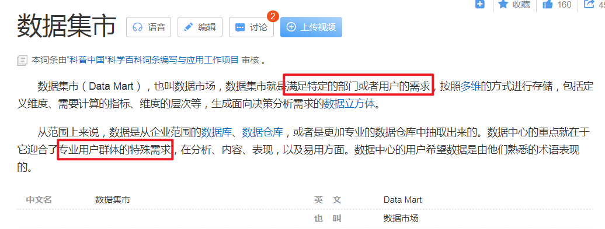

# DM层建设实战

## I. DM层架构

### 目标与需求

- 新零售数仓分层图

  

- DM

  - 名称：数据集市层 Data Market

  - 功能：基于DWS层日统计宽表，==上卷==出周、月、年等统计宽表，即==粗粒度汇总==。

  - 解释

    - 从理论层面来说，数据集市是一个小型的部门或工作组级别的数据仓库。
    - 一些公司早期的数据集市后期可能会演变成为数仓系统。
    - 本项目中在数据集市层面主要进行粗粒度汇总，也可以将这些功能下放至DWS层完成。抛弃DM.

    百科数据集市：https://baike.baidu.com/item/%E6%95%B0%E6%8D%AE%E9%9B%86%E5%B8%82/607135?fr=aladdin

    

- 使用DataGrip在Hive中创建dm层

  > 注意，==**对于建库建表操作，需直接使用Hive**==，因为Presto只是一个数据分析的引擎，其语法不一定支持直接在Hive中建库建表。

  ```sql
  create database if not exists yp_dm;
  ```

### 1. 销售主题统计宽表构建

#### 1.1. 建模


#### 1.2. 表关系梳理


#### 1.3. 按年统计


#### 1.4. 完整实现


#### 1.5. grouping精准识别分组


### 2. 商品主题统计宽表构建

#### 2.1. 建模


#### 2.2. 首次执行


#### 2.3. 循环操作


### 3. 用户主题统计宽表构建

#### 3.1. 建模


#### 3.2. 首次执行, 循环执行


## II. 数据治理

### 1. 元数据管理


### 2. 数据质量管理


